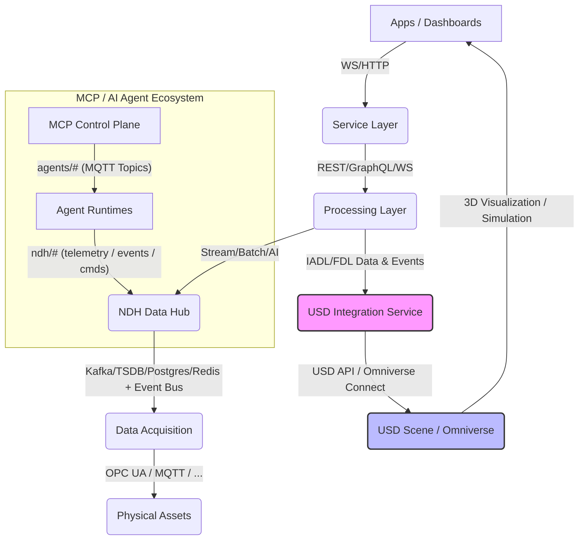

# IADL 與 USD 3D Model 整合分析報告

**版本**: 1.0
**日期**: 2025-10-16
**作者**: 林志錚 Michael Lin(Chih Cheng Lin)

---

## 1. 摘要

本報告旨在深入分析 IDTF (Industrial Digital Twin Framework) 中的 IADL (Industrial Asset Definition Language) 為何在設計初期未直接連結 USD (Universal Scene Description) 3D Model 的原因，並基於當前工業數位分身發展趨勢，提出將 IADL 與 USD 3D Model 有效整合的建議方案。報告將闡述 IADL 的核心設計理念、USD 在工業領域的潛力、兩者整合的價值與挑戰，最終提供一套包含數據映射策略、整合架構和實施步驟的全面性方案，以期提升 IDTF 在視覺化、模擬和協作方面的能力。

## 2. IADL 的設計初衷與當前範圍

IADL 的核心設計理念是作為一個**語義層**，專注於工業資產的**邏輯定義和行為描述**，而非其物理外觀或空間幾何。其主要關注點包括：

*   **資產類型標準化**：定義資產的通用模板 (AssetType)，包含屬性 (Properties)、組件 (Components)、接口 (Interfaces)、遙測點 (Telemetry Points) 和命令 (Commands)，確保不同製造商和系統之間資產數據的互操作性。
*   **數據模型抽象化**：提供一個高層次的抽象，使資產定義與底層的物理實現解耦，便於管理和擴展。
*   **行為與功能描述**：側重於資產的運行邏輯、狀態轉換和可執行操作，為自動化、控制和監控系統提供語義基礎。
*   **與 OT/IT 系統的橋接**：作為數據整合的語義基礎，促進操作技術 (OT) 數據與資訊技術 (IT) 應用之間的無縫流動。

因此，IADL 在設計時，將 3D 視覺化和空間佈局的處理視為獨立的關注點，並預期由其他專門的工具或框架來處理。這種分層設計使得 IADL 能夠保持其**輕量級、高抽象度**的特性，專注於提供強大的語義定義能力，而不被複雜的 3D 幾何和渲染細節所束縛。

## 3. USD (Universal Scene Description) 3D Model 的特性與工業應用潛力

USD 是 Pixar 開發並開源的一個強大、可擴展的 3D 場景描述框架，旨在解決大規模 3D 內容創作中的協作和數據交換挑戰。其關鍵特性包括 [1, 2]：

*   **層次化與非破壞性編輯**：允許不同團隊在同一場景上協作，並透過層次疊加實現非破壞性修改。
*   **可擴展性**：支援自定義數據類型、屬性和行為，使其能夠適應多樣化的應用場景。
*   **高性能**：針對大規模 3D 場景的載入、渲染和操作進行了優化。
*   **物理屬性支持**：能夠描述材質、光照、物理屬性等，為真實感渲染和物理模擬提供基礎。
*   **開放生態系統**：NVIDIA Omniverse 等平台基於 USD 構建，提供強大的 3D 協作、模擬和數位分身能力 [3]。

在工業領域，USD 的應用潛力巨大，尤其是在數位分身和模擬方面 [4, 5]：

*   **虛擬工廠與產線模擬**：建立工廠的精確 3D 模型，進行佈局優化、流程模擬和機器人路徑規劃。
*   **產品設計與原型驗證**：在虛擬環境中對產品進行設計、測試和迭代，加速開發週期。
*   **沉浸式操作與維護**：透過 3D 視覺化介面，提供直觀的資產監控、遠程操作和虛擬培訓。
*   **多物理場模擬**：結合 IADL 的語義數據，在 USD 場景中進行熱力學、流體力學等複雜物理模擬。

## 4. IADL 與 USD 整合的潛在價值與挑戰

### 4.1 潛在價值

將 IADL 的語義數據與 USD 的 3D 視覺化和模擬能力結合，將為 IDTF 帶來以下關鍵價值：

*   **實現真正意義上的數位分身**：將資產的實時數據、行為狀態與其物理 3D 模型緊密結合，提供一個動態、互動且語義豐富的數位分身體驗。
*   **提升決策效率**：操作員和管理者可以透過直觀的 3D 介面，實時監控資產狀態、預測潛在問題，並在虛擬環境中測試決策。
*   **優化工程與運營協作**：設計、工程、製造和運營團隊可以在統一的 USD 3D 環境中共享資產的語義和幾何資訊，促進跨領域協作。
*   **加速創新與驗證**：在虛擬環境中進行新產品、新製程的快速迭代和驗證，降低實體測試成本和風險。
*   **支持 AI 驅動的模擬與優化**：結合 IADL 定義的資產行為和 USD 的物理模型，為 AI Agent 提供更豐富的環境上下文，實現更智能的模擬和優化。

### 4.2 整合挑戰

儘管潛力巨大，IADL 與 USD 的整合也面臨一些挑戰：

*   **數據模型對齊與語義橋接**：IADL 側重於抽象的語義和數據屬性，而 USD 側重於具體的幾何、材質和場景結構。如何建立一套有效且可擴展的映射機制，將 IADL 的語義屬性精確地映射到 USD 的 3D 元素上，是一個核心挑戰。
*   **實時數據同步與性能**：如何高效、低延遲地將來自 NDH 的實時遙測數據和命令狀態更新反映到 USD 場景中，特別是在大規模工廠環境下，需要考慮數據傳輸效率和渲染性能。
*   **資產生命週期管理**：IADL 和 USD 模型都可能經歷多個版本迭代。如何確保兩者在整個資產生命週期中的版本對齊和一致性，以及如何管理模型更新和變更，是一個複雜的問題。
*   **工具鏈與生態系統整合**：將 IADL 定義的資產導入到 USD 創作工具（如 NVIDIA Omniverse Create）中，並確保雙向數據流的順暢，需要良好的工具鏈整合和標準化接口。
*   **物理與行為模型整合**：IADL 描述資產的行為邏輯，USD 描述物理屬性。如何將 IADL 的行為模型與 USD 的物理模型（如碰撞、重力、流體）結合，以實現更真實的模擬，需要深入研究。

## 5. IADL 與 USD 整合建議方案

為克服上述挑戰並實現 IADL 與 USD 的有效整合，建議採用以下策略和架構：

### 5.1 數據映射策略

1.  **基於 UUID 的資產關聯**：
    *   在 IADL 的 `AssetType` 和 FDL 的 `AssetInstance` 中引入一個可選的 `usdModelReference` 屬性。該屬性應包含 USD 模型的唯一識別符 (UUID) 或其在 USD 場景中的路徑。
    *   這將建立 IADL/FDL 語義模型與 USD 物理模型之間的一對一或一對多關聯。
2.  **屬性映射表 (Property Mapping Table)**：
    *   建立一個明確的、可配置的映射表，定義 IADL 屬性如何映射到 USD 的自定義屬性 (Custom Attributes) 或現有屬性。
    *   例如，IADL 中的 `MotorTemperature` (number, °C) 可以映射到 USD 中馬達 Prim (Primitive) 的 `customData:temperature` 屬性。
    *   對於複雜數據類型，可以定義轉換規則或使用 USD 的 `Relationship` 機制。
3.  **行為與狀態映射 (Behavior and State Mapping)**：
    *   將 IADL 定義的命令 (Commands) 和遙測點 (Telemetry Points) 映射到 USD 場景中的行為或動畫控制。
    *   例如，IADL 的 `StartPump` 命令可以觸發 USD 模型中泵的旋轉動畫或改變其材質顏色以表示運行狀態。
    *   IADL 的 `OperationalStatus` 屬性可以直接映射到 USD Prim 的可視性、顏色或動畫狀態。

### 5.2 整合架構

建議在 IDTF 的 Processing Layer 和 Service Layer 之間引入一個專門的 **USD 整合服務 (USD Integration Service)**。該服務將作為 IADL/FDL 語義數據與 USD 3D 場景之間的橋樑。其架構示意圖如下：

**USD 整合服務 (USD Integration Service)** 的核心職責包括：

*   **IADL/FDL 解析與 USD 場景生成**：
    *   解析 IADL 和 FDL 定義，理解資產的語義、階層結構和工廠佈局。
    *   根據解析結果，動態創建或更新 USD 場景圖 (Scene Graph)，將 IADL 屬性映射為 USD 自定義屬性，並根據 FDL 構建資產的空間階層。
*   **實時數據同步引擎**：
    *   建立與 NDH 的 MQTT 或 Kafka 連接，監聽 IADL 定義的遙測數據流。
    *   將實時數據高效地寫入 USD 場景中對應 Prim (Primitive) 的屬性，實現 3D 模型狀態的實時更新。
*   **命令與事件處理器**：
    *   處理來自 Service Layer 的命令，並將其轉換為 USD 場景中的資產行為或動畫觸發。
    *   將 USD 場景中的事件（如用戶互動）回傳給 NDH 或 MCP Control Plane。
*   **USD 場景管理**：
    *   管理 USD 場景的載入、卸載、版本控制和權限。
    *   提供 API 供外部應用查詢和操作 USD 場景。
*   **與 Omniverse Connect 整合**：
    *   利用 NVIDIA Omniverse Connect 服務，實現與 Omniverse 生態系統的無縫連接，提供高性能的 3D 視覺化、物理模擬和 AI 驅動的應用能力。

### 5.3 實施步驟

1.  **擴展 IADL/FDL Schema**：
    *   在 IADL 的 `AssetType` 和 FDL 的 `AssetInstance` 中添加 `usdModelReference` 字段，用於指定 USD 模型的路徑或識別符。
    *   考慮添加 `usdPropertyMapping` 字段，允許在 IADL 中直接定義屬性到 USD 屬性的映射規則。
2.  **開發 USD 整合服務 (MVP)**：
    *   **數據模型解析器**：開發模組來解析 IADL 和 FDL 的 JSON Schema 定義。
    *   **USD 場景生成器**：基於解析結果，使用 OpenUSD API 動態創建或更新 USD 場景圖，並將 IADL 屬性映射為 USD 自定義屬性。
    *   **實時數據連接器**：實現與 NDH 的 MQTT 或 Kafka 連接，將實時遙測數據寫入 USD 場景中的對應 Prim 屬性。
    *   **命令/事件處理器**：實現將 Service Layer 命令轉換為 USD 場景操作的功能。
3.  **建立 USD 資產庫**：
    *   為 IDTF 中常見的工業資產類型創建標準化的 USD 3D 模型。
    *   確保這些 USD 模型具有清晰的層次結構和可供 IADL 屬性映射的接口 (Primvars 或 Custom Attributes)。
4.  **開發視覺化應用**：
    *   利用 NVIDIA Omniverse 或其他 USD 兼容的渲染引擎，開發基於 USD 場景的 3D 視覺化和互動應用。
    *   展示 IADL 數據如何驅動 USD 模型狀態的變化（例如，溫度升高導致顏色變紅）。
5.  **測試與驗證**：
    *   對整合方案進行全面的單元測試、整合測試和性能測試。
    *   驗證數據同步的準確性、實時性以及 3D 視覺化的一致性。
    *   建立 Conformance Test，確保 IADL/FDL 到 USD 的映射符合預期。

### 5.4 預期效益

*   **提升數位分身價值**：提供更直觀、互動和沉浸式的數位分身體驗，加速決策過程。
*   **優化運營效率**：透過 3D 視覺化和模擬，提升資產監控、故障診斷和維護規劃的效率。
*   **加速創新**：為虛擬測試、新產品開發和製程優化提供強大的平台。
*   **增強協作能力**：促進跨部門和跨地域團隊在統一的 3D 環境中進行協作。

## 6. 結論

IADL 在設計時專注於語義和行為描述，使其保持了抽象性和輕量級。然而，隨著工業數位分身技術的發展，將 IADL 的語義數據與 USD 的 3D 視覺化和模擬能力結合，已成為提升 IDTF 價值的必然趨勢。透過本報告提出的整合方案，IDTF 將能夠構建一個既具備強大語義基礎，又擁有豐富視覺化和模擬能力的下一代工業數位分身平台，為智慧製造和工業元宇宙奠定堅實基礎。

## 7. 參考文獻

[1] Introduction to USD. (n.d.). Retrieved from [https://openusd.org/docs/](https://openusd.org/docs/)
[2] Pixar Universal Scene Description USD | NVIDIA Developer. (n.d.). Retrieved from [https://developer.nvidia.com/usd](https://developer.nvidia.com/usd)
[3] What You Need to Know About Universal Scene Description. (2 years ago). Retrieved from [https://medium.com/@nvidiaomniverse/what-you-need-to-know-about-universal-scene-description-from-one-of-its-founding-developers-12625e99389a](https://medium.com/@nvidiaomniverse/what-you-need-to-know-about-universal-scene-description-from-one-of-its-founding-developers-12625e99389a)
[4] Developing Virtual Factory Solutions with OpenUSD and NVIDIA Omniverse. (Apr 22, 2024). Retrieved from [https://developer.nvidia.com/blog/developing-virtual-factory-solutions-with-openusd-and-nvidia-omniverse/](https://developer.nvidia.com/blog/developing-virtual-factory-solutions-with-openusd-and-nvidia-omniverse/)
[5] Unlocking the Future of Manufacturing With OpenUSD on NVIDIA Omniverse. (Apr 25, 2024). Retrieved from [https://blogs.nvidia.com/blog/siemens-unlocks-future-of-manufacturing-with-openusd/](https://blogs.nvidia.com/blog/siemens-unlocks-future-of-manufacturing-with-openusd/)

