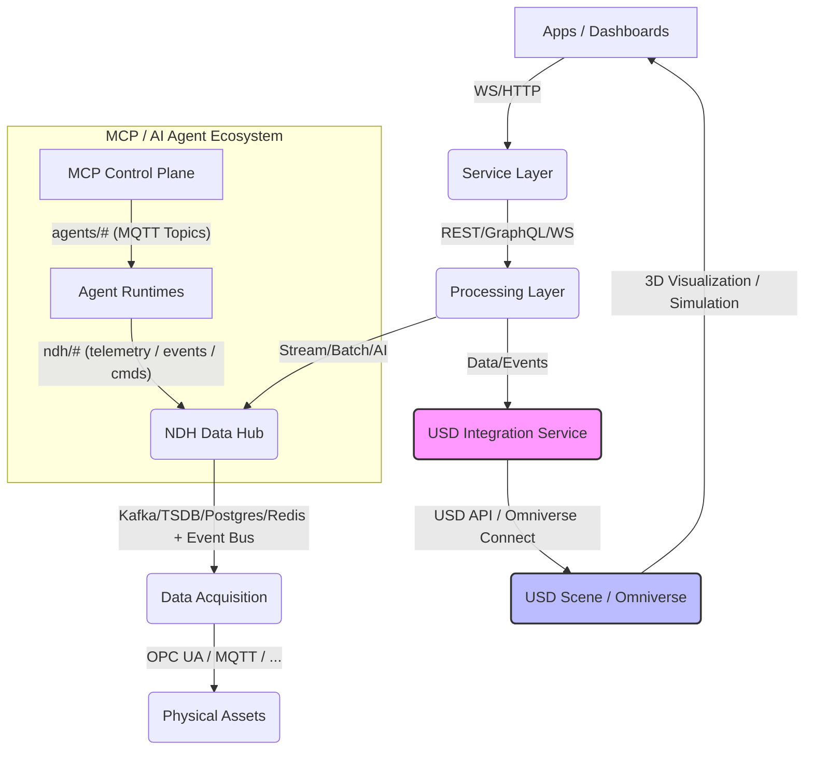

# IADL 與 USD 3D Model 整合建議方案

**版本**: 1.0
**日期**: 2025-10-16
**作者**: 林志錚 Michael Lin(Chih Cheng Lin)

---

## 1. 前言

IADL (Industrial Asset Definition Language) 旨在提供工業資產的語義定義，而 USD (Universal Scene Description) 則是一個強大的 3D 場景描述框架，特別適用於大規模協作和模擬。目前 IADL 尚未直接連結到 USD 3D Model，這限制了 IDTF 在視覺化、模擬和數位分身應用方面的潛力。本文件旨在分析 IADL 未連結到 USD 的原因，並提出將 IADL 與 USD 3D Model 連結的建議方案，以實現更豐富的數位分身體驗。

## 2. IADL 未連結 USD 的原因分析

IADL 的設計初衷主要聚焦於**資產的語義和行為描述**，而非其**物理外觀或空間佈局**。其核心關注點在於：

*   **數據模型標準化**：提供一致的資產類型、屬性、接口和遙測點定義，以確保數據互操作性。
*   **行為描述**：定義資產的功能、命令和生命週期狀態，以支援自動化和控制邏輯。
*   **與 OT/IT 系統整合**：作為數據整合的語義基礎，橋接操作技術 (OT) 和資訊技術 (IT) 系統。

因此，IADL 在設計時並未將 3D 模型的連結作為其核心功能。它更側重於**資產的邏輯和數據層面**，而將視覺化和空間資訊的處理留給其他專門的工具或框架。這使得 IADL 能夠保持輕量級和高度抽象，專注於其語義定義的任務。

## 3. IADL 與 USD 整合的潛在價值

將 IADL 的語義數據與 USD 的 3D 視覺化和模擬能力結合，將為 IDTF 帶來巨大的價值：

*   **豐富的數位分身體驗**：將資產的實時數據、行為狀態直接映射到其 3D 模型上，實現動態、互動式的數位分身視覺化。
*   **沉浸式操作與維護**：操作員和維護人員可以透過 3D 介面直觀地監控資產狀態、執行命令，並進行虛擬培訓。
*   **高效的工程設計與驗證**：在設計階段即可將 IADL 定義的資產屬性與 USD 模型關聯，進行早期模擬和驗證，減少實體原型製作。
*   **跨領域協作**：USD 作為開放標準，能促進設計、工程、製造和運營團隊之間的協作，共享統一的 3D 數據和語義資訊。
*   **模擬與預測分析**：結合 IADL 的行為模型和 USD 的物理模型，進行更精確的性能模擬、故障預測和優化。

## 4. 整合挑戰

儘管潛力巨大，IADL 與 USD 的整合也面臨一些挑戰：

*   **數據模型對齊**：IADL 側重於語義和數據屬性，USD 側重於幾何、材質和場景結構。需要建立有效的映射機制來橋接這兩種不同的數據模型。
*   **語義一致性**：確保 IADL 中定義的資產屬性能夠在 USD 場景中被正確理解和呈現，例如，IADL 中的「馬達溫度」屬性如何影響 USD 模型中馬達的視覺表現（如顏色變化）。
*   **實時數據更新**：如何高效地將來自 NDH 的實時遙測數據和命令狀態更新反映到 USD 場景中，需要考慮性能和延遲。
*   **工具鏈整合**：將 IADL 定義的資產導入到 USD 創作工具（如 NVIDIA Omniverse Create）中，並確保雙向數據流的順暢。
*   **版本控制與生命週期管理**：IADL 和 USD 模型都可能經歷多個版本迭代，需要一套機制來管理它們之間的版本對齊和生命週期。

## 5. 整合建議方案

為實現 IADL 與 USD 的有效整合，建議採用以下策略和架構：

### 5.1 數據映射策略

*   **基於 UUID 的關聯**：在 IADL 的 `AssetType` 和 FDL 的 `AssetInstance` 中引入一個可選的 `usdModelReference` 屬性，該屬性包含 USD 模型的路徑或唯一識別符 (UUID)。
*   **屬性映射表**：建立一個明確的映射表，定義 IADL 屬性如何映射到 USD 的自定義屬性 (Custom Attributes) 或現有屬性。例如，IADL 的 `MotorTemperature` 可以映射到 USD 中馬達模型的 `primvar:temperature`。
*   **行為映射**：將 IADL 定義的命令和遙測點映射到 USD 場景中的行為或動畫控制。例如，`StartPump` 命令可以觸發 USD 模型中泵的旋轉動畫。

### 5.2 整合架構

建議在 IDTF 的 Processing Layer 和 Service Layer 之間引入一個 **USD 整合服務 (USD Integration Service)**，其架構如下：

**USD 整合服務 (USD Integration Service)** 的職責包括：

*   **IADL/FDL 到 USD 的轉換**：根據 IADL 和 FDL 的定義，動態生成或更新 USD 場景圖 (Scene Graph)。
*   **實時數據同步**：監聽 NDH 的實時數據流，將 IADL 定義的遙測數據同步到 USD 場景中的對應屬性。
*   **命令執行映射**：將來自 Service Layer 的命令映射到 USD 場景中的資產行為。
*   **USD 場景管理**：管理 USD 場景的載入、卸載、版本控制和權限。
*   **與 Omniverse Connect 整合**：利用 NVIDIA Omniverse Connect 服務，實現與 Omniverse 生態系統的無縫連接，提供高性能的 3D 視覺化和模擬能力。

### 5.3 實施步驟

1.  **擴展 IADL/FDL Schema**：在 IADL 的 `AssetType` 和 FDL 的 `AssetInstance` 中添加 `usdModelReference` 字段，用於指定 USD 模型的路徑或識別符。
2.  **開發 USD 整合服務**：
    *   **數據模型解析器**：解析 IADL 和 FDL 定義，理解資產的語義和階層結構。
    *   **USD 場景生成器**：根據解析結果，動態創建或更新 USD 場景圖，並將 IADL 屬性映射為 USD 自定義屬性。
    *   **實時數據連接器**：建立與 NDH 的 MQTT 或 Kafka 連接，監聽實時數據，並將其寫入 USD 場景中的對應 Prim (Primitive) 屬性。
    *   **命令/事件處理器**：處理來自 Service Layer 的命令，並觸發 USD 場景中的相應行為或動畫。
3.  **建立 USD 資產庫**：為常見的工業資產創建標準化的 USD 3D 模型，並確保這些模型具有可供 IADL 屬性映射的接口。
4.  **開發視覺化應用**：利用 Omniverse 或其他 USD 兼容的渲染引擎，開發基於 USD 場景的 3D 視覺化和互動應用。
5.  **測試與驗證**：對整合方案進行全面的測試，確保數據同步的準確性、實時性以及 3D 視覺化的一致性。

### 5.4 預期效益

*   **提升數位分身價值**：提供更直觀、互動和沉浸式的數位分身體驗，加速決策過程。
*   **優化運營效率**：透過 3D 視覺化和模擬，提升資產監控、故障診斷和維護規劃的效率。
*   **加速創新**：為虛擬測試、新產品開發和製程優化提供強大的平台。
*   **增強協作能力**：促進跨部門和跨地域團隊在統一的 3D 環境中進行協作。

## 6. 結論

將 IADL 的語義定義與 USD 的 3D 場景描述能力結合，是 IDTF 邁向更全面、更智能數位分身的關鍵一步。透過上述建議的整合方案，IDTF 將能夠為工業領域提供一個既具備強大語義基礎，又擁有豐富視覺化和模擬能力的下一代數位分身平台。
