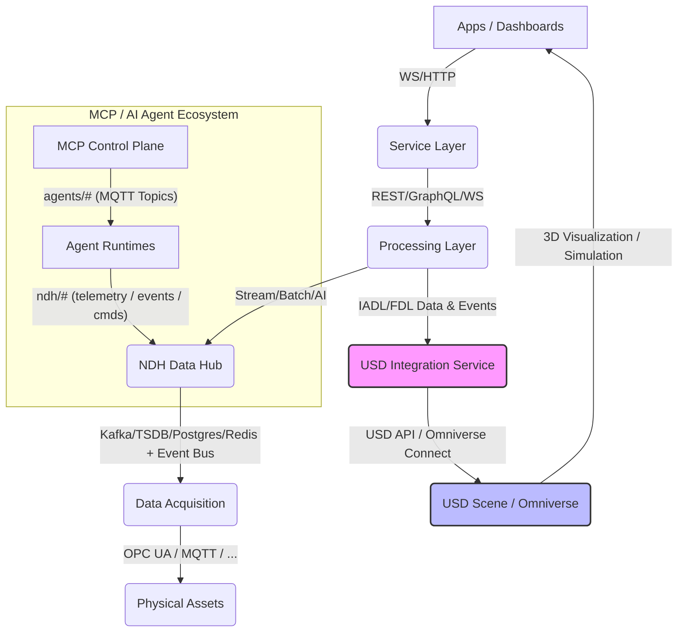

# IDTF 與 Omniverse 連結合作：架構與功能說明文件

**版本**: 1.0
**日期**: 2025-10-16
**作者**: 林志錚 Michael Lin(Chih Cheng Lin)

---

## 1. 摘要

本文件旨在詳細說明 IDTF (Industrial Digital Twin Framework) 如何與 NVIDIA Omniverse 平台進行連結與合作，包括其整合架構、核心功能、數據流以及為工業數位分身帶來的價值。透過將 IDTF 的語義數據模型 (IADL/FDL) 與 Omniverse 的 3D 視覺化、物理模擬和協作能力結合，IDTF 旨在實現一個動態、互動且語義豐富的下一代工業數位分身平台。

## 2. IDTF 與 Omniverse 整合的目標與價值

IDTF 的核心價值主張是實現「一次建模，到處使用」的工業數位分身。在這一願景中，Omniverse 扮演著關鍵的 3D 視覺化與模擬平台角色。將 IADL (Industrial Asset Definition Language) 的語義數據與 USD (Universal Scene Description) 的 3D 視覺化和模擬能力結合，將為 IDTF 帶來以下關鍵價值：

*   **實現真正意義上的數位分身**：將資產的實時數據、行為狀態與其物理 3D 模型緊密結合，提供一個動態、互動且語義豐富的數位分身體驗。
*   **提升決策效率**：操作員和管理者可以透過直觀的 3D 介面，實時監控資產狀態、預測潛在問題，並在虛擬環境中測試決策。
*   **優化工程與運營協作**：設計、工程、製造和運營團隊可以在統一的 USD 3D 環境中共享資產的語義和幾何資訊，促進跨領域協作。
*   **加速創新與驗證**：在虛擬環境中進行新產品、新製程的快速迭代和驗證，降低實體測試成本和風險。
*   **支持 AI 驅動的模擬與優化**：結合 IADL 定義的資產行為和 USD 的物理模型，為 AI Agent 提供更豐富的環境上下文，實現更智能的模擬和優化。

## 3. 整合架構概述

IDTF 與 Omniverse 的整合架構在 IDTF 的分層架構中扮演著重要角色。核心的整合點在於引入了一個專門的 **USD 整合服務 (USD Integration Service)**，它作為 IADL/FDL 語義數據與 USD 3D 場景之間的橋樑。以下是更新後的 IDTF 生態系統架構圖，展示了 USD 整合服務的位置：



**架構說明**：

*   **NDH (Neutral Data Hub)**：作為數據中樞，整合來自 Data Acquisition 層的實時數據，並提供給上層服務。
*   **Processing Layer**：處理數據流、批次處理和 AI 分析，並將 IADL/FDL 數據和事件傳遞給 USD 整合服務。
*   **USD Integration Service**：這是 IDTF 與 Omniverse 整合的核心組件，負責 IADL/FDL 語義數據與 USD 3D 場景之間的轉換和同步。
*   **USD Scene / Omniverse**：代表基於 USD 的 3D 場景和 NVIDIA Omniverse 平台，提供 3D 視覺化、物理模擬和協作能力。
*   **Apps / Dashboards**：最終使用者介面，透過 3D 視覺化和模擬來呈現數位分身。

## 4. USD 整合服務的核心功能

**USD 整合服務 (USD Integration Service)** 是實現 IDTF 與 Omniverse 深度整合的關鍵。其核心職責包括：

1.  **IADL/FDL 解析與 USD 場景生成**：
    *   **功能**：解析 IADL 和 FDL 定義，理解資產的語義、階層結構和工廠佈局。
    *   **輸出**：根據解析結果，動態創建或更新 USD 場景圖 (Scene Graph)，將 IADL 屬性映射為 USD 自定義屬性，並根據 FDL 構建資產的空間階層。
    *   **範例**：IADL 中的 `AssetType: Pump` 及其 `power_rating` 屬性，在 USD 場景中會生成一個 `Pump` Prim，並帶有 `customData:power_rating` 屬性。

2.  **實時數據同步引擎**：
    *   **功能**：建立與 NDH 的 MQTT 或 Kafka 連接，監聽 IADL 定義的遙測數據流。
    *   **輸出**：將實時數據高效地寫入 USD 場景中對應 Prim (Primitive) 的屬性，實現 3D 模型狀態的實時更新。
    *   **範例**：來自 NDH 的 `Pump.MotorTemperature` 數據會實時更新 USD 場景中泵模型上對應的 `primvar:temperature` 屬性，進而可能觸發 3D 模型顏色的變化。

3.  **命令與事件處理器**：
    *   **功能**：處理來自 Service Layer 的命令，並將其轉換為 USD 場景中的資產行為或動畫觸發。同時，將 USD 場景中的事件（如用戶互動）回傳給 NDH 或 MCP Control Plane。
    *   **範例**：來自控制面板的 `StartPump` 命令會觸發 USD 模型中泵的旋轉動畫或改變其材質顏色以表示運行狀態。在 3D 場景中點擊一個閥門，可以觸發 NDH 中的事件，進而控制實際設備。

4.  **USD 場景管理**：
    *   **功能**：管理 USD 場景的載入、卸載、版本控制和權限。
    *   **輸出**：提供 API 供外部應用查詢和操作 USD 場景，確保場景的一致性和安全性。

5.  **與 Omniverse Connect 整合**：
    *   **功能**：利用 NVIDIA Omniverse Connect 服務，實現與 Omniverse 生態系統的無縫連接。
    *   **輸出**：提供高性能的 3D 視覺化、物理模擬和 AI 驅動的應用能力，例如在 Omniverse Create 中直接編輯 IDTF 數據驅動的 3D 場景。

## 5. 數據流與互動範例

### 5.1 數據映射策略

*   **基於 UUID 的資產關聯**：
    *   在 IADL 的 `AssetType` 和 FDL 的 `AssetInstance` 中引入 `usdModelReference` 屬性，包含 USD 模型的路徑或唯一識別符 (UUID)。這建立了語義模型與物理模型之間的明確關聯。
    *   **IADL 範例**：
        ```yaml
        asset_type: Pump
        ...
        3d_model:
          format: USD
          path: 

models/pump_standard.usd
          usd_uuid: "a1b2c3d4-e5f6-7890-1234-567890abcdef"
        ...
        ```

*   **FDL 範例**：
    ```yaml
    factory_layout:
      - area: ProductionFloor1
        instances:
          - type: StandardPump
            instance_id: Pump_001
            ...
            usd_model_reference: "a1b2c3d4-e5f6-7890-1234-567890abcdef" # 引用 IADL 中定義的 USD 模型 UUID
            ...
    ```

*   **屬性映射表**：
    *   建立一個明確的映射表，定義 IADL 屬性如何映射到 USD 的自定義屬性 (Custom Attributes) 或現有屬性。這可以透過配置文件或 IADL 自身的擴展機制來實現。
    *   **範例**：
        ```json
        {
          "iadl_property": "MotorTemperature",
          "usd_prim_path": "/World/ProductionFloor1/Pump_001/Motor",
          "usd_attribute": "primvar:temperature",
          "data_type_conversion": "float_to_float"
        }
        ```

*   **行為映射**：
    *   將 IADL 定義的命令和遙測點映射到 USD 場景中的行為或動畫控制。這可以透過 USD 的 `Relationship` 或自定義的 `ActionGraph` 來實現。
    *   **範例**：
        *   IADL 命令 `StartPump` → USD 場景中 `Pump_001` Prim 的 `start_animation` ActionGraph。
        *   IADL 遙測點 `OperationalStatus` → USD 場景中 `Pump_001` Prim 的材質顏色變化 (綠色表示運行，紅色表示停止)。

### 5.2 實時數據流

1.  **NDH 數據採集**：NDH 從物理資產 (OPC UA, MQTT 等) 採集實時遙測數據和事件。
2.  **數據發佈**：NDH 將這些數據發佈到其內部 Event Bus (如 Kafka 或 MQTT)，供 USD 整合服務訂閱。
3.  **USD 整合服務處理**：
    *   USD 整合服務監聽 NDH 的數據流。
    *   根據預定義的屬性映射表，將接收到的數據轉換為 USD 格式。
    *   透過 OpenUSD API 或 Omniverse Connect，將轉換後的數據寫入 USD 場景中對應 Prim 的屬性。
4.  **Omniverse 視覺化**：Omniverse 平台實時渲染更新後的 USD 場景，將數據變化以 3D 視覺化的方式呈現給使用者。

### 5.3 命令與控制流

1.  **使用者互動**：使用者在 Omniverse 3D 介面中與資產模型互動（例如，點擊一個按鈕來啟動泵）。
2.  **Omniverse 事件**：Omniverse 將使用者互動轉換為事件，並透過 Omniverse Connect 發送給 USD 整合服務。
3.  **USD 整合服務處理**：
    *   USD 整合服務接收來自 Omniverse 的事件。
    *   根據預定義的行為映射，將事件轉換為 IADL 定義的命令。
    *   透過 Service Layer 將命令發送給 NDH，NDH 再將命令傳遞給物理資產。
4.  **物理資產響應**：物理資產執行命令，並將其狀態變化回傳給 NDH，形成閉環控制。

## 6. 結論

IDTF 與 Omniverse 的深度整合，是實現工業數位分身從「數據」到「智慧」再到「視覺化與模擬」的關鍵一步。透過引入 USD 整合服務，IDTF 不僅能夠將抽象的語義數據具象化為豐富的 3D 場景，還能實現實時數據與 3D 模型的雙向互動，為工業領域帶來前所未有的洞察力、協作效率和創新潛力。這將為智慧製造、虛擬調試、預測性維護和沉浸式操作等應用場景提供堅實的技術基礎，加速工業元宇宙的實現。

## 7. 參考文獻

*   [IADL 與 USD 3D Model 整合分析報告](/home/ubuntu/idtf-v3.5/01_IDTF_Spec/docs/IADL_USD_Integration_Analysis_Report.md)
*   [USD Integration Service Design](/home/ubuntu/idtf-v3.5/06_NDH_Spec/docs/USD_Integration_Service_Design.md)
*   [IDTF V3.6 MCP / AI Agent Extension Blueprint](/home/ubuntu/idtf-v3.5/01_IDTF_Spec/docs/IDTF_V3.6_MCP_AI_Agent_Extension_Blueprint.md)

