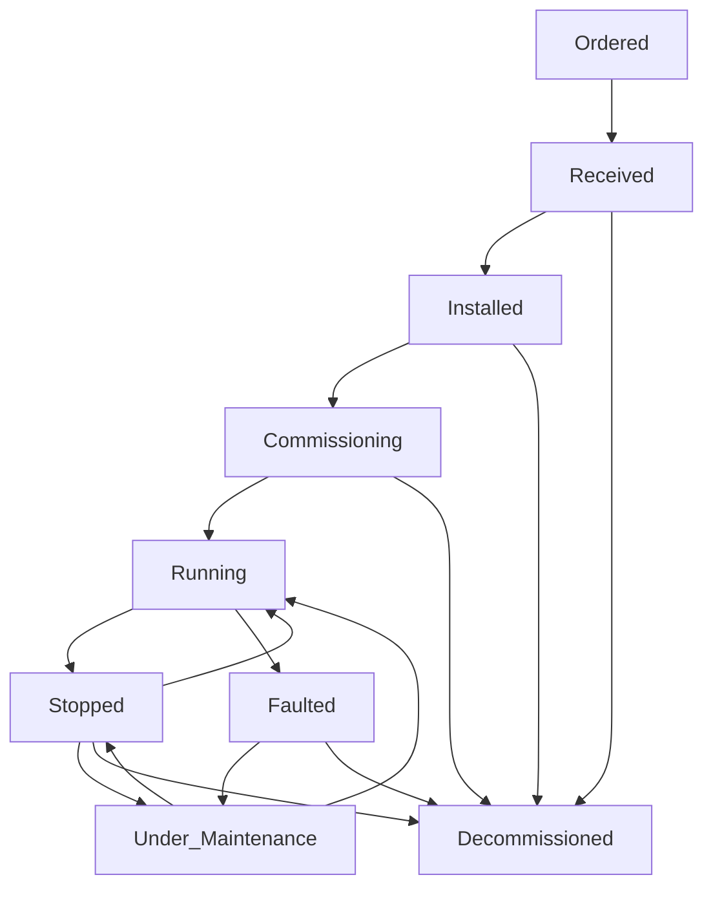

# IDTF 生命週期事件字彙與策略

**版本**: 1.0
**日期**: 2025-10-15
**作者**: Manus AI

---

## 1. 概述

本文件旨在補齊 IDTF (Industrial Digital Twin Framework) 中資產生命週期事件的正式字彙、狀態轉移守則與回寫策略。資產生命週期管理是數位分身的核心功能之一，透過標準化的事件定義和處理機制，可以確保資產狀態的準確性、一致性，並支援與外部系統（如 ERP、MES、CMMS）的無縫整合。本文件將以表格形式詳細闡述每個關鍵生命週期狀態的事件觸發、轉移邏輯和數據回寫策略，並提出測試建議。

## 2. 資產生命週期狀態與事件字彙

IDTF 中的資產實例 (AssetInstance) 具有一系列定義好的生命週期狀態。這些狀態的轉換由特定的事件觸發，並可能涉及數據的回寫到源系統。

| 生命週期狀態 | 描述 | 事件來源 (Triggering System) | 狀態轉移守則 (Transition Rules) | 回寫策略 (Write-back Strategy) | 測試建議 (Testing Considerations) |
|:---|:---|:---|:---|:---|:---|
| **Ordered** | 資產已下訂單，等待交付。 | ERP (Enterprise Resource Planning) 系統 | 1. 採購訂單 (Purchase Order) 創建並確認。 2. 接收到供應商的訂單確認。 | **ERP**: 更新採購訂單狀態為「已確認」。 **NDH**: 記錄訂單資訊，更新資產實例狀態。 | 模擬 ERP 創建訂單事件，驗證 NDH 狀態更新。檢查重複事件處理。 |
| **Received** | 資產已送達工廠並完成驗收。 | ERP / 倉儲管理系統 (WMS) | 1. 物理收貨完成。 2. 質量檢驗 (Quality Inspection) 通過。 3. 系統中完成收貨入庫操作。 | **ERP/WMS**: 更新收貨狀態，記錄入庫資訊。 **NDH**: 記錄收貨日期、供應商資訊，更新資產實例狀態。 | 模擬收貨事件，驗證 NDH 狀態更新及相關屬性（如收貨日期）的記錄。 |
| **Installed** | 資產已物理安裝到位，但尚未投入使用。 | CMMS (Computerized Maintenance Management System) / MES (Manufacturing Execution System) | 1. 物理安裝完成。 2. 基礎連接（電力、網路、管道）完成。 3. 安裝工單 (Work Order) 關閉。 | **CMMS/MES**: 更新安裝工單狀態為「完成」。 **NDH**: 記錄安裝日期、位置資訊，更新資產實例狀態。 | 模擬安裝完成事件，驗證 NDH 狀態更新及位置資訊的準確性。 |
| **Commissioning** | 資產正在進行功能測試、調試和校準。 | MES / 控制系統 (Control System) | 1. 安裝後啟動調試流程。 2. 進行一系列功能測試和性能驗證。 3. 尚未正式投入生產。 | **MES/控制系統**: 記錄調試進度、測試結果。 **NDH**: 記錄調試開始日期、測試報告連結，更新資產實例狀態。 | 模擬調試開始/結束事件，驗證 NDH 狀態更新及測試數據的關聯。 |
| **Running** | 資產已投入正常生產運行。 | MES / 控制系統 | 1. 調試完成並驗收。 2. 設備啟動並開始生產。 3. 達到預期性能指標。 | **MES/控制系統**: 記錄生產數據、稼動率。 **NDH**: 記錄啟動日期、生產模式，更新資產實例狀態。 | 模擬設備啟動事件，驗證 NDH 狀態更新及生產數據的持續流入。 |
| **Stopped** | 資產因計畫或非計畫原因停止運行。 | MES / 控制系統 | 1. 操作員手動停止。 2. 生產排程結束。 3. 設備故障或警報觸發。 | **MES/控制系統**: 記錄停機原因、停機時間。 **NDH**: 記錄停機事件、原因代碼，更新資產實例狀態。 | 模擬設備停機事件，驗證 NDH 狀態更新及停機原因的記錄。 |
| **Faulted** | 資產發生故障，無法正常運行。 | 控制系統 / 設備監控系統 (SCADA) | 1. 傳感器數據異常。 2. 設備警報觸發。 3. 系統檢測到故障模式。 | **SCADA/MES**: 記錄故障代碼、警報時間。 **NDH**: 記錄故障事件、故障代碼、影響範圍，更新資產實例狀態。 | 模擬故障警報事件，驗證 NDH 狀態更新及故障資訊的記錄。 |
| **Under_Maintenance** | 資產正在進行維護活動。 | CMMS / MES | 1. 收到維護工單。 2. 設備從運行狀態切換到維護狀態。 3. 維護人員開始作業。 | **CMMS/MES**: 更新維護工單狀態為「進行中」。 **NDH**: 記錄維護工單 ID、預計完成時間，更新資產實例狀態。 | 模擬維護工單啟動事件，驗證 NDH 狀態更新及維護工單資訊的關聯。 |
| **Decommissioned** | 資產已從生產中移除並準備報廢。 | ERP / CMMS | 1. 資產達到使用壽命。 2. 設備損壞無法修復。 3. 報廢流程批准。 | **ERP/CMMS**: 更新資產狀態為「報廢」，記錄報廢原因。 **NDH**: 記錄報廢日期、原因，更新資產實例狀態。 | 模擬資產報廢事件，驗證 NDH 狀態更新及報廢資訊的記錄。 |

## 3. 狀態轉移圖 (State Transition Diagram)

(此處可插入一個狀態轉移圖，視覺化展示各狀態之間的轉換路徑和觸發事件。例如，使用 Mermaid 語法或 PlantUML 繪製。)

## 4. 測試與驗證

為了確保生命週期事件處理的正確性，應建立一套自動化測試框架。

*   **單元測試**：針對每個狀態轉移守則和回寫策略的邏輯進行單獨測試。
*   **整合測試**：模擬不同事件來源系統發送事件，驗證 NDH 接收、處理事件並更新資產狀態的端到端流程。
*   **錯誤情境測試**：測試無效事件、重複事件、事件順序錯誤等異常情況下的系統行為。
*   **數據一致性檢查**：在事件處理前後，驗證 NDH 與源系統之間數據的一致性。

## 5. 結論

透過本文件定義的生命週期事件字彙、狀態轉移守則和回寫策略，IDTF 將能夠更精確、可靠地管理工業資產的動態狀態。這不僅提升了數位分身數據的準確性，也為基於資產狀態的自動化決策、預測性維護和營運優化提供了堅實的基礎。標準化的測試建議將進一步確保這些機制的穩健性和可靠性。
