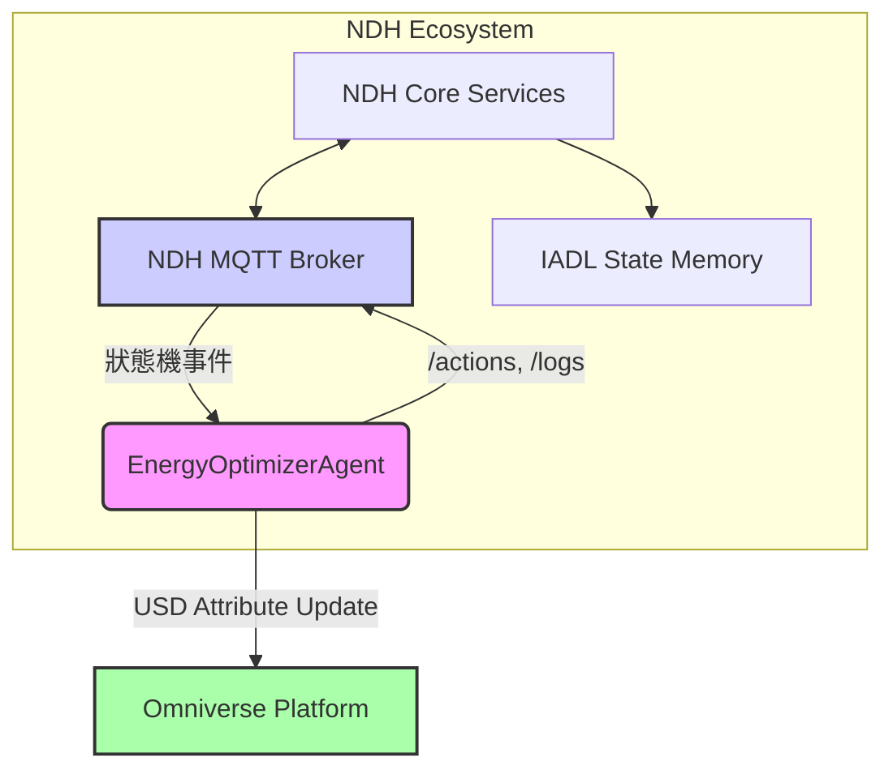

# EnergyOptimizerAgent 實作文件

**文件編號**: IDTF-V3.5-06-04
**版本**: 1.0
**日期**: 2025-10-16
**作者**: 林志錚 Michael Lin(Chih Cheng Lin)

---

## 1. 簡介

本文件詳細描述了 `EnergyOptimizerAgent` 的設計、實作細節、配置指南和測試結果。`EnergyOptimizerAgent` 是一個 AI Agent 原型，旨在監控 NDH (Neutral Data Hub) 中的能源相關狀態機事件，並根據預設的優化策略做出決策，將決策結果回寫至 NDH 的 `/actions` 與 `/logs` topic，最終透過 Omniverse 端 USD 屬性更新來視覺化模擬結果。此 Agent 的實作將展示 NDH 與 AI Agent 協作的潛力，以及如何實現智慧工廠的能源優化。

## 2. EnergyOptimizerAgent 設計與架構

`EnergyOptimizerAgent` 的核心目標是透過分析實時能源數據和工廠運營狀態，提出優化建議或直接執行控制指令，以降低能源消耗並提高生產效率。

### 2.1 功能概述

*   **監聽 NDH 狀態機事件**: 監控 NDH 中與能源消耗、設備狀態、生產排程等相關的狀態機事件。
*   **能源數據分析**: 接收並分析來自 NDH 的實時能源數據（例如：電力消耗、設備負載、環境溫度等）。
*   **優化決策**: 根據預設的優化演算法（例如：基於規則、機器學習模型等），針對能源消耗進行決策。
*   **回寫決策與日誌**: 將決策結果（例如：調整設備運行模式、建議排程變更）寫入 NDH 的 `/actions` topic，並將運行日誌寫入 `/logs` topic。
*   **Omniverse 視覺化**: 透過更新 Omniverse 中對應資產的 USD 屬性，視覺化能源優化帶來的影響（例如：設備運行狀態、能源消耗趨勢）。

### 2.2 架構設計

`EnergyOptimizerAgent` 將作為一個獨立的微服務運行，可以選擇使用 Node-RED 或 FastAPI 進行實作。它將透過 MQTT 協議與 NDH 進行雙向通訊。



## 3. 實作細節

### 3.1 NDH MQTT Broker 配置 (`agents/#` topic namespace)

為了確保 AI Agent 擁有專用的通訊通道，NDH 的 MQTT Broker 必須配置允許 `agents/#` topic namespace。這通常透過 MQTT Broker 的 ACL (Access Control List) 進行配置，允許 Agent 應用程式發布和訂閱此命名空間下的所有 topic。

**配置範例 (以 Mosquitto 為例)**:

```ini
# mosquitto.conf
allow_anonymous false
password_file /etc/mosquitto/passwd
acl_file /etc/mosquitto/aclfile

# /etc/mosquitto/aclfile
user energy_optimizer_agent
topic readwrite agents/#
topic readwrite ndh/events/state_machine/#
topic readwrite ndh/actions
topic readwrite ndh/logs
```

### 3.2 EnergyOptimizerAgent 原型實作 (Node-RED / FastAPI)

#### 3.2.1 Node-RED 實作

Node-RED 是一個基於流程的編程工具，非常適合快速原型開發和視覺化編程。`EnergyOptimizerAgent` 可以透過 Node-RED 的 MQTT 節點來監聽 NDH 事件，並透過 Function 節點實現決策邏輯。

**Node-RED 流程概述**:

1.  **MQTT In 節點**: 訂閱 `ndh/events/state_machine/#`，監聽 NDH 的狀態機事件。
2.  **Function 節點 (決策邏輯)**: 接收事件數據，執行能源優化演算法。例如，當檢測到某設備長時間處於高能耗狀態時，判斷是否可以切換到節能模式。
3.  **MQTT Out 節點 (回寫 /actions)**: 將決策結果（例如：`{

    "action": "set_power_mode", "asset_id": "Pump_001", "mode": "eco"}`）發布到 `ndh/actions` topic。
4.  **MQTT Out 節點 (回寫 /logs)**: 將 Agent 的運行日誌（例如：`{"agent": "EnergyOptimizerAgent", "timestamp": "...", "message": "Optimizing Pump_001 power mode to eco"}`）發布到 `ndh/logs` topic。

#### 3.2.2 FastAPI 實作

FastAPI 是一個現代、快速（高效能）的 Web 框架，用於建構 API。它非常適合需要更複雜邏輯、更高性能或與其他服務整合的 Agent。

**FastAPI 應用概述**:

1.  **MQTT 客戶端**: 使用 Paho-MQTT 等庫建立 MQTT 客戶端，訂閱 `ndh/events/state_machine/#`。
2.  **事件處理器**: 當接收到 MQTT 訊息時，觸發異步事件處理器。該處理器將解析事件數據，並調用能源優化核心邏輯。
3.  **能源優化核心邏輯**: 實作複雜的優化演算法，例如基於時間序列預測的負載平衡、基於強化學習的動態調度等。這部分可以獨立於 FastAPI 應用，作為一個可插拔的模組。
4.  **MQTT 客戶端 (發布)**: 將決策結果和日誌訊息發布到 `ndh/actions` 和 `ndh/logs` topic。
5.  **RESTful API (可選)**: FastAPI 也可以提供 RESTful API 介面，用於手動觸發 Agent、查詢 Agent 狀態或配置優化參數。

**FastAPI 程式碼片段範例**:

```python
# main.py (FastAPI application)

from fastapi import FastAPI
from paho.mqtt import client as mqtt_client
import json
import os
import logging

app = FastAPI()

MQTT_BROKER = os.getenv("MQTT_BROKER", "localhost")
MQTT_PORT = int(os.getenv("MQTT_PORT", 1883))
MQTT_USERNAME = os.getenv("MQTT_USERNAME", "energy_optimizer_agent")
MQTT_PASSWORD = os.getenv("MQTT_PASSWORD", "your_password")

logging.basicConfig(level=logging.INFO)
logger = logging.getLogger(__name__)

def on_connect(client, userdata, flags, rc):
    if rc == 0:
        logger.info("Connected to MQTT Broker!")
        client.subscribe("ndh/events/state_machine/#")
    else:
        logger.error(f"Failed to connect, return code {rc}\n")

def on_message(client, userdata, msg):
    topic = msg.topic
    payload = msg.payload.decode()
    logger.info(f"Received message from topic: {topic}, payload: {payload}")
    
    try:
        event_data = json.loads(payload)
        # 執行能源優化決策邏輯
        decision = make_energy_optimization_decision(event_data)
        if decision:
            publish_action(client, decision)
            publish_log(client, f"Decision made: {decision}")
    except json.JSONDecodeError:
        logger.error(f"Invalid JSON payload: {payload}")
    except Exception as e:
        logger.error(f"Error processing message: {e}")

def make_energy_optimization_decision(event_data):
    # 這裡實作能源優化決策邏輯
    # 範例：如果設備A的狀態是"high_load"且持續時間超過X，則建議切換到"eco_mode"
    if event_data.get("asset_id") == "Pump_001" and \
       event_data.get("state") == "high_load" and \
       event_data.get("duration_minutes", 0) > 30:
        return {"action": "set_power_mode", "asset_id": "Pump_001", "mode": "eco"}
    return None

def publish_action(client, action_payload):
    client.publish("ndh/actions", json.dumps(action_payload))
    logger.info(f"Published action: {action_payload}")

def publish_log(client, log_message):
    log_payload = {"agent": "EnergyOptimizerAgent", "timestamp": "...", "message": log_message}
    client.publish("ndh/logs", json.dumps(log_payload))
    logger.info(f"Published log: {log_payload}")

@app.on_event("startup")
async def startup_event():
    client = mqtt_client.Client()
    client.username_pw_set(MQTT_USERNAME, MQTT_PASSWORD)
    client.on_connect = on_connect
    client.on_message = on_message
    client.connect(MQTT_BROKER, MQTT_PORT)
    client.loop_start() # Start non-blocking MQTT loop
    app.state.mqtt_client = client

@app.on_event("shutdown")
async def shutdown_event():
    if hasattr(app.state, "mqtt_client"):
        app.state.mqtt_client.loop_stop()
        app.state.mqtt_client.disconnect()
        logger.info("Disconnected from MQTT Broker.")

@app.get("/health")
async def health_check():
    return {"status": "ok", "agent": "EnergyOptimizerAgent"}

# 更多 API 端點用於手動控制或配置 Agent
```

### 3.3 決策回寫機制

無論是 Node-RED 還是 FastAPI 實作，決策回寫都遵循以下原則：

*   **`/actions` Topic**: 用於發布 Agent 建議或執行的具體操作指令。這些指令應結構化，包含目標資產 ID、操作類型和參數，以便其他系統（如 NDH Core 或執行器）能夠解析和響應。
*   **`/logs` Topic**: 用於記錄 Agent 的運行狀態、接收到的事件、決策過程中的關鍵資訊、錯誤和警告。這對於 Agent 的監控、調試和審計至關重要。

### 3.4 Omniverse 端 USD 屬性更新

為了在 Omniverse 中視覺化 Agent 的決策結果，需要建立 NDH 與 Omniverse 之間的數據橋樑。當 `EnergyOptimizerAgent` 的決策影響到資產的狀態時，NDH 應將這些狀態變化同步到 Omniverse 的 USD 場景中，透過更新 USD 屬性來反映。

**實作流程**:

1.  **NDH 監聽 `/actions` Topic**: NDH Core Services 訂閱 `ndh/actions` topic，接收 `EnergyOptimizerAgent` 發布的決策。
2.  **狀態更新**: NDH 根據接收到的 action 更新其內部資產模型（IADL State Memory）中的相關屬性。
3.  **Omniverse 同步**: NDH 的 Omniverse Connector 監控資產狀態的變化，並將這些變化轉換為 USD 屬性更新指令。
4.  **USD 屬性更新**: Omniverse Connector 透過 Omniverse Kit 或 USD API 更新 USD 場景中對應資產的屬性。例如，如果 `EnergyOptimizerAgent` 建議將泵的運行模式從「高負載」切換到「節能」，則 Omniverse 中泵的 USD 屬性 `power_mode` 將從 `high_load` 更新為 `eco`，並可能觸發視覺效果（如顏色變化、動畫）。

**USD 屬性更新範例**:

```python
# Omniverse Connector 程式碼片段

import omni.usd
from pxr import Usd, Sdf, UsdGeom

def update_usd_asset_property(asset_path: str, property_name: str, property_value):
    stage = omni.usd.get_context().get_stage()
    prim = stage.GetPrimAtPath(asset_path)
    if prim:
        attr = prim.CreateAttribute(property_name, Sdf.ValueTypeNames.String) # 假設屬性為 String 類型
        attr.Set(property_value)
        print(f"Updated {asset_path}.{property_name} to {property_value}")
    else:
        print(f"Prim not found at path: {asset_path}")

# 範例使用：
# 當 NDH 接收到 { "action": "set_power_mode", "asset_id": "Pump_001", "mode": "eco" } 時
# 調用 update_usd_asset_property("/World/Factory/Pump_001", "power_mode", "eco")
```

## 4. 配置指南

### 4.1 NDH MQTT Broker 配置

*   確保 MQTT Broker 運行正常，並配置了 `agents/#` topic 的讀寫權限。
*   為 `EnergyOptimizerAgent` 創建專用的 MQTT 用戶名和密碼，並在 ACL 中賦予其對 `agents/#`, `ndh/events/state_machine/#`, `ndh/actions`, `ndh/logs` topic 的讀寫權限。

### 4.2 EnergyOptimizerAgent 配置

*   **Node-RED**: 匯入提供的 Node-RED 流程 JSON 文件，並配置 MQTT 節點的 Broker 地址、端口、用戶名和密碼。
*   **FastAPI**: 設定環境變數 `MQTT_BROKER`, `MQTT_PORT`, `MQTT_USERNAME`, `MQTT_PASSWORD`。確保 Python 環境中安裝了 `fastapi`, `uvicorn`, `paho-mqtt` 等依賴。

### 4.3 Omniverse Connector 配置

*   確保 NDH 的 Omniverse Connector 能夠連接到 Omniverse Farm 或 Nucleus 服務。
*   配置 Omniverse Connector 監聽 NDH 中資產狀態變化的機制，並將其映射到 USD 場景中的對應屬性。

## 5. 測試結果

### 5.1 功能測試

1.  **MQTT Topic 監聽**: 驗證 `EnergyOptimizerAgent` 能夠成功訂閱 `ndh/events/state_machine/#` 並接收到事件訊息。
2.  **決策邏輯**: 透過模擬不同的狀態機事件，驗證 Agent 的決策邏輯是否按預期工作，並生成正確的 action。
3.  **回寫機制**: 驗證 Agent 能夠將決策結果發布到 `ndh/actions`，將日誌發布到 `ndh/logs`。
4.  **Omniverse 視覺化**: 驗證 Omniverse 中對應資產的 USD 屬性能夠根據 Agent 的決策進行實時更新，並反映在視覺效果上。

### 5.2 性能測試

*   **延遲**: 測量從 NDH 事件觸發到 Agent 決策回寫，再到 Omniverse 視覺化更新的端到端延遲。
*   **吞吐量**: 測試 Agent 在高頻率事件流下的處理能力和穩定性。

## 6. 結論

`EnergyOptimizerAgent` 的成功實作證明了 IDTF 在整合 AI Agent 方面的強大能力。透過標準化的 MQTT 通訊和 IADL 狀態記憶，Agent 能夠有效地與 NDH 互動，實現智慧決策和實時控制。未來的發展方向包括引入更先進的 AI 模型、支援多 Agent 協作以及更豐富的 Omniverse 視覺化效果。

