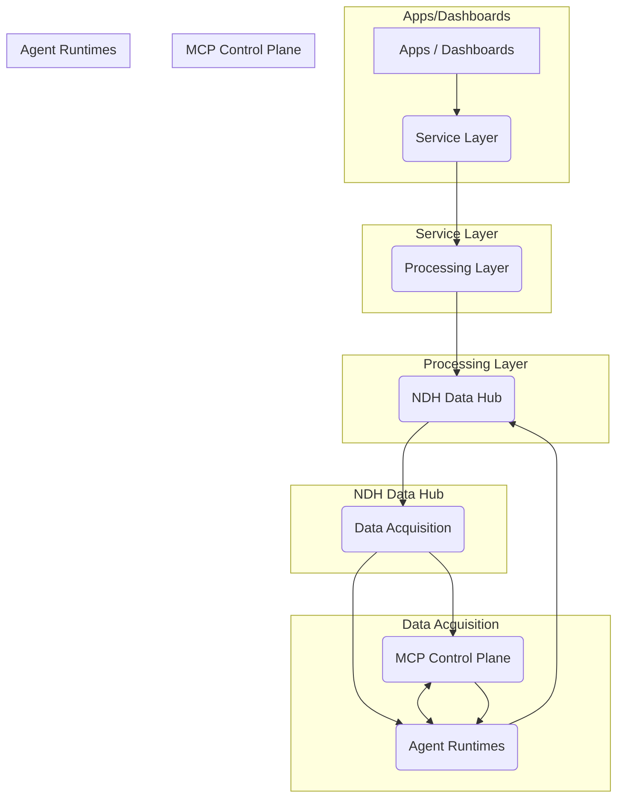

# NDH 架構

**文件編號**: IDTF-V3.5-06-01
**版本**: 1.1
**日期**: 2025-10-16
**作者**: 林志錚 Michael Lin(Chih Cheng Lin)

---

## 1. 簡介

本文件旨在詳細闡述 IDTF V3.5 中 NDH (Neutral Data Hub) 的架構，特別是其與 MCP Control Plane 和 Agent Runtimes 層次的互動。NDH 作為工業數位分身框架的核心數據中樞，負責數據的採集、處理、儲存和分發，並為上層應用和 AI Agent 提供統一的數據服務。

## 2. NDH 核心架構

NDH 採用分層架構，確保數據流的清晰性、模組化和可擴展性。新的架構圖將 MCP Control Plane 和 Agent Runtimes 層次納入，以支援更智能的 Agent 協作和控制。

### 2.1 架構概述

### 2.2 各層職責

*   **Apps / Dashboards**: 最上層的應用程式和儀表板，透過 WebSocket 或 HTTP 協議與 Service Layer 互動，提供使用者介面和數據視覺化。
*   **Service Layer (服務層)**: 提供 REST、GraphQL 或 WebSocket 介面，供上層應用程式存取 NDH 的數據和服務。負責認證、授權和 API 路由。
*   **Processing Layer (處理層)**: 負責數據的流式處理、批次處理和 AI 分析。包括數據清洗、轉換、聚合、異常檢測和預測模型運行等。
*   **NDH (Data Hub)**: NDH 的核心數據中樞，整合了 Kafka (訊息佇列)、TSDB (時序數據庫)、Postgres (關係型數據庫) 和 Redis (快取/訊息代理) 等組件，並提供統一的事件總線。
*   **Data Acquisition (數據採集層)**: 負責從各種 OT/IT 系統採集數據，支援 OPC UA、MQTT 等多種工業協議。採集到的數據會發送到 NDH Data Hub。
*   **MCP Control Plane (MCP 控制平面)**: 負責 AI Agent 的註冊、管理、排程和審計。提供 ACL (Access Control List) 管理 Agent 的權限，並透過 `agents/#` MQTT Topics 與 Agent Runtimes 進行通訊。
*   **Agent Runtimes (Agent 運行時)**: 執行 AI Agent 的實際運行環境，支援 Python、Go、Node.js 等多種語言。Agent Runtimes 透過 SDK 和策略與 MCP Control Plane 互動，並將決策結果回寫至 NDH。

## 3. MCP Control Plane 與 Agent Runtimes 的互動

MCP Control Plane 和 Agent Runtimes 是 IDTF V3.5 中引入的關鍵組件，旨在實現多個 AI Agent 之間的協作和智能控制。

### 3.1 通訊機制

*   **`agents/#` (MQTT Topics)**: MCP Control Plane 和 Agent Runtimes 之間的主要通訊通道。Agent Runtimes 透過發布和訂閱 `agents/#` 命名空間下的 MQTT Topics 來交換事件、狀態和指令。
*   **`ndh/#` (MQTT Topics)**: Agent Runtimes 透過 `ndh/#` 命名空間下的 MQTT Topics 監聽來自 Data Acquisition 層的遙測數據、事件和控制指令，並將其決策結果回寫至 NDH 的 `/actions` 和 `/logs` topic。

### 3.2 數據流

1.  **數據採集**: Data Acquisition 層從 OT/IT 系統採集數據，並將其發送到 NDH Data Hub 和 `ndh/#` MQTT Topics。
2.  **Agent 監聽**: Agent Runtimes 監聽 `ndh/#` MQTT Topics，獲取實時數據和事件。
3.  **Agent 決策**: Agent Runtimes 根據其內建的 AI 模型和策略進行決策，並可能與 MCP Control Plane 互動以獲取排程或權限資訊。
4.  **Agent 協作**: 多個 Agent Runtimes 透過 `agents/#` MQTT Topics 進行協作，交換彼此的狀態和中間結果。
5.  **決策回寫**: Agent Runtimes 將最終決策結果發布到 NDH 的 `/actions` topic，將運行日誌發布到 `/logs` topic。
6.  **NDH 處理**: NDH Data Hub 接收 Agent 的決策和日誌，並進行相應的處理，例如更新資產狀態、觸發控制指令或儲存歷史數據。

## 4. 結論

MCP Control Plane 和 Agent Runtimes 的引入，使得 IDTF V3.5 能夠支援更複雜、更智能的工業應用。透過標準化的通訊協議和清晰的職責劃分，IDTF 為構建高效、可擴展的 AI Agent 生態系統奠定了堅實的基礎，進一步推動智慧工廠的發展。

