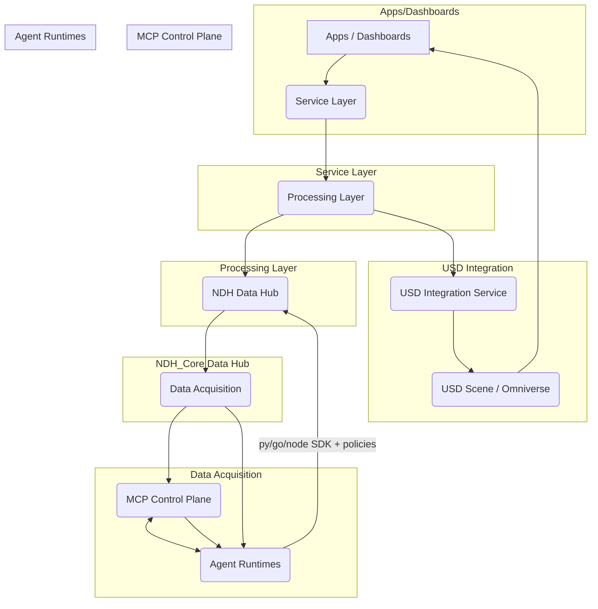

# NDH 功能與架構介紹

**文件編號**: IDTF-V3.5-06-04
**版本**: 1.0
**日期**: 2025-10-16
**作者**: 林志錚 Michael Lin(Chih Cheng Lin)

---

## 1. 簡介

NDH (Neutral Data Hub) 是 IDTF (Industrial Digital Twin Framework) 的核心數據中樞，旨在為工業數位分身提供一個開放、可擴展且供應商中立的數據基礎設施。它負責從各種工業設備和系統中採集、處理、儲存和分發數據，並為上層應用、分析服務和 AI Agent 提供統一的數據存取介面。本文件將詳細介紹 NDH 的主要功能、分層架構及其關鍵組件，特別是新引入的 MCP (Multi-Agent Control Plane) 和 Agent Runtimes 層次，以展現其在智慧工廠應用中的核心價值。

## 2. NDH 核心架構概述

NDH 採用分層架構設計，確保數據流的清晰性、模組化和可擴展性。此架構不僅整合了傳統的數據處理能力，更加入了針對 AI Agent 協作和控制的 MCP 層，使其能夠支援更複雜、更智能的工業應用。

## 3. NDH 各層職責與功能

### 3.1 Apps / Dashboards (應用程式 / 儀表板)

這是最上層的用戶介面，提供數據視覺化、操作控制和業務流程管理。透過 WebSocket 或 HTTP 協議與 Service Layer 互動，實現人機交互。

### 3.2 Service Layer (服務層)

作為 NDH 的對外窗口，提供標準化的 REST、GraphQL 或 WebSocket API，供上層應用程式和服務存取數據。負責用戶認證、授權、API 路由和請求管理，確保數據存取的安全性和效率。

### 3.3 Processing Layer (處理層)

此層負責數據的深度處理和分析，包括：

*   **流式處理 (Stream Processing)**: 實時處理來自數據採集層的連續數據流，進行數據清洗、轉換、聚合和實時分析。
*   **批次處理 (Batch Processing)**: 對歷史數據進行週期性處理，執行複雜的分析任務，如數據挖掘、報表生成和模型訓練。
*   **AI 分析 (AI Analytics)**: 運行機器學習模型，進行異常檢測、預測性維護、品質預測等高級分析。

### 3.4 USD Integration Service (USD 整合服務)

作為 Processing Layer 的一個關鍵組件，此服務專門負責將 IADL/FDL 的語義數據與 NVIDIA Omniverse 平台中的 USD (Universal Scene Description) 3D 物理模型進行深度整合。其職責包括：

*   **數據模型解析器**: 解析 IADL/FDL 定義，理解資產的屬性、關係和行為。
*   **USD 場景生成器**: 根據 IADL/FDL 數據動態生成或更新 USD 場景圖，包括資產的幾何、材質、物理屬性等。
*   **實時數據連接器**: 將 NDH 中的實時數據（如感測器讀數、設備狀態）同步到 USD 場景中，實現數位分身的實時更新。
*   **命令與事件處理器**: 將來自 USD 場景的互動（如虛擬操作）或模擬結果映射回 NDH 的命令和事件。
*   **USD 場景管理**: 管理 USD 場景的版本、權限和協作。
*   **Omniverse Connect 整合**: 透過 Omniverse Connect 協議與 Omniverse 平台無縫連接，實現高效的數據交換和協同工作。

### 3.5 NDH (Data Hub) 核心

NDH 的核心數據中樞，整合了多種數據技術以滿足不同數據類型和處理需求：

*   **Kafka**: 作為高性能的訊息佇列，處理實時數據流和事件分發。
*   **TSDB (時序數據庫)**: 專門儲存和查詢時間序列數據，如感測器讀數、設備運行參數。
*   **Postgres (關係型數據庫)**: 儲存結構化數據，如資產元數據、配置資訊和業務數據。
*   **Redis (快取 / 訊息代理)**: 提供高速數據快取和輕量級訊息發布/訂閱功能。
*   **Event Bus**: 統一的事件總線，用於 NDH 內部組件之間的事件通訊。

### 3.6 Data Acquisition (數據採集層)

負責從工廠現場的 OT (Operational Technology) 和 IT (Information Technology) 系統採集數據。支援多種工業通訊協議，如 OPC UA、MQTT、Modbus 等，將採集到的數據標準化後發送到 NDH Data Hub 和 MQTT Broker。

### 3.7 MCP Control Plane (MCP 控制平面)

MCP Control Plane 是 IDTF V3.6 引入的關鍵組件，旨在實現多個 AI Agent 之間的協作和智能控制。其主要職責包括：

*   **Agent 註冊與發現**: 允許 AI Agent 註冊其身份、能力和通訊端點，並發現其他可用的 Agent。
*   **事件分發**: 根據預定義的規則或訂閱關係，將事件從發布 Agent 路由到訂閱 Agent。
*   **狀態管理**: 接收 Agent 發布的狀態更新，並將其持久化到 IADL Schema 定義的 Agent 狀態記憶中，同時通知相關訂閱者。
*   **ACL (Access Control List)**: 管理 Agent 的權限，確保只有經過授權的 Agent 才能參與通訊和狀態管理。
*   **排程與審計**: 負責 Agent 任務的排程，並記錄 Agent 的行為和決策，以便進行審計和追溯。

### 3.8 Agent Runtimes (Agent 運行時)

Agent Runtimes 是執行 AI Agent 實際邏輯的運行環境。它支援多種程式語言（如 Python、Go、Node.js），並透過標準化的 SDK 和策略與 MCP Control Plane 互動。Agent Runtimes 監聽來自 NDH 的數據和事件，執行 AI 模型進行決策，並將結果回寫至 NDH。

## 4. MCP Control Plane 與 Agent Runtimes 的互動

MCP Control Plane 和 Agent Runtimes 透過 NDH 內建的 MQTT Broker 進行高效通訊，實現了 Agent 之間的協同工作。

### 4.1 通訊機制

*   **`agents/#` (MQTT Topics)**: MCP Control Plane 和 Agent Runtimes 之間的主要通訊通道。Agent Runtimes 透過發布和訂閱 `agents/#` 命名空間下的 MQTT Topics 來交換事件、狀態和指令。
*   **`ndh/#` (MQTT Topics)**: Agent Runtimes 透過 `ndh/#` 命名空間下的 MQTT Topics 監聽來自 Data Acquisition 層的遙測數據、事件和控制指令，並將其決策結果回寫至 NDH 的 `/actions` 和 `/logs` topic。

### 4.2 數據流

1.  **數據採集**: Data Acquisition 層從 OT/IT 系統採集數據，並將其發送到 NDH Data Hub 和 `ndh/#` MQTT Topics。
2.  **Agent 監聽**: Agent Runtimes 監聽 `ndh/#` MQTT Topics，獲取實時數據和事件。
3.  **Agent 決策**: Agent Runtimes 根據其內建的 AI 模型和策略進行決策，並可能與 MCP Control Plane 互動以獲取排程或權限資訊。
4.  **Agent 協作**: 多個 Agent Runtimes 透過 `agents/#` MQTT Topics 進行協作，交換彼此的狀態和中間結果。
5.  **決策回寫**: Agent Runtimes 將最終決策結果發布到 NDH 的 `/actions` topic，將運行日誌發布到 `/logs` topic。
6.  **NDH 處理**: NDH Data Hub 接收 Agent 的決策和日誌，並進行相應的處理，例如更新資產狀態、觸發控制指令或儲存歷史數據。

## 5. 結論

NDH 作為 IDTF 的核心數據中樞，透過其強大的數據整合、處理和分發能力，以及新引入的 MCP Control Plane 和 Agent Runtimes 層次，為構建智能、自主的工業數位分身解決方案提供了堅實的基礎。它不僅確保了數據的標準化和互操作性，更為 AI Agent 的協作和控制提供了高效的平台，將極大推動智慧工廠的發展和數位轉型。
