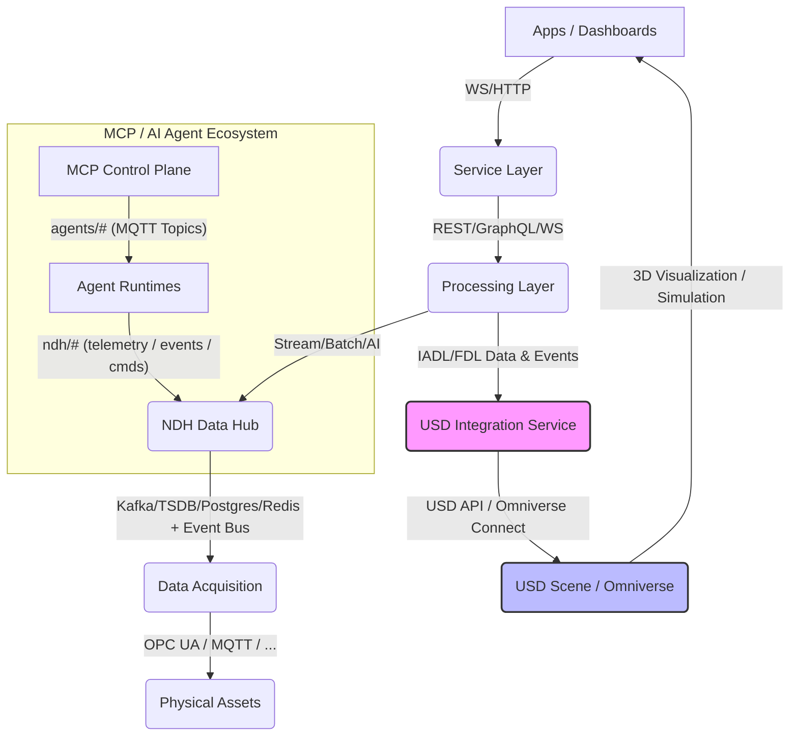

# USD 整合服務詳細設計

**文件編號**: IDTF-V3.5-06-03
**版本**: 1.0
**日期**: 2025-10-16
**作者**: 林志錚 Michael Lin(Chih Cheng Lin)

---

## 1. 簡介

USD 整合服務 (USD Integration Service) 是 IDTF (Industrial Digital Twin Framework) 中一個關鍵的新組件，旨在彌合 IADL/FDL 語義數據與 USD (Universal Scene Description) 3D 物理模型之間的鴻溝。本文件將詳細闡述 USD 整合服務的設計，包括其核心組件、功能、與 NDH (Neutral Data Hub) 的互動，以及與 NVIDIA Omniverse Connect 的整合策略。其目標是實現 IADL 定義的工業資產在 3D 環境中的實時視覺化、模擬和互動。

## 2. 架構定位

USD 整合服務位於 IDTF 的 Processing Layer 和 Service Layer 之間，作為一個專門的微服務運行。它從 NDH 接收 IADL/FDL 數據和實時事件，並將其轉換為 USD 場景的更新，最終透過 Omniverse Connect 服務將 3D 視覺化和模擬結果呈現給 Apps / Dashboards。

## 3. 核心組件與功能

USD 整合服務將由以下核心組件構成：

### 3.1 數據模型解析器 (Data Model Parser)

*   **功能**：負責解析 IADL (Industrial Asset Definition Language) 和 FDL (Factory Design Language) 的 JSON Schema 定義，理解資產的語義、階層結構、屬性、接口、遙測點和命令。
*   **輸入**：IADL Schema (JSON)、FDL Schema (JSON)、IADL AssetType 定義、FDL AssetInstance 定義。
*   **輸出**：內部資產語義模型 (In-memory Semantic Model)，包含資產類型、實例、屬性、關係和 USD 參考信息。
*   **關鍵考量**：
    *   **Schema 驗證**：確保輸入的 IADL/FDL 定義符合其 JSON Schema 規範。
    *   **階層解析**：正確解析 IADL 的 `components` 和 FDL 的 `AssetInstance` 階層關係。
    *   **USD 參考提取**：從 IADL `AssetType` 和 FDL `AssetInstance` 中提取 `usdModelReference` 字段，用於定位基礎 USD 模型。

### 3.2 USD 場景生成器 (USD Scene Generator)

*   **功能**：根據數據模型解析器生成的內部資產語義模型，動態創建或更新 USD 場景圖 (Scene Graph)。
*   **輸入**：內部資產語義模型、基礎 USD 模型文件 (來自 USD 資產庫)。
*   **輸出**：USD Stage (USD 場景)，包含 Prim (Primitive)、屬性 (Attributes)、關係 (Relationships) 和層次結構。
*   **關鍵考量**：
    *   **Prim 創建與管理**：為每個 IADL AssetType 和 FDL AssetInstance 創建對應的 USD Prim，並建立其父子關係。
    *   **屬性映射**：將 IADL 屬性映射為 USD Prim 的自定義屬性 (Custom Attributes)。例如，IADL 的 `MotorTemperature` 映射為 `/World/Factory/Pump_001.primvars:temperature`。
    *   **材質與外觀**：根據 IADL 屬性（如 `operationalStatus`）動態調整 USD Prim 的材質或顏色，以視覺化資產狀態。
    *   **USD Layering**：利用 USD 的分層機制，將 IADL/FDL 數據生成的場景疊加在基礎 3D 模型之上，實現非破壞性更新。
    *   **USD 變體 (Variants)**：利用 USD 變體來表示資產的不同配置或狀態。

### 3.3 實時數據連接器 (Real-time Data Connector)

*   **功能**：監聽 NDH 的實時數據流（例如 MQTT Topics 或 Kafka），將 IADL 定義的遙測數據同步到 USD 場景中的對應屬性。
*   **輸入**：NDH 實時數據流 (MQTT/Kafka)、IADL TelemetryPoint 定義。
*   **輸出**：更新 USD Stage 中的 Prim 屬性。
*   **關鍵考量**：
    *   **高吞吐量與低延遲**：確保能夠高效處理大量的實時數據，並以最小延遲更新 3D 場景。
    *   **數據格式轉換**：將 NDH 中的數據格式轉換為 USD 屬性所需的格式。
    *   **數據過濾與聚合**：根據需要對數據進行過濾或聚合，以減少不必要的 USD 場景更新。
    *   **錯誤處理**：處理數據丟失、格式錯誤或 USD 場景更新失敗的情況。

### 3.4 命令與事件處理器 (Command and Event Processor)

*   **功能**：處理來自 Service Layer 的命令，並將其轉換為 USD 場景中的資產行為或動畫觸發。同時，將 USD 場景中的用戶互動事件回傳給 NDH 或 MCP Control Plane。
*   **輸入**：Service Layer 命令 (REST/GraphQL/WS)、USD 場景互動事件。
*   **輸出**：USD 場景操作、NDH `/actions` 或 `/logs` Topic 消息。
*   **關鍵考量**：
    *   **命令映射**：將 IADL 命令映射到 USD 場景中的特定動作或腳本。
    *   **事件訂閱**：監聽 USD 場景中的用戶互動事件（如點擊、選擇），並將其轉換為 IDTF 事件。
    *   **安全與權限**：確保只有經過授權的命令才能在 USD 場景中執行。
    *   **雙向通訊**：支援從 Service Layer 到 USD 場景的命令，以及從 USD 場景到 NDH 的事件。

### 3.5 USD 場景管理 (USD Scene Management)

*   **功能**：管理 USD 場景的生命週期，包括載入、卸載、版本控制、權限管理和持久化。
*   **輸入**：USD 場景文件、版本信息、用戶權限。
*   **輸出**：受管理的 USD 場景。
*   **關鍵考量**：
    *   **場景持久化**：將動態生成的 USD 場景持久化到文件系統或 USD 服務器。
    *   **版本控制**：與 Git 或其他版本控制系統整合，管理 USD 場景的歷史版本。
    *   **權限管理**：基於 RBAC/ABAC 機制，控制用戶對 USD 場景的讀寫和操作權限。
    *   **場景優化**：對 USD 場景進行優化，以提高載入和渲染性能。

### 3.6 Omniverse Connect 整合 (Omniverse Connect Integration)

*   **功能**：利用 NVIDIA Omniverse Connect 服務，實現與 Omniverse 生態系統的無縫連接，提供高性能的 3D 視覺化、物理模擬和 AI 驅動的應用能力。
*   **輸入**：USD Stage、Omniverse 服務憑證。
*   **輸出**：Omniverse 平台上的實時 3D 場景。
*   **關鍵考量**：
    *   **Omniverse Nucleus**：利用 Nucleus 服務進行 USD 場景的協作和版本管理。
    *   **實時串流**：透過 Omniverse Connect 實現 USD 場景的實時串流到客戶端應用。
    *   **物理模擬**：與 Omniverse Physics 引擎整合，實現基於 USD 場景的物理模擬。
    *   **AI 擴展**：利用 Omniverse 的 AI 擴展，實現 AI Agent 與 3D 場景的互動。

## 4. 與 NDH 的互動

USD 整合服務將與 NDH 進行緊密互動，主要透過以下方式：

*   **訂閱 NDH Event Bus**：監聽來自 Data Acquisition 層的實時遙測數據、資產狀態更新和事件。
*   **查詢 NDH 數據庫**：獲取 IADL AssetType 和 FDL AssetInstance 的定義，以及歷史數據。
*   **發布命令到 NDH `/actions` Topic**：將來自 3D 場景的用戶互動或 Agent 決策轉換為控制命令，發布到 NDH 的 `/actions` Topic。
*   **發布日誌到 NDH `/logs` Topic**：記錄 USD 整合服務的運行狀態、錯誤和重要事件。

## 5. 實施考量

*   **技術棧**：建議使用 Python (OpenUSD Python API) 或 C++ (OpenUSD C++ API) 進行開發，以充分利用 OpenUSD 的功能和性能。
*   **可擴展性**：服務應設計為可水平擴展的微服務，以應對大規模工業場景的數據量和複雜性。
*   **安全性**：所有與 NDH 和 Omniverse Connect 的通訊都應加密，並實施嚴格的身份驗證和授權機制。
*   **錯誤恢復**：服務應具備錯誤檢測和恢復機制，確保在部分組件失敗時仍能保持穩定運行。
*   **配置管理**：所有服務配置（如 NDH 連接字符串、Omniverse 憑證、USD 資產庫路徑）應可外部化和動態管理。

## 6. 結論

USD 整合服務是 IDTF 實現下一代工業數位分身願景的關鍵。透過其精心設計的組件和與 NDH 及 Omniverse Connect 的緊密整合，它將能夠將 IADL 的語義智能轉化為直觀、互動的 3D 體驗，為智慧製造、虛擬調試、遠程操作和 AI 驅動的模擬提供強大的基礎。
