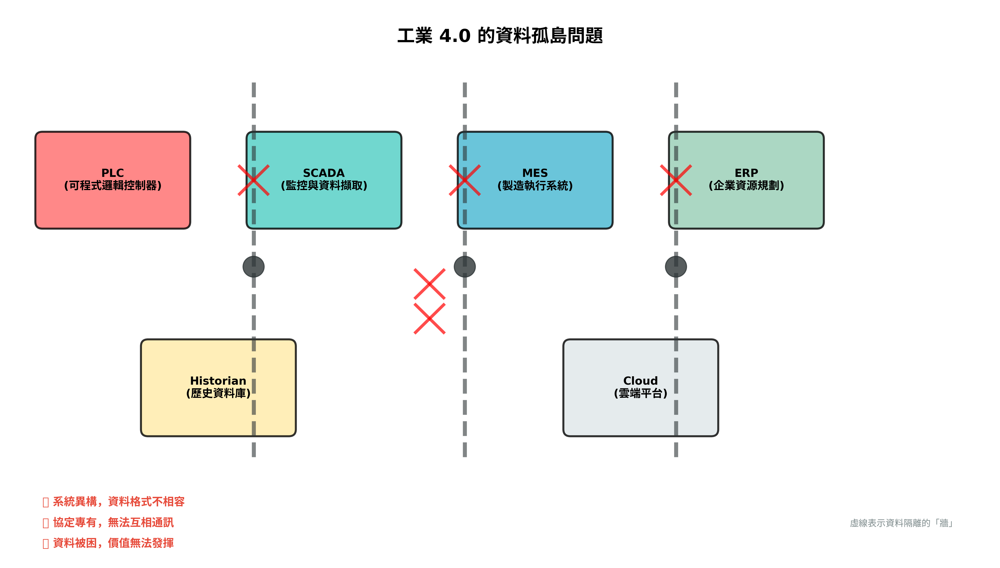
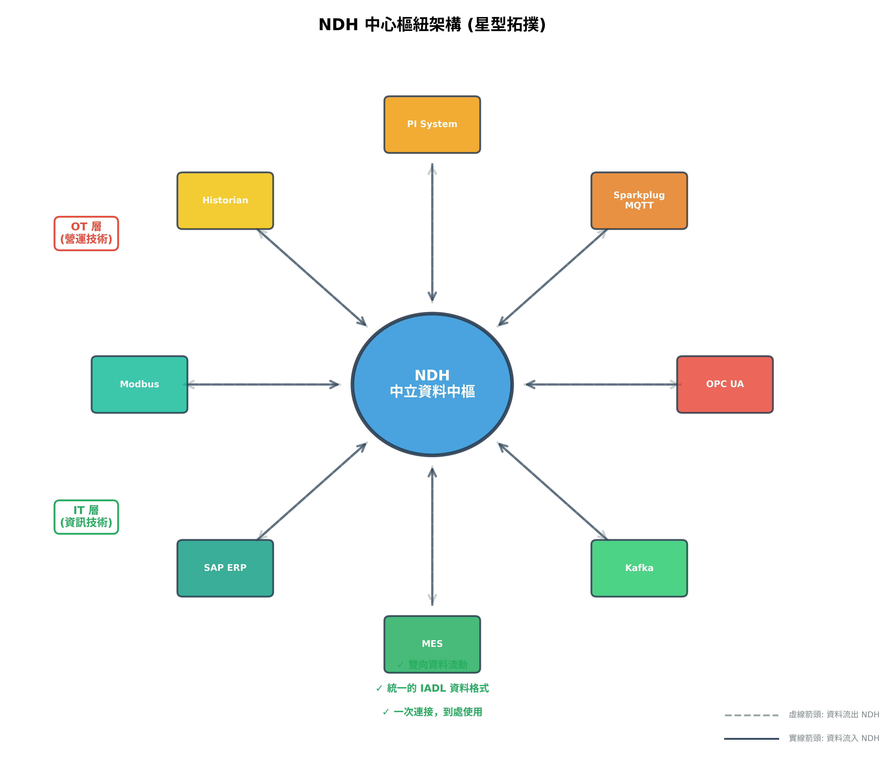
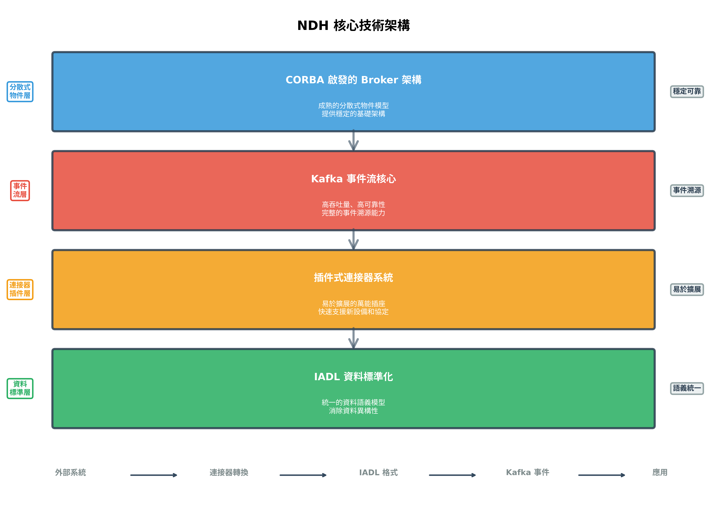
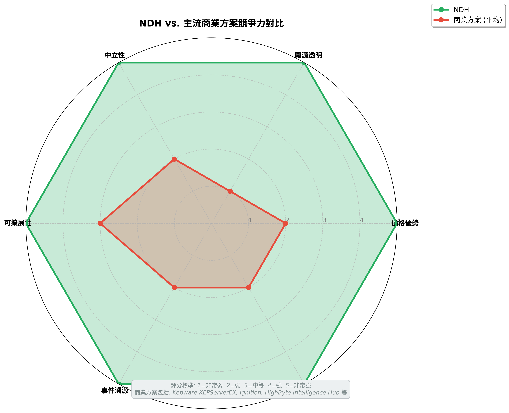

# IADL 與 NDH 技術簡報

**版本**: 2.0.0  
**日期**: 2025-10-10

---

## 第二頁: 工業 4.0 的資料挑戰

### 核心問題: 資料孤島

- **系統異構**: PLC, SCADA, MES, ERP... 來自不同廠商
- **協定專有**: Modbus, Profinet, OPC UA, MQTT...
- **整合複雜**: 點對點整合,成本高昂
- **供應商鎖定**: 難以更換或升級

---

## 第三頁: 我們的解決方案: NDH + IADL

### 核心理念: 中立資料中樞

- **IADL**: 統一的工業資產資料語言
- **NDH**: 連接所有系統的中央神經系統

### 核心價值: 一次連接,到處使用

---

## 第四頁: NDH 核心技術架構

### 四大技術支柱

1. **CORBA 啟發的 Broker 架構**
2. **Kafka 事件流核心**
3. **插件式連接器系統**
4. **IADL 資料標準化**

---

## 第五頁: 廣泛的系統整合能力

| 類別 | 系統/協定 | 狀態 |
|---|---|---|
| **OT** | OPC UA | ✅ |
| | Sparkplug (MQTT) | ✅ |
| | PI System | ✅ |
| | AVEVA Historian | ✅ |
| | Modbus TCP | ✅ |
| **IT** | SAP ERP | ✅ |
| | MES (通用) | ✅ |
| | Kafka | ✅ |
| **Digital Twins** | NVIDIA Omniverse | ✅ |

---

## 第六頁: 競爭力分析

### NDH vs. 主流商業方案

| 特性 | NDH | 商業方案 |
|---|---|---|
| **價格** | 🟢 免費 | 🔴 昂貴 |
| **開源** | 🟢 是 | 🔴 否 |
| **中立性** | 🟢 高 | 🔴 低 |
| **可擴展性** | 🟢 高 | 🟡 中 |
| **事件溯源** | 🟢 是 | 🟡 部分 |
| **資料主權** | 🟢 完全掌控 | 🔴 依賴廠商 |

---

## 第七頁: 典型應用場景

- **智慧製造**: 工廠數位分身,即時監控
- **預測性維護**: 設備資料分析,預測故障
- **能源管理**: 能源消耗監控,優化效率
- **品質追溯**: 追溯生產過程,定位問題

---

## 第八頁: 實施路線圖

- **短期 (1-3 個月)**: 建立核心模型,整合關鍵系統
- **中期 (3-6 個月)**: 擴展連接器,建立數位分身 POC
- **長期 (6-12 個月)**: 建立插件市場,整合 AI/ML

---

## 第九頁: 總結與展望

### NDH 的核心價值

- **開放**: 開源、中立、可擴展
- **高效**: 事件驅動、即時響應
- **標準**: IADL 統一資料模型

### 未來展望

- **AI/ML 整合**: 賦能智慧決策
- **邊緣計算**: 實現邊緣智慧
- **生態系統**: 建立活躍的開發者社群

---

## 第十頁: 聯絡我們

- **GitHub**: [https://github.com/chchlin1018/NDH-Win-Test1](https://github.com/chchlin1018/NDH-Win-Test1)
- **作者**: 林志錚 (Chih-Cheng Lin, Michael Lin)

