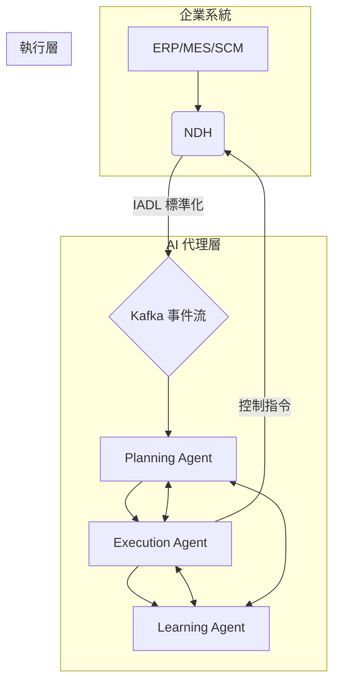

# IADL+NDH 與 AI/AGI 整合技術願景白皮書

## 文件資訊

- **標題**: IADL+NDH 與 AI/AGI 整合技術願景白皮書
- **版本**: 1.0
- **日期**: 2025-10-10
- **作者**: NDH 開發團隊

---

## 目錄

1. [執行摘要](#執行摘要)
2. [工業 4.0 的終極挑戰: 從自動化到自主化](#工業-40-的終極挑戰-從自動化到自主化)
3. [奠定基石: IADL+NDH - AI 的理想資料基礎設施](#奠定基石-iadlndh---ai-的理想資料基礎設施)
4. [第一階段: 工業 AI (Narrow AI) - 智慧優化](#第一階段-工業-ai-narrow-ai---智慧優化)
5. [第二階段: 代理 AI (Agentic AI) - 自主決策](#第二階段-代理-ai-agentic-ai---自主決策)
6. [最終願景: 通用人工智慧 (AGI) - 完全自主工廠](#最終願景-通用人工智慧-agi---完全自主工廠)
7. [技術實現路線圖](#技術實現路線圖)
8. [結論: 構建工業的未來](#結論-構建工業的未來)

---

## 1. 執行摘要

本白皮書闡述了 IADL (工業資產資料語言) 和 NDH (中立資料中樞) 如何與人工智慧 (AI) 和通用人工智慧 (AGI) 結合,逐步實現從自動化到完全自主化的工業革命。我們提出了一個三階段的發展路徑:

1.  **工業 AI (Narrow AI)**: 利用 IADL+NDH 提供的標準化資料,實現預測性維護、視覺品質檢測和能源優化等特定任務的智慧化。
2.  **代理 AI (Agentic AI)**: 建立在 NDH 之上的 AI 代理,能夠自主進行生產調度、供應鏈管理等複雜決策。
3.  **通用人工智慧 (AGI)**: 最終實現完全自主的工廠,AGI 通過 IADL 理解工廠的完整語義,通過 NDH 感知和控制整個工廠,實現自我優化和持續學習。

IADL+NDH 不僅是解決當前工業資料問題的方案,更是通往未來智慧製造和 AGI 時代的關鍵基礎設施。

---

## 2. 工業 4.0 的終極挑戰: 從自動化到自主化

工業 4.0 已經取得了顯著的進展,但我們仍然面臨著從「自動化」到「自主化」的巨大鴻溝。目前的挑戰包括:

- **資料孤島**: 系統異構、協定專有,導致資料無法有效利用。
- **上下文缺失**: 原始資料缺乏語義,AI 模型難以理解其真實含義。
- **決策瓶頸**: 依賴人類專家進行決策,響應速度慢,且難以實現全局最優。
- **高昂的 AI 實施成本**: 每個 AI 專案都需要大量的資料清洗、特徵工程和客製化開發。

要實現真正的自主化,我們需要一個能夠讓 AI 理解和操作物理世界的「作業系統」。

---

## 3. 奠定基石: IADL+NDH - AI 的理想資料基礎設施

IADL+NDH 正是為了解決上述挑戰而設計的,它為 AI 提供了理想的資料基礎設施:

| 組件 | 角色 | 為 AI 提供的價值 |
|---|---|---|
| **IADL** | **通用語言** | **語義理解**: 提供豐富的上下文,讓 AI 理解資料的真實含義,而不僅僅是數字。 |
| **NDH** | **中央神經系統** | **統一存取**: 提供單一的、標準化的介面,讓 AI 感知和控制所有工業系統。 |
| **Kafka** | **事件記憶** | **完整記憶**: 提供完整的、不可變的歷史記錄,讓 AI 進行根因分析、模擬和學習。 |

**IADL+NDH 將混亂的工業資料轉化為 AI 可以理解和利用的結構化知識。**

---

## 4. 第一階段: 工業 AI (Narrow AI) - 智慧優化

這是整合的初級階段,專注於解決特定領域的問題。

### 架構

```mermaid
graph TD
    subgraph 工業現場
        A[感測器/設備] -->|OPC UA, PI, Modbus| B(NDH)
    end
    subgraph 雲端/邊緣
        B -->|IADL 標準化| C{Kafka 事件流}
        C --> D[AI 模型 (LSTM, CNN, XGBoost)]
        D --> E[預測/檢測/優化結果]
        E --> F(應用系統 MES/CMMS)
    end
```

### 應用場景

1.  **預測性維護**: 準確率 > 95%, 減少非計劃停機 50%。
2.  **視覺品質檢測**: 準確率 > 99%, 檢測速度提高 10 倍。
3.  **能源優化**: 節省能源成本 10-20%。

### 核心價值

- **加速 AI 落地**: 標準化的資料大大減少了資料準備時間。
- **提高模型效能**: 豐富的語義資訊提高了模型的準確性和泛化能力。
- **可擴展性**: AI 應用可以輕鬆擴展到不同的設備和產線。

---

## 5. 第二階段: 代理 AI (Agentic AI) - 自主決策

這是整合的中級階段,AI 從「工具」進化為「代理」,能夠自主進行複雜決策。

### 架構



### 應用場景

1.  **自主生產調度**: AI 代理根據訂單、產能、物料和維護計畫,自主制定和調整生產計畫,設備利用率提高 20%。
2.  **智慧供應鏈管理**: AI 代理自主進行需求預測、採購決策和物流優化,庫存成本降低 30%。

### 核心價值

- **決策自動化**: 將複雜的、需要人類經驗的決策過程自動化。
- **全局最優**: AI 代理能夠考慮更多變數,實現全局最優,而非局部最優。
- **快速響應**: 7x24 小時不間斷監控和調整,快速響應市場變化。

---

## 6. 最終願景: 通用人工智慧 (AGI) - 完全自主工廠

這是整合的終極願景,AGI 接管整個工廠的運營。

### 架構: AGI 作為工廠的「大腦」

```mermaid
graph TD
    subgraph AGI 大腦
        A[AGI Core]
    end
    subgraph 感知與執行 (NDH)
        B(NDH)
    end
    subgraph 知識與記憶 (IADL + Kafka)
        C(IADL 語義模型)
        D(Kafka 事件記憶)
    end
    subgraph 物理世界
        E(工廠所有系統)
    end
    
    A <-->|感知/控制| B
    A <-->|理解/推理| C
    A <-->|學習/回溯| D
    B <--> E
```

### AGI 的工作模式: OODA 循環

1.  **觀察 (Observe)**: AGI 通過 NDH 即時感知工廠的所有狀態。
2.  **判斷 (Orient)**: AGI 結合 IADL 語義模型和 Kafka 歷史記憶,理解當前狀態的上下文和意義。
3.  **決策 (Decide)**: AGI 根據高層次的業務目標 (如利潤最大化),推理並生成最優的行動計畫。
4.  **行動 (Act)**: AGI 通過 NDH 向工廠的所有系統發送控制指令,執行行動計畫。

這個循環不斷重複,AGI 持續學習和優化,最終實現完全自主的工廠運營。

### 核心價值

- **完全自主**: 人類只需設定目標,AGI 自主完成所有工作。
- **自我優化**: AGI 持續學習,不斷提高效率、品質和安全性。
- **極致效率**: 停機時間和缺陷率趨近於零,資源利用率趨近於 100%。
- **創新加速**: AGI 可以自主進行實驗和創新,開發新的產品和製程。

---

## 7. 技術實現路線圖

| 階段 | 時間框架 | 核心任務 | 關鍵技術 |
|---|---|---|---|
| **第一階段** | 6-12 個月 | 完善 NDH 連接器生態,建立 AI 插件 | LSTM, CNN, XGBoost, TensorFlow, PyTorch |
| **第二階段** | 1-2 年 | 開發 Agentic AI 框架,建立決策模型 | LangChain, LLM (GPT-4), Agent Executor |
| **第三階段** | 3-5 年 | 建立 AGI 整合介面,完善 IADL 語義模型 | AGI Core, Knowledge Graph, Causal Inference |

---

## 8. 結論: 構建工業的未來

IADL+NDH 與 AI/AGI 的整合不是遙不可及的夢想,而是一個清晰、可行的技術演進路徑。通過奠定堅實的資料基礎,我們可以逐步釋放 AI 的潛力,從解決特定問題到實現自主決策,最終邁向完全自主的智慧製造時代。

IADL+NDH 不僅僅是一個技術平台,它是構建未來工業的基石。我們邀請所有開發者、合作夥伴和行業專家加入我們,共同打造這個激動人心的未來。

---

**文件版本**: 1.0  
**最後更新**: 2025-10-10  
**下一次審查**: 2026-04-01
