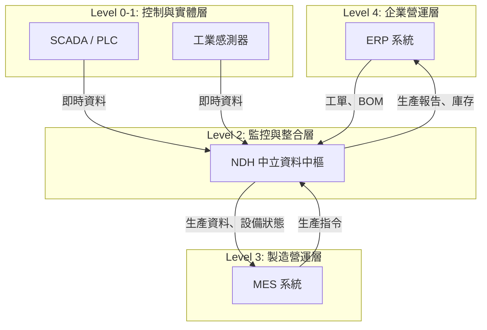
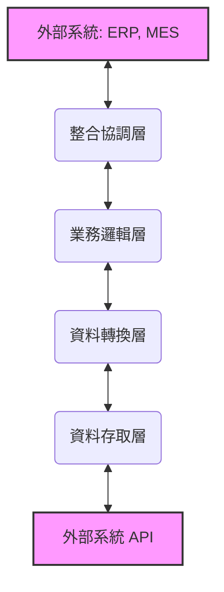
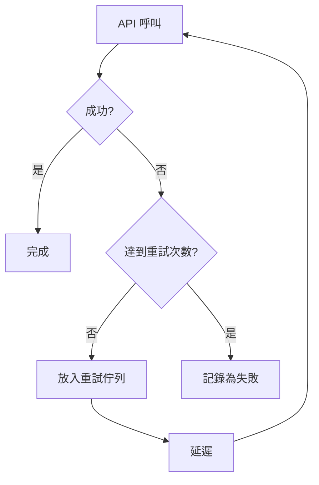

# NDH 與 MES/ERP 系統整合指南

**版本**: 1.0.0  
**最後更新**: 2025-10-10

## 目錄

1.  [**簡介**](#1-簡介)
    1.1. [目的](#11-目的)
    1.2. [讀者對象](#12-讀者對象)
    1.3. [NDH 在整合中的角色](#13-ndh-在整合中的角色)
2.  [**整合架構**](#2-整合架構)
    2.1. [ISA-95 標準](#21-isa-95-標準)
    2.2. [NDH 整合架構](#22-ndh-整合架構)
    2.3. [核心元件](#23-核心元件)
3.  [**連接器實作**](#3-連接器實作)
    3.1. [統一連接器介面](#31-統一連接器介面)
    3.2. [支援的系統](#32-支援的系統)
    3.3. [通用 REST 連接器](#33-通用-rest-連接器)
4.  [**設定與配置**](#4-設定與配置)
    4.1. [連接器管理器](#41-連接器管理器)
    4.2. [SAP ERP 連接器配置](#42-sap-erp-連接器配置)
    4.3. [通用 REST 連接器配置](#43-通用-rest-連接器配置)
5.  [**使用範例：端到端整合流程**](#5-使用範例端到端整合流程)
    5.1. [場景描述](#51-場景描述)
    5.2. [步驟 1: 設定環境](#52-步驟-1-設定環境)
    5.3. [步驟 2: 從 ERP 同步工單](#53-步驟-2-從-erp-同步工單)
    5.4. [步驟 3: 工單釋放到 MES](#54-步驟-3-工單釋放到-mes)
    5.5. [步驟 4: 模擬設備生產與資料收集](#55-步驟-4-模擬設備生產與資料收集)
    5.6. [步驟 5: MES 更新生產進度](#56-步驟-5-mes-更新生產進度)
    5.7. [步驟 6: 工單完成並回報 ERP](#57-步驟-6-工單完成並回報-erp)
6.  [**資料映射**](#6-資料映射)
    6.1. [資料轉換層](#61-資料轉換層)
    6.2. [映射規則設定](#62-映射規則設定)
7.  [**錯誤處理與日誌**](#7-錯誤處理與日誌)
    7.1. [連接器錯誤處理](#71-連接器錯誤處理)
    7.2. [交易重試機制](#72-交易重試機制)
    7.3. [結構化日誌](#73-結構化日誌)
8.  [**附錄**](#8-附錄)
    8.1. [參考文件](#81-參考文件)

---

## 1. 簡介

### 1.1. 目的

本指南旨在提供一個全面性的技術說明,闡述如何使用 **NDH (Neutral Data Hub)** 作為中介平台,實現企業資源規劃 (ERP) 系統與製造執行系統 (MES) 之間的無縫整合。本文件將涵蓋從架構設計、連接器實作、系統配置到完整的端到端使用範例,協助開發者與系統整合商快速上手。

### 1.2. 讀者對象

本文件主要適用於以下讀者:

*   **軟體架構師**: 負責設計企業級系統整合方案。
*   **開發工程師**: 負責實作和維護連接器與整合邏輯。
*   **系統整合商**: 需要將 NDH 導入客戶現有 IT/OT 環境的專業人員。
*   **技術顧問**: 提供製造業數位轉型諮詢的專家。

### 1.3. NDH 在整合中的角色

在傳統的點對點整合中,企業的 IT 系統 (如 ERP) 與 OT 系統 (如 MES、SCADA) 之間存在巨大的鴻溝。NDH 的目標是作為一個**中立的資料中樞**,彌合這道鴻溝,其扮演的角色如下:

*   **統一資料模型**: NDH 提供基於 IADL (Industrial Asset Data Language) 的統一資產模型,將來自不同系統的異質資料轉換為標準格式。
*   **事件驅動中樞**: 透過整合 Kafka,NDH 將所有系統互動轉化為事件流,提供事件溯源、資料重播與非同步處理的能力。
*   **連接器框架**: 提供一個可擴展的連接器框架,用於快速開發與各種企業和工業系統的連接。
*   **業務邏輯抽象**: 將複雜的整合邏輯從端點系統中抽離,集中在 NDH 的業務邏輯層進行管理,降低系統耦合度。

下圖展示了 NDH 在企業系統整合中的核心定位:



## 2. 整合架構

### 2.1. ISA-95 標準

NDH 的整合架構嚴格遵循 **ISA-95 (ANSI/ISA-95)** 標準,該標準定義了企業系統與控制系統之間的整合模型。透過分層定義,ISA-95 確保了資訊流在企業各層級之間的清晰界定。

| 層級 | 名稱 | 典型系統 | NDH 扮演角色 |
| :--- | :--- | :--- | :--- |
| **Level 4** | 企業資源規劃 | ERP, SCM | 資料交換端點 |
| **Level 3** | 製造執行系統 | MES, LIMS | 資料交換端點 |
| **Level 2** | 監控與控制 | SCADA, HMI | **核心中樞與資料整合平台** |
| **Level 1** | 程序控制 | PLC, DCS | 資料來源 |
| **Level 0** | 實體程序 | 感測器, 致動器 | 資料來源 |

### 2.2. NDH 整合架構

NDH 採用了分層的軟體架構,以實現高度的模組化和可擴展性。每一層都專注於特定的職責,並透過定義良好的介面與其他層互動。



*   **整合協調層**: 負責協調不同系統之間的完整業務流程,例如從 ERP 接收工單,下發到 MES,再將 MES 的生產結果回報給 ERP。
*   **業務邏輯層**: 處理核心的業務規則和狀態管理,例如工單的生命週期管理 (建立、釋放、執行、完成)。
*   **資料轉換層**: 負責將不同系統的資料格式轉換為 NDH 統一的內部格式,反之亦然。這是實現「中立」資料中樞的關鍵。
*   **資料存取層**: 封裝了與外部系統 API (REST, SOAP, OData, RFC) 互動的底層細節。

### 2.3. 核心元件

此架構由以下幾個核心元件組成:

*   **企業連接器 (Enterprise Connector)**: 實作與特定 ERP 或 MES 系統通訊的邏輯,是資料存取層和轉換層的具體實現。
*   **整合協調器 (Integration Orchestrator)**: 位於協調層,用於編排跨系統的業務流程。
*   **工單管理器 (Work Order Manager)**: 位於業務邏輯層,負責管理工單的狀態和生命週期。
*   **事件匯流排 (Event Bus)**: 基於 Kafka 實現,所有元件之間的互動都透過發布/訂閱事件來完成,實現了系統的解耦和非同步處理。

## 3. 連接器實作

### 3.1. 統一連接器介面

為了標準化與不同企業系統的互動,NDH 定義了一個統一的 `EnterpriseConnector` 抽象基礎類別。所有特定系統的連接器都必須實作此介面。

```python
class EnterpriseConnector(ABC):
    """企業系統連接器基礎類別"""

    @abstractmethod
    async def connect(self) -> bool:
        """建立與目標系統的連接"""
        pass

    @abstractmethod
    async def get_production_orders(self, **kwargs) -> List[Dict]:
        """從系統中獲取生產訂單"""
        pass

    @abstractmethod
    async def report_production_completion(self, completion_data: Dict) -> bool:
        """向系統回報生產完成情況"""
        pass

    @abstractmethod
    async def report_material_consumption(self, consumption_data: Dict) -> bool:
        """向系統回報物料消耗"""
        pass

    # ... 其他必要的介面方法
```

### 3.2. 支援的系統

NDH 內建了對多種主流企業系統的連接器支援:

| 系統類型 | 系統名稱 | 連接器類型 | 整合方式 |
| :--- | :--- | :--- | :--- |
| **ERP** | SAP ERP (ECC, S/4HANA) | `SAPERPConnector` | BAPI/RFC, OData |
| **ERP** | Microsoft Dynamics 365 | `Dynamics365Connector` | OData v4.0 |
| **MES** | Siemens Opcenter | `OpcenterMESConnector` | REST API |
| **MES** | Rockwell FactoryTalk | `RockwellMESConnector` | REST API, .NET SDK |
| **通用** | 任何提供 REST API 的系統 | `GenericRESTConnector` | REST API |

### 3.3. 通用 REST 連接器

對於未內建專用連接器的系統,只要該系統提供 REST API,就可以使用 `GenericRESTConnector` 進行整合。此連接器透過外部 JSON 設定檔來定義 API 端點和欄位映射,無需撰寫任何程式碼即可快速完成整合。

**特性**:

*   **配置驅動**: 所有 API 細節和資料映射都在設定檔中定義。
*   **多種認證**: 支援 Basic Auth, Bearer Token, API Key 等多種認證方式。
*   **彈性映射**: 支援巢狀欄位的映射和簡單的資料轉換。

---
*本文件後續章節將提供詳細的配置和使用範例。*


_Continued from previous part..._

## 4. 設定與配置

### 4.1. 連接器管理器

`ConnectorManager` 負責管理所有已配置的連接器實例。您需要將從設定檔中讀取的連接器配置實例化,並將它們添加到管理器中。

```python
import json

# 讀取連接器配置
with open("connectors.json", "r") as f:
    connector_configs = json.load(f)

# 建立連接器管理器
manager = ConnectorManager()

# 建立並新增連接器
for config in connector_configs:
    connector = ConnectorFactory.create_from_config(config)
    manager.add_connector(connector)

# 非同步連接所有連接器
await manager.connect_all()
```

### 4.2. SAP ERP 連接器配置

若要連接 SAP ERP,您需要提供 RFC 或 OData 的連接參數。以下是使用 RFC (BAPI) 的配置範例:

```json
{
  "connector_type": "sap_erp",
  "connector_id": "sap_main_plant",
  "use_odata": false,
  "host": "sap.example.com",
  "system_number": "00",
  "client": "100",
  "username": "RFC_USER",
  "password": "your_password"
}
```

### 4.3. 通用 REST 連接器配置

通用 REST 連接器的配置更為複雜,因为它需要定義所有 API 的細節。這提供了極大的靈活性。

```json
{
  "connector_type": "generic_rest",
  "connector_id": "custom_mes_system",
  "system_type": "MES",
  "base_url": "https://mes-api.example.com/api/v2",
  "auth_type": "apikey",
  "auth": {
    "header_name": "X-API-Key",
    "api_key": "your-secret-api-key"
  },
  "endpoints": {
    "get_orders": "/jobs",
    "create_order": "/jobs",
    "report_completion": "/jobs/{order_id}/complete"
  },
  "field_mappings": {
    "production_order": {
      "order_id": "jobId",
      "product_id": "partNumber",
      "quantity": "targetQuantity"
    }
  }
}
```

## 5. 使用範例：端到端整合流程

本節將展示一個完整的端到端整合場景,從 ERP 接收工單,到 MES 執行,再將結果回報給 ERP。

### 5.1. 場景描述

1.  **ERP 系統** (SAP) 建立了一張新的生產訂單。
2.  **NDH** 定期輪詢 ERP,發現此新訂單,並在內部建立一個對應的工單。
3.  NDH 將此工單**釋放**到 **MES 系統** (Siemens Opcenter)。
4.  工廠中的**設備**開始生產,並透過 OPC UA 將生產計數回報給 **NDH**。
5.  NDH 將即時產量更新到 **MES**。
6.  當工單完成後,NDH 自動將完成狀態和最終產量回報給 **ERP**。

### 5.2. 步驟 1: 設定環境

此步驟涉及實例化所有必要的元件,包括連接器、管理器和協調器。

```python
import asyncio

async def main():
    # 1. 建立連接器
    erp_connector = ConnectorFactory.create_from_config(sap_config)
    mes_connector = ConnectorFactory.create_from_config(opcenter_config)

    # 2. 建立工單管理器和整合協調器
    work_order_manager = WorkOrderManager()
    orchestrator = IntegrationOrchestrator(
        erp_connector=erp_connector,
        mes_connector=mes_connector,
        ndh_broker=None,  # 簡化範例,不涉及 NDH Broker
        work_order_manager=work_order_manager
    )

    # 3. 連接所有外部系統
    await erp_connector.connect()
    await mes_connector.connect()

    # ... 後續步驟
```

### 5.3. 步驟 2: 從 ERP 同步工單

協調器定期呼叫 `sync_from_erp` 方法,從 ERP 獲取新的生產訂單。

```python
# 在協調器中
async def sync_from_erp(self):
    # 從 ERP 取得新的生產訂單
    orders = await self.erp_connector.get_production_orders(status="CRTD")

    for order in orders:
        # 轉換為 NDH 工單
        work_order = self._transform_erp_order_to_ndh(order)
        # 在 NDH 中建立工單
        self.work_order_manager.create_work_order(work_order)
```

### 5.4. 步驟 3: 工單釋放到 MES

當 NDH 內部工單建立後,會觸發一個 `WORK_ORDER_CREATED` 事件。協調器監聽此事件,並將工單釋放到 MES。

```python
# 在協調器中,註冊事件處理器
def _register_event_handlers(self):
    self.work_order_manager.register_event_handler(
        EventType.WORK_ORDER_CREATED,
        self._handle_work_order_created
    )

# 事件處理器邏輯
async def _handle_work_order_created(self, event: ProductionEvent):
    work_order = event.data['work_order']
    # 將工單資料發送到 MES
    mes_job = await self.mes_connector.create_job(work_order)
    # 更新 NDH 工單,記錄 MES 的作業 ID
    self.work_order_manager.update_work_order(
        work_order['work_order_id'],
        {'mes_job_id': mes_job['job_id']}
    )
```

### 5.5. 步驟 4: 模擬設備生產與資料收集

此步驟模擬來自設備層的資料。在實際應用中,這將由 NDH 的 OPC UA 或其他工業協定連接器處理。

```python
# 模擬設備回報產量
async def simulate_device_production(work_order_manager, order_id, quantity):
    print(f"設備回報: 工單 {order_id} 生產了 {quantity} 件")
    # 呼叫工單管理器的報工方法
    work_order_manager.report_production(
        work_order_id=order_id,
        quantity=quantity
    )

# 模擬生產過程
await simulate_device_production(work_order_manager, "WO-1000001", 50)
await asyncio.sleep(5) # 模擬生產間隔
await simulate_device_production(work_order_manager, "WO-1000001", 50)
```

### 5.6. 步驟 5: MES 更新生產進度

當 NDH 收到設備產量時,會觸發 `PRODUCTION_REPORTED` 事件,協調器將此資訊同步到 MES。

```python
# 在協調器中,處理生產報告事件
async def _handle_production_reported(self, event: ProductionEvent):
    # 將生產數量報告給 MES
    await self.mes_connector.report_production(event.data)
```

### 5.7. 步驟 6: 工單完成並回報 ERP

當 `report_production` 方法發現工單的已完成數量達到目標數量時,它會自動將工單狀態設置為 `COMPLETED`,並觸發 `WORK_ORDER_COMPLETED` 事件。協調器監聽此事件,並將最終結果回報給 ERP。

```python
# 在協調器中,處理工單完成事件
async def _handle_work_order_completed(self, event: ProductionEvent):
    work_order = self.work_order_manager.get_work_order(event.work_order_id)
    # 將完成情況報告給 ERP
    await self.erp_connector.report_production_completion({
        "order_id": work_order.erp_order_id,
        "completed_quantity": work_order.completed_quantity,
        "actual_end": work_order.actual_end.isoformat()
    })
```

## 6. 資料映射

### 6.1. 資料轉換層

資料映射是整合的核心挑戰之一。NDH 的**資料轉換層** (`DataTransformer`) 專門用於處理此問題。它允許您定義宣告式的轉換規則,將任何來源格式的資料轉換為 NDH 的標準 IADL 格式。

### 6.2. 映射規則設定

映射規則可以在外部 JSON 檔案中定義,並在連接器初始化時載入。

```json
{
  "sap_erp_to_ndh": {
    "production_order": [
      { "source": "AUFNR", "target": "order_id" },
      { "source": "MATNR", "target": "product_id" },
      { "source": "GAMNG", "target": "quantity", "transform": "to_float" },
      { "source": "GSTRP", "target": "scheduled_start", "transform": "sap_date_to_iso" }
    ]
  },
  "ndh_to_opcenter_mes": {
    "job": [
      { "source": "work_order_id", "target": "Name" },
      { "source": "product_id", "target": "Product" },
      { "source": "quantity", "target": "Qty" }
    ]
  }
}
```

## 7. 錯誤處理與日誌

### 7.1. 連接器錯誤處理

每個連接器都應實作健全的錯誤處理機制,包括:

*   **連接重試**: 在網路不穩定時自動重新連接。
*   **API 錯誤解析**: 解析 API 回應中的錯誤訊息,並將其記錄下來。
*   **逾時處理**: 設定合理的 API 請求逾時時間。

### 7.2. 交易重試機制

對於關鍵的寫入操作 (如回報生產完成),NDH 應提供一個基於**訊息佇列**的重試機制。如果一次 API 呼叫失敗,該操作將被放入一個重試佇列中,並在稍後由背景工作程序重新執行,以保證資料的最終一致性。



### 7.3. 結構化日誌

所有整合活動都應被記錄為**結構化日誌** (例如,JSON 格式)。這使得日誌可以輕鬆地被傳輸到日誌分析平台 (如 ELK Stack 或 Splunk) 進行查詢、監控和告警。

一個典型的日誌條目可能如下所示:

```json
{
  "timestamp": "2025-10-10T10:30:00Z",
  "level": "INFO",
  "message": "Work order completion reported to ERP",
  "component": "IntegrationOrchestrator",
  "trace_id": "trace-xyz-123",
  "details": {
    "connector_id": "sap_main_plant",
    "erp_order_id": "1000001",
    "ndh_order_id": "WO-1000001",
    "completed_quantity": 100
  }
}
```

## 8. 附錄

### 8.1. 參考文件

*   [NDH 與 MES/ERP 系統整合需求分析](MES_ERP_REQUIREMENTS.md)
*   [NDH 與 MES/ERP 系統整合架構設計](MES_ERP_INTEGRATION_ARCHITECTURE.md)
*   [NDH MES/ERP 連接器實作](MES_ERP_CONNECTORS.md)

---

**作者**: 林志錚 Michael Lin(Chih Cheng Lin)(Chih Cheng Lin) (Chih-Cheng Lin, Michael Lin)  
**版權**: © 2025 版權所有

