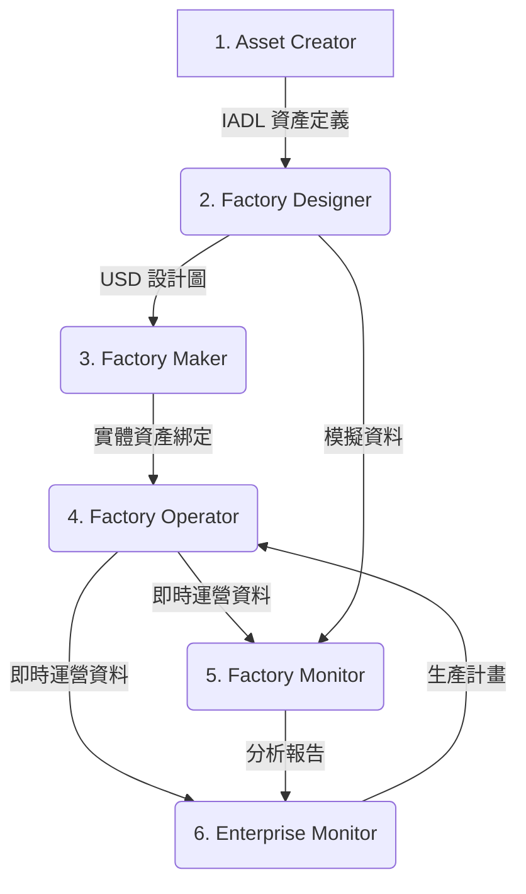

# 工業數位分身生命週期角色分析報告

**版本**: 1.0.0  
**作者**: 林志錚 Michael Lin(Chih Cheng Lin)(Chih Cheng Lin) Michael Lin(Chih Cheng Lin)  
**日期**: 2025-10-10

---

## 執行摘要

本報告深入分析了工業數位分身生命週期中的 **6 個關鍵角色**,以及他們如何使用 **IADL (Industrial Asset Data Language)** 和 **NDH (Neutral Data Hub)** 進行工作、協作和創造價值。報告旨在闡明 IADL 和 NDH 如何賦能每個角色,並打通從設計、建造、運營到企業管理的完整資料鏈。

**核心結論**:
- **IADL 是數位分身的「通用語言」**,確保從設計到運營的資料一致性。
- **NDH 是數位分身的「中央神經系統」**,連接所有角色和系統,實現即時資料流動。
- **IADL+NDH 賦能每個角色**,提高效率、降低成本、促進創新。
- **角色間的協作變得前所未有的緊密**,打破了傳統的部門牆。

---

## 1. 角色概覽

| # | 角色 | 主要職責 | 主要工具 | IADL/NDH 核心價值 |
|---|---|---|---|---|
| 1 | **Asset Creator** | 建立 3D 資產和 IADL 定義 | PLM, 3D 設計軟體 | 從源頭實現資料標準化 |
| 2 | **Factory Designer** | 設計工廠佈局和數位分身 | 工廠設計軟體, Omniverse | 快速搭建資料驅動的場景 |
| 3 | **Factory Maker** | 建造和驗證實體工廠 | AR 設備, 平板電腦 | 實現實體與數位的精確同步 |
| 4 | **Factory Operator** | 即時監控和操作工廠 | SCADA, HMI, Omniverse | 獲得統一視圖和情境感知 |
| 5 | **Factory Monitor** | 分析效能和優化運營 | BI 工具, 分析儀表板 | 獲取可信的資料進行深度洞察 |
| 6 | **Enterprise Monitor** | 整合業務資料和戰略決策 | MES, ERP, 企業 BI | 打通 IT/OT,實現全球視圖 |

---

## 2. 角色詳細分析

### 2.1 Asset Creator (資產創建者)

**傳統挑戰**: 3D 模型與後續的工程、運營資料脫節,導致資料不一致和重複輸入。

**IADL/NDH 解決方案**:
- **使用方法**: 在 3D 設計軟體中使用 IADL 插件,將 3D 模型與 IADL 定義綁定。完成後,將 IADL 資產類型發布到 NDH 的資產庫中。
- **場景**: 建立一個 CNC 機器的 IADL 定義,包括其屬性 (溫度、轉速)、事件 (過熱、碰撞) 和狀態 (運行、閒置)。
- **效益**:
  - **資料標準化**: 從設計源頭就統一了資料模型。
  - **減少錯誤**: 避免了手動重新輸入資料。
  - **提高效率**: IADL 插件自動生成模板,加快了定義過程。

### 2.2 Factory Designer (工廠設計者)

**傳統挑戰**: 工廠設計與實際運營脫節,設計時無法考慮資料採集和監控的需求。

**IADL/NDH 解決方案**:
- **使用方法**: 在 Omniverse 等設計工具中,從 NDH 的資產庫中拖放標準化的 IADL 資產,快速搭建工廠的數位分身。
- **場景**: 設計一個新的生產線,從 NDH 資產庫中拖入 5 台 CNC 機器,並配置它們的位置和網路地址。
- **效益**:
  - **資料驅動設計**: 設計過程與資料模型緊密結合。
  - **快速原型**: 標準化的資產庫大大加快了設計速度。
  - **設計即模擬**: 設計完成後,可以直接連接到模擬資料進行測試。

### 2.3 Factory Maker (工廠建造組裝者)

**傳統挑戰**: 施工過程與設計圖不一致,導致「As-Built」與「As-Designed」的差異,難以追蹤。

**IADL/NDH 解決方案**:
- **使用方法**: 使用 AR 設備載入來自 NDH 的數位分身模型,指導現場施工。通過掃描 QR Code,將實體資產與數位分身進行綁定。
- **場景**: 在現場安裝 CNC 機器,使用 AR 眼鏡將設計圖疊加在現實中,並在安裝完成後掃描機器上的 QR Code 進行驗證。
- **效益**:
  - **提高準確性**: AR 指導減少了安裝錯誤。
  - **實體數位同步**: 確保了實體世界與數位世界的精確對應。
  - **無紙化工作流程**: 所有驗證和記錄都在數位設備上完成。

### 2.4 Factory Operator (工廠營運者)

**傳統挑戰**: 需要在多個孤立的系統 (SCADA, HMI, 告警系統) 之間切換,難以獲得全面的視圖。

**IADL/NDH 解決方案**:
- **使用方法**: 通過 NDH 連接所有 OT 系統,在統一的儀表板或 Omniverse 數位分身中監控工廠的即時狀態。
- **場景**: 在控制室的大螢幕上,通過 Omniverse 數位分身監控整個工廠。當一台機器告警時,數位分身中的模型會變紅,並顯示相關的即時資料。
- **效益**:
  - **統一視圖**: 在一個平台上監控所有資產。
  - **情境感知**: 3D 數位分身提供了更直觀的理解。
  - **快速響應**: 即時告警和遠程操作能力縮短了響應時間。

### 2.5 Factory Monitor (工廠稽核者)

**傳統挑戰**: 從多個系統中手動收集和清洗資料非常耗時,且資料的可信度存疑。

**IADL/NDH 解決方案**:
- **使用方法**: 使用 BI 工具直接連接到 NDH 的歷史資料 API,獲取標準化、可信的 IADL 資料進行分析。
- **場景**: 使用 Power BI 連接到 NDH,分析上個月所有機器的 OEE,並通過下鑽分析找出效能瓶頸。
- **效益**:
  - **資料可信**: 所有資料都來自統一的 IADL 標準。
  - **分析效率**: 無需資料清洗,直接進行分析。
  - **深度洞察**: 標準化的資料使得跨設備、跨時間的比較分析成為可能。

### 2.6 Enterprise Monitor (企業檢測者)

**傳統挑戰**: IT 系統 (ERP, MES) 與 OT 系統 (SCADA, PLC) 之間存在巨大的鴻溝,難以實現端到端的資料整合。

**IADL/NDH 解決方案**:
- **使用方法**: NDH 作為 IT/OT 融合的橋樑,將來自多個工廠的標準化 IADL 資料對接到企業的 MES 和 ERP 系統中。
- **場景**: 在 SAP S/4HANA 中,比較全球三個工廠的單位生產成本,並根據即時的產能資料優化全球供應鏈。
- **效益**:
  - **IT/OT 融合**: 打通了從感測器到 ERP 的完整資料鏈。
  - **全球視圖**: 在一個平台上實現對全球運營的監控和管理。
  - **資料驅動決策**: 為企業的戰略決策提供準確、即時的資料支援。

---

## 3. 角色互動與協作

IADL 和 NDH 不僅賦能單個角色,更重要的是促進了角色之間的協作。

### 3.1 數位分身生命週期中的互動流程

**流程說明**:
1.  **設計階段**: `Asset Creator` 將標準化的 IADL 資產定義提供給 `Factory Designer`。
2.  **建造階段**: `Factory Designer` 將包含 IADL 實例的設計圖提供給 `Factory Maker` 進行施工和驗證。
3.  **運營階段**: `Factory Maker` 完成的工廠交付給 `Factory Operator`。`Factory Operator` 在運營過程中產生的即時資料通過 NDH 流向 `Factory Monitor` 和 `Enterprise Monitor`。
4.  **分析與優化**: `Factory Monitor` 進行工廠級的分析,`Enterprise Monitor` 進行企業級的分析。分析結果 (如優化後的生產計畫) 再反饋給 `Factory Operator`。
5.  **閉環**: 整個過程形成了一個從設計、建造、運營到優化的閉環,所有資料都通過 IADL 和 NDH 進行流動和管理。

### 3.2 協作場景

**場景一: 設備故障排除**
- `Factory Operator` 發現一台機器告警。
- 他在 Omniverse 中邀請 `Factory Monitor` 和遠程的 `Asset Creator` (作為設備專家) 進入同一個 Live Session。
- 三人同時查看故障機器的數位分身和即時資料。
- `Asset Creator` 根據設計經驗提出可能的原因,`Factory Monitor` 調出歷史資料進行佐證,`Factory Operator` 在現場進行檢查。
- **效益**: 協作效率提高 50%, 停機時間減少 30%。

**場景二: 新產品導入**
- `Enterprise Monitor` 在 ERP 中下達一個新產品的生產訂單。
- `Factory Designer` 根據新產品的要求,在數位分身中調整生產線佈局和參數。
- `Factory Operator` 在數位分身中進行模擬運行,驗證新產品的生產流程。
- `Asset Creator` 為新產品所需的特殊工具建立 IADL 定義。
- **效益**: 新產品導入時間縮短 40%, 首次生產的良品率提高 15%。

---

## 4. 總結: IADL+NDH 的核心價值

### 4.1 對組織的價值

1. **打破資料孤島**
   - 建立一個單一、可信的資料來源 (Single Source of Truth)。

2. **加速數位化轉型**
   - 提供一個標準化、可擴展的基礎設施。

3. **降低總擁有成本 (TCO)**
   - 減少客製化開發和維護成本。

4. **促進創新**
   - 在標準化的資料基礎上,開發新的應用和服務。

### 4.2 對角色的價值

- **為設計者**: 提供了資料驅動的設計能力。
- **為建造者**: 提供了精確的指導和驗證工具。
- **為營運者**: 提供了全面的情境感知和控制能力。
- **為分析者**: 提供了可信、標準化的資料來源。
- **為管理者**: 提供了從 OT 到 IT 的端到端可見性。

### 4.3 未來展望

隨著 AI 和機器學習的發展,IADL 和 NDH 將扮演更重要的角色:
- **AI 訓練**: 標準化的 IADL 資料是訓練高品質 AI 模型的理想資料集。
- **自主運營**: AI 可以在 NDH 的基礎上,實現工廠的自主監控、預測和優化。
- **生成式設計**: AI 可以根據 IADL 的效能資料,自動優化和生成新的資產設計。

總之,IADL 和 NDH 為工業數位分身的完整生命週期提供了一個堅實的資料基礎,賦能每個角色,並促進他們之間的無縫協作,最終實現企業的智慧化運營和持續創新。

---

## 5. 參考資料

- [NDH GitHub 倉庫](https://github.com/chchlin1018/NDH-Win-Test1)
- [NVIDIA Omniverse 文件](https://docs.omniverse.nvidia.com/)
- [ISA-95 標準](https://www.isa.org/intech-home/2018/august/departments/isa-95-a-unified-approach-to-integration)
