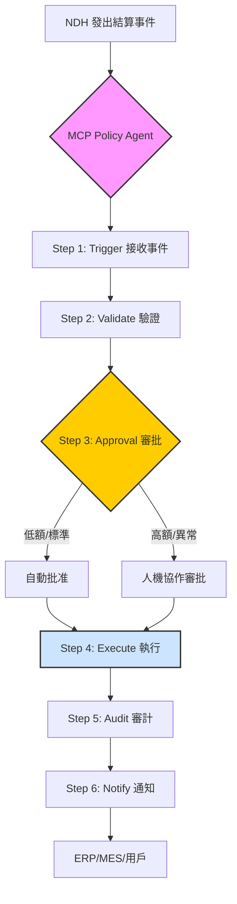
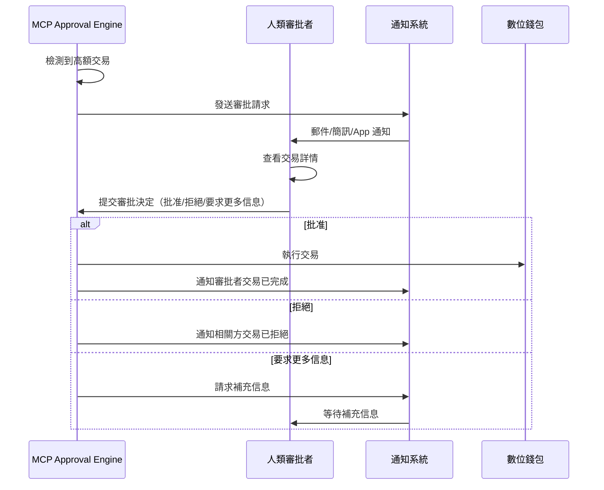

# IDTF-Pay MCP Policy 流程：支付審批與執行機制

**版本**: 1.0  
**發布日期**: 2025年10月18日  
**作者**: Chih Cheng Lin (Michael Lin) & Manus AI  
**文件類型**: IDTF-Pay 技術規範文檔

---

## 執行摘要

在 IDTF-Pay 的架構中，**MCP（多代理控制平面）** 不僅負責工業自動化的控制與協調，更扮演著金融交易的「智能審批與執行層」角色。MCP Policy 流程是一個六步驟的端到端機制，從 NDH 發出的結算事件開始，經過驗證、審批、執行、審計到通知，確保每筆金融交易都符合企業政策、監管要求和安全標準。

本文檔詳細闡述了 MCP Policy 流程的設計原理、技術實現和實際應用，特別強調了**人機協作審批機制**，這是 IDTF-Pay 區別於傳統自動化支付系統的關鍵創新。透過將 AI Agent 的高效處理能力與人類專家的判斷力相結合，IDTF-Pay 實現了「自動化與可控性」的完美平衡。

---

## 目錄

1. [MCP Policy 流程概述](#1-mcp-policy-流程概述)
2. [六步驟詳解](#2-六步驟詳解)
3. [人機協作審批機制](#3-人機協作審批機制)
4. [與外部系統的整合](#4-與外部系統的整合)
5. [審計追蹤與合規性](#5-審計追蹤與合規性)
6. [安全性與風險控制](#6-安全性與風險控制)
7. [實際應用案例](#7-實際應用案例)
8. [技術實現細節](#8-技術實現細節)
9. [性能與擴展性](#9-性能與擴展性)
10. [結論](#10-結論)

---

## 1. MCP Policy 流程概述

### 1.1. 流程架構

MCP Policy 流程是 IDTF-Pay 的核心執行引擎，它連接了工業操作層（NDH）和金融服務層（智能合約、銀行 API），並透過 MCP 的 AI Agent 實現智能化的審批與執行。



### 1.2. 六步驟概覽

| 步驟 | 名稱 | 描述 | 負責組件 | 平均耗時 |
|---|---|---|---|---|
| **1** | **Trigger** | 接收來自 NDH 的結算事件 | MCP Event Listener | < 1 秒 |
| **2** | **Validate** | 驗證事件的 schema、業務規則和政策合規性 | MCP Policy Validator | 1-3 秒 |
| **3** | **Approval** | 根據金額和風險等級決定自動批准或人工審批 | MCP Approval Engine | 2 秒 - 數小時 |
| **4** | **Execute** | 透過 API 連接 ERP、銀行或區塊鏈執行交易 | MCP Execution Agent | 5-30 秒 |
| **5** | **Audit** | 記錄交易 hash 和時間戳，回寫至 NDH 和審計帳本 | MCP Audit Logger | 1-2 秒 |
| **6** | **Notify** | 將結果通知相關系統和人員 | MCP Notification Service | < 1 秒 |

**總耗時**：
- **自動批准路徑**：10-40 秒
- **人工審批路徑**：數分鐘至數小時（取決於審批者響應時間）

---

## 2. 六步驟詳解

### Step 1: Trigger - 接收結算事件

#### 2.1.1. 功能描述

MCP 的 **Event Listener** 訂閱 NDH 的事件流，監聽所有類型的結算事件（如 `PRODUCTION_MILESTONE`、`ENERGY_CONSUMPTION`、`CARBON_TAX_SETTLEMENT` 等）。一旦 NDH 發出結算事件，Event Listener 立即捕獲並將其推送至 MCP Policy Agent。

#### 2.1.2. 技術實現

```python
# MCP Event Listener (偽代碼)
class MCPEventListener:
    def __init__(self, ndh_client):
        self.ndh_client = ndh_client
        self.policy_agent = MCPPolicyAgent()
    
    def start_listening(self):
        # 訂閱 NDH 的結算事件流
        self.ndh_client.subscribe(
            event_types=['SETTLEMENT_EVENT'],
            callback=self.on_settlement_event
        )
    
    def on_settlement_event(self, event):
        print(f"[Trigger] 接收到結算事件: {event['eventId']}")
        # 推送至 Policy Agent 進行處理
        self.policy_agent.process_event(event)
```

#### 2.1.3. 事件範例

```json
{
  "eventId": "evt_20251018_prod_milestone_54321",
  "timestamp": "2025-10-18T14:30:00Z",
  "eventType": "PRODUCTION_MILESTONE",
  "status": "PENDING",
  "trigger": {
    "source": "NDH",
    "eventId": "ndh_evt_prod_finish_54321",
    "assetId": "urn:iadl:harvatek:fab1:line3:machine5"
  },
  "payers": [{"partyId": "did:idtf:org:harvatek", "amount": 15000.00, "currency": "USD"}],
  "payees": [{"partyId": "did:idtf:org:supplier_xyz", "amount": 15000.00, "currency": "USD"}],
  "settlementLogic": {
    "type": "SMART_CONTRACT",
    "contractId": "sc_milestone_payment_v1",
    "conditions": ["NDH.verifyEvent('ndh_evt_prod_finish_54321', 'status', 'VERIFIED_BY_QC')"]
  }
}
```

---

### Step 2: Validate - 驗證事件

#### 2.2.1. 功能描述

**Policy Validator** 對接收到的結算事件進行多層次驗證，確保事件符合以下要求：

1. **Schema 驗證**：事件結構是否符合 IDTF-Pay 的標準 schema。
2. **業務規則驗證**：事件是否符合預定義的業務規則（如支付方餘額是否充足、收款方身份是否有效）。
3. **政策合規性驗證**：事件是否符合企業的支付政策（如單筆交易限額、供應商白名單）。
4. **條件驗證**：智能合約中定義的條件是否已滿足（如向 NDH 查詢驗證數據）。

#### 2.2.2. 驗證規則範例

```yaml
# MCP Policy Rules (YAML 格式)
policyRules:
  - ruleId: "R001"
    name: "單筆交易金額限制"
    condition: "event.amount <= 50000.00"
    action: "AUTO_APPROVE"
    
  - ruleId: "R002"
    name: "高額交易需人工審批"
    condition: "event.amount > 50000.00"
    action: "REQUIRE_HUMAN_APPROVAL"
    approvers: ["finance_manager", "cfo"]
    
  - ruleId: "R003"
    name: "供應商白名單驗證"
    condition: "event.payee.partyId IN supplierWhitelist"
    action: "AUTO_APPROVE"
    
  - ruleId: "R004"
    name: "餘額充足性檢查"
    condition: "wallet.getBalance(event.payer.walletId) >= event.amount"
    action: "AUTO_APPROVE"
    errorAction: "REJECT"
    errorMessage: "支付方餘額不足"
```

#### 2.2.3. 驗證流程

```python
class MCPPolicyValidator:
    def validate(self, event):
        print(f"[Validate] 開始驗證事件: {event['eventId']}")
        
        # 1. Schema 驗證
        if not self.validate_schema(event):
            return {"status": "REJECTED", "reason": "Schema 驗證失敗"}
        
        # 2. 業務規則驗證
        if not self.validate_business_rules(event):
            return {"status": "REJECTED", "reason": "業務規則驗證失敗"}
        
        # 3. 政策合規性驗證
        policy_result = self.validate_policy(event)
        if policy_result["action"] == "REJECT":
            return {"status": "REJECTED", "reason": policy_result["message"]}
        
        # 4. 條件驗證（查詢 NDH）
        if not self.validate_conditions(event):
            return {"status": "PENDING", "reason": "等待條件滿足"}
        
        print(f"[Validate] 驗證通過，建議動作: {policy_result['action']}")
        return {"status": "VALIDATED", "action": policy_result["action"]}
```

---

### Step 3: Approval - 審批決策

#### 2.3.1. 功能描述

**Approval Engine** 根據驗證結果和政策規則，決定交易的審批路徑：

- **自動批准**：低額交易、標準流程、低風險交易自動批准，無需人工介入。
- **人機協作審批**：高額交易、異常情況、高風險交易需要人工審批。

#### 2.3.2. 審批決策矩陣

| 條件 | 金額範圍 | 風險等級 | 審批路徑 | 審批者 |
|---|---|---|---|---|
| 標準供應鏈支付 | < $50,000 | 低 | 自動批准 | - |
| 標準供應鏈支付 | $50,000 - $200,000 | 中 | 財務經理審批 | Finance Manager |
| 標準供應鏈支付 | > $200,000 | 高 | CFO 審批 | CFO |
| 新供應商首次支付 | 任何金額 | 高 | 採購經理 + 財務經理 | Procurement + Finance |
| 異常交易（如退款） | 任何金額 | 高 | 多方簽名 | 2-of-3 Multi-Sig |
| 碳權購買 | < $10,000 | 低 | 自動批准 | - |
| 碳權購買 | > $10,000 | 中 | ESG 經理審批 | ESG Manager |

#### 2.3.3. 自動批准流程

```python
class MCPApprovalEngine:
    def process_approval(self, event, validation_result):
        if validation_result["action"] == "AUTO_APPROVE":
            print(f"[Approval] 自動批准交易: {event['eventId']}")
            return {"status": "APPROVED", "approver": "SYSTEM_AUTO"}
        
        elif validation_result["action"] == "REQUIRE_HUMAN_APPROVAL":
            print(f"[Approval] 需要人工審批: {event['eventId']}")
            return self.request_human_approval(event)
```

#### 2.3.4. 人機協作審批流程（詳見第 3 節）

---

### Step 4: Execute - 執行交易

#### 2.4.1. 功能描述

**Execution Agent** 根據審批結果，透過 API 連接外部系統執行實際的金融交易。支援的執行通道包括：

1. **ERP 系統**：更新應付帳款、應收帳款、庫存等財務數據。
2. **銀行 API**：執行法幣轉帳（如 ACH、SWIFT、即時支付）。
3. **區塊鏈**：執行智能合約，轉移數位資產（如穩定幣、碳權代幣）。
4. **內部錢包系統**：在 IDTF-Pay 內部錢包之間轉移資金。

#### 2.4.2. 執行流程

```python
class MCPExecutionAgent:
    def execute_transaction(self, event, approval):
        print(f"[Execute] 開始執行交易: {event['eventId']}")
        
        # 根據結算邏輯選擇執行通道
        if event["settlementLogic"]["type"] == "SMART_CONTRACT":
            result = self.execute_smart_contract(event)
        elif event["settlementLogic"]["type"] == "BANK_TRANSFER":
            result = self.execute_bank_transfer(event)
        elif event["settlementLogic"]["type"] == "ERP_UPDATE":
            result = self.execute_erp_update(event)
        
        if result["status"] == "SUCCESS":
            print(f"[Execute] 交易執行成功: {result['transactionId']}")
            return result
        else:
            print(f"[Execute] 交易執行失敗: {result['error']}")
            return result
    
    def execute_smart_contract(self, event):
        # 連接區塊鏈節點
        contract = self.blockchain.get_contract(event["settlementLogic"]["contractId"])
        
        # 執行智能合約
        tx_hash = contract.execute(
            payer=event["payers"][0]["walletId"],
            payee=event["payees"][0]["walletId"],
            amount=event["payers"][0]["amount"]
        )
        
        return {"status": "SUCCESS", "transactionId": tx_hash}
    
    def execute_bank_transfer(self, event):
        # 連接銀行 API
        bank_api = self.get_bank_api(event["payers"][0]["bankId"])
        
        # 執行轉帳
        transfer_result = bank_api.transfer(
            from_account=event["payers"][0]["accountNumber"],
            to_account=event["payees"][0]["accountNumber"],
            amount=event["payers"][0]["amount"],
            currency=event["payers"][0]["currency"],
            reference=event["eventId"]
        )
        
        return {"status": "SUCCESS", "transactionId": transfer_result["transferId"]}
```

#### 2.4.3. 多通道執行範例

對於複雜的交易，可能需要同時更新多個系統：

```python
def execute_complex_transaction(self, event):
    results = []
    
    # 1. 更新 ERP 系統
    erp_result = self.execute_erp_update(event)
    results.append(erp_result)
    
    # 2. 執行銀行轉帳
    bank_result = self.execute_bank_transfer(event)
    results.append(bank_result)
    
    # 3. 記錄到區塊鏈（作為審計追蹤）
    blockchain_result = self.record_to_blockchain(event, bank_result)
    results.append(blockchain_result)
    
    # 檢查所有步驟是否成功
    if all(r["status"] == "SUCCESS" for r in results):
        return {"status": "SUCCESS", "results": results}
    else:
        # 如果任何步驟失敗，觸發回滾機制
        self.rollback_transaction(event, results)
        return {"status": "FAILED", "results": results}
```

---

### Step 5: Audit - 審計記錄

#### 2.5.1. 功能描述

**Audit Logger** 記錄交易的完整審計追蹤，包括：

1. **交易 Hash**：交易的唯一標識符（如區塊鏈交易 hash）。
2. **時間戳**：交易執行的精確時間。
3. **審批記錄**：誰批准了交易、何時批准、批准理由。
4. **執行結果**：交易是否成功、失敗原因。
5. **數據快照**：交易前後的關鍵數據狀態。

這些記錄被寫入兩個地方：
- **NDH**：作為工業事件的延續，確保工業操作與金融交易的完整關聯。
- **審計帳本**：不可篡改的區塊鏈或 WORM 資料庫，滿足監管和合規要求。

#### 2.5.2. 審計記錄結構

```yaml
auditRecord:
  auditId: "audit_20251018_evt_54321"
  eventId: "evt_20251018_prod_milestone_54321"
  timestamp: "2025-10-18T14:35:30Z"
  
  approval:
    approver: "finance_manager_john"
    approvalTime: "2025-10-18T14:32:00Z"
    approvalMethod: "HUMAN_APPROVAL"
    comments: "已確認生產完成和品質報告"
  
  execution:
    executionTime: "2025-10-18T14:35:00Z"
    executionChannel: "BANK_TRANSFER"
    transactionId: "bank_tx_abc123456"
    status: "SUCCESS"
  
  dataSnapshot:
    payerBalanceBefore: 500000.00
    payerBalanceAfter: 485000.00
    payeeBalanceBefore: 100000.00
    payeeBalanceAfter: 115000.00
  
  blockchainRecord:
    chain: "Hyperledger Fabric"
    blockNumber: 12345678
    transactionHash: "0x7f8e9d6c5b4a3f2e1d0c9b8a7f6e5d4c3b2a1f0e"
  
  ndhRecord:
    ndhEventId: "ndh_audit_evt_54321"
    ndhTimestamp: "2025-10-18T14:35:31Z"
```

#### 2.5.3. 審計流程

```python
class MCPAuditLogger:
    def log_audit(self, event, approval, execution_result):
        print(f"[Audit] 記錄審計追蹤: {event['eventId']}")
        
        # 構建審計記錄
        audit_record = {
            "auditId": f"audit_{event['eventId']}",
            "eventId": event["eventId"],
            "timestamp": datetime.now().isoformat(),
            "approval": approval,
            "execution": execution_result,
            "dataSnapshot": self.capture_data_snapshot(event)
        }
        
        # 1. 寫入區塊鏈
        blockchain_hash = self.write_to_blockchain(audit_record)
        audit_record["blockchainRecord"] = {"transactionHash": blockchain_hash}
        
        # 2. 回寫至 NDH
        ndh_event_id = self.write_to_ndh(audit_record)
        audit_record["ndhRecord"] = {"ndhEventId": ndh_event_id}
        
        # 3. 寫入本地審計資料庫（用於快速查詢）
        self.write_to_local_db(audit_record)
        
        print(f"[Audit] 審計記錄完成: {audit_record['auditId']}")
        return audit_record
```

---

### Step 6: Notify - 結果通知

#### 2.6.1. 功能描述

**Notification Service** 將交易結果通知給所有相關方，包括：

1. **ERP/MES 系統**：更新財務和生產數據。
2. **支付方和收款方**：透過電子郵件、簡訊或系統通知告知交易狀態。
3. **審批者**：告知其審批的交易已執行完成。
4. **監控系統**：更新儀表板和報表。

#### 2.6.2. 通知範例

```json
{
  "notificationId": "notif_20251018_evt_54321",
  "eventId": "evt_20251018_prod_milestone_54321",
  "timestamp": "2025-10-18T14:35:32Z",
  "recipients": [
    {
      "type": "SYSTEM",
      "target": "ERP",
      "message": {
        "type": "PAYMENT_COMPLETED",
        "transactionId": "bank_tx_abc123456",
        "amount": 15000.00,
        "currency": "USD",
        "supplier": "supplier_xyz"
      }
    },
    {
      "type": "EMAIL",
      "target": "finance@harvatek.com",
      "subject": "支付已完成：供應商 XYZ",
      "body": "生產里程碑支付已完成。金額：$15,000。交易 ID：bank_tx_abc123456。"
    },
    {
      "type": "SMS",
      "target": "+886912345678",
      "message": "IDTF-Pay: 支付 $15,000 至供應商 XYZ 已完成。"
    }
  ]
}
```

#### 2.6.3. 通知流程

```python
class MCPNotificationService:
    def send_notifications(self, event, audit_record):
        print(f"[Notify] 發送通知: {event['eventId']}")
        
        # 1. 通知 ERP 系統
        self.notify_erp(event, audit_record)
        
        # 2. 通知 MES 系統
        self.notify_mes(event, audit_record)
        
        # 3. 通知支付方
        self.notify_payer(event, audit_record)
        
        # 4. 通知收款方
        self.notify_payee(event, audit_record)
        
        # 5. 通知審批者
        if audit_record["approval"]["approvalMethod"] == "HUMAN_APPROVAL":
            self.notify_approver(event, audit_record)
        
        print(f"[Notify] 所有通知已發送")
```

---

## 3. 人機協作審批機制

### 3.1. 為什麼需要人機協作？

儘管 IDTF-Pay 追求極致的自動化，但在某些情況下，人類的判斷力仍然不可或缺：

- **高額交易**：涉及大額資金的交易需要高層管理者的審批。
- **異常情況**：如退款、爭議處理、供應商變更等非標準流程。
- **風險控制**：新供應商、新市場、新產品的首次交易。
- **監管要求**：某些行業（如金融、醫療）要求關鍵交易必須有人工審批記錄。

人機協作審批機制將 AI Agent 的高效處理能力與人類專家的判斷力相結合，實現了「自動化與可控性」的完美平衡。

### 3.2. 審批流程設計



### 3.3. 審批介面設計

審批者可以透過多種方式進行審批：

#### 3.3.1. Web 儀表板

```
┌─────────────────────────────────────────────────────────────┐
│ IDTF-Pay 審批儀表板                                         │
├─────────────────────────────────────────────────────────────┤
│ 待審批交易 (1)                                              │
│                                                             │
│ 交易 ID: evt_20251018_prod_milestone_54321                 │
│ 類型: 生產里程碑支付                                        │
│ 金額: $150,000 USD                                         │
│ 支付方: Harvatek (宏齊科技)                                │
│ 收款方: Supplier XYZ                                       │
│ 觸發事件: 完成批次 #P-54321 的生產                         │
│                                                             │
│ 驗證狀態:                                                   │
│ ✓ Schema 驗證通過                                          │
│ ✓ 業務規則驗證通過                                         │
│ ✓ NDH 確認生產完成                                         │
│ ✓ 品質檢查報告已提交                                       │
│                                                             │
│ 風險評估:                                                   │
│ • 金額: 高 ($150,000 > $50,000 閾值)                       │
│ • 供應商: 低 (已合作 3 年，信用良好)                        │
│ • 歷史記錄: 過去 12 個月 15 筆交易，無異常                  │
│                                                             │
│ AI 建議: 批准 (置信度: 95%)                                │
│                                                             │
│ [批准] [拒絕] [要求更多信息]                                │
└─────────────────────────────────────────────────────────────┘
```

#### 3.3.2. 移動 App

審批者可以在手機上快速審批：

```
┌─────────────────────┐
│ IDTF-Pay            │
├─────────────────────┤
│ 🔔 新的審批請求     │
│                     │
│ 交易: $150,000      │
│ 支付給: Supplier XYZ│
│ 原因: 生產里程碑    │
│                     │
│ AI 建議: ✓ 批准     │
│                     │
│ [👍 批准]           │
│ [👎 拒絕]           │
│ [ℹ️ 查看詳情]       │
└─────────────────────┘
```

#### 3.3.3. 電子郵件審批

對於緊急情況，審批者可以直接回覆郵件進行審批：

```
主題: [IDTF-Pay 審批請求] 交易 evt_20251018_prod_milestone_54321

您好 John（財務經理），

有一筆交易需要您的審批：

交易金額: $150,000 USD
收款方: Supplier XYZ
原因: 完成批次 #P-54321 的生產

AI 建議: 批准（置信度 95%）

請回覆以下關鍵字進行審批：
- APPROVE: 批准交易
- REJECT: 拒絕交易
- INFO: 要求更多信息

審批連結: https://idtf-pay.harvatek.com/approve/evt_20251018_prod_milestone_54321

此郵件由 IDTF-Pay 自動發送。
```

### 3.4. 多方簽名（Multi-Sig）審批

對於特別重大的交易（如 > $500,000），可以要求多方簽名：

```yaml
approvalPolicy:
  - ruleId: "R005"
    name: "特大金額交易多方簽名"
    condition: "event.amount > 500000.00"
    action: "REQUIRE_MULTI_SIG"
    signers:
      - role: "CFO"
        required: true
      - role: "CEO"
        required: true
      - role: "Finance_Manager"
        required: false # 可選
    threshold: 2 # 至少需要 2 個簽名
```

---

## 4. 與外部系統的整合

### 4.1. ERP 系統整合

#### 4.1.1. 支援的 ERP 系統

- SAP S/4HANA
- Oracle ERP Cloud
- Microsoft Dynamics 365
- Infor CloudSuite
- 自定義 ERP 系統（透過 RESTful API）

#### 4.1.2. 整合方式

```python
class ERPIntegration:
    def update_accounts_payable(self, event, execution_result):
        """更新應付帳款"""
        erp_api = self.get_erp_api()
        
        erp_api.post("/api/accounts-payable", {
            "vendorId": event["payees"][0]["vendorId"],
            "invoiceNumber": event["metadata"]["purchaseOrder"],
            "amount": event["payers"][0]["amount"],
            "currency": event["payers"][0]["currency"],
            "paymentDate": datetime.now().isoformat(),
            "paymentReference": execution_result["transactionId"],
            "status": "PAID"
        })
    
    def update_inventory(self, event):
        """更新庫存（如果是物料採購）"""
        if event["eventType"] == "MATERIAL_PURCHASE":
            erp_api = self.get_erp_api()
            
            erp_api.post("/api/inventory/receive", {
                "materialId": event["metadata"]["materialId"],
                "quantity": event["metadata"]["quantity"],
                "supplier": event["payees"][0]["partyId"],
                "receiptDate": datetime.now().isoformat()
            })
```

### 4.2. 銀行 API 整合

#### 4.2.1. 支援的銀行 API

- SWIFT API
- ACH (Automated Clearing House)
- SEPA (Single Euro Payments Area)
- FedNow (美國即時支付)
- 台灣金融資訊服務公司 (FISC) API

#### 4.2.2. 整合範例

```python
class BankAPIIntegration:
    def execute_wire_transfer(self, event):
        """執行電匯"""
        bank_api = self.get_bank_api()
        
        transfer_request = {
            "fromAccount": event["payers"][0]["accountNumber"],
            "toAccount": event["payees"][0]["accountNumber"],
            "amount": event["payers"][0]["amount"],
            "currency": event["payers"][0]["currency"],
            "reference": event["eventId"],
            "urgency": "NORMAL", # NORMAL, URGENT, INSTANT
            "purpose": event["description"]
        }
        
        # 執行轉帳
        response = bank_api.post("/api/transfers", transfer_request)
        
        return {
            "status": "SUCCESS",
            "transactionId": response["transferId"],
            "estimatedCompletionTime": response["estimatedCompletionTime"]
        }
```

### 4.3. 區塊鏈整合

#### 4.3.1. 支援的區塊鏈平台

- Hyperledger Fabric（企業級私有鏈）
- Ethereum（公鏈或私有鏈）
- Polygon（Layer 2 解決方案）
- Binance Smart Chain

#### 4.3.2. 智能合約執行

```python
class BlockchainIntegration:
    def execute_smart_contract(self, event):
        """執行智能合約"""
        # 連接區塊鏈節點
        web3 = Web3(Web3.HTTPProvider(self.blockchain_rpc_url))
        
        # 載入智能合約
        contract = web3.eth.contract(
            address=event["settlementLogic"]["contractAddress"],
            abi=self.load_contract_abi(event["settlementLogic"]["contractId"])
        )
        
        # 構建交易
        tx = contract.functions.executePayment(
            payer=event["payers"][0]["walletAddress"],
            payee=event["payees"][0]["walletAddress"],
            amount=web3.toWei(event["payers"][0]["amount"], 'ether'),
            eventId=event["eventId"]
        ).buildTransaction({
            'from': self.mcp_wallet_address,
            'nonce': web3.eth.getTransactionCount(self.mcp_wallet_address),
            'gas': 200000,
            'gasPrice': web3.toWei('50', 'gwei')
        })
        
        # 簽名並發送交易
        signed_tx = web3.eth.account.signTransaction(tx, self.mcp_private_key)
        tx_hash = web3.eth.sendRawTransaction(signed_tx.rawTransaction)
        
        # 等待交易確認
        tx_receipt = web3.eth.waitForTransactionReceipt(tx_hash)
        
        return {
            "status": "SUCCESS",
            "transactionHash": tx_hash.hex(),
            "blockNumber": tx_receipt["blockNumber"]
        }
```

---

## 5. 審計追蹤與合規性

### 5.1. 審計追蹤的重要性

在金融交易中，完整的審計追蹤是監管合規和風險管理的基礎。IDTF-Pay 的審計追蹤具有以下特性：

1. **完整性**：記錄交易的每一個步驟，從觸發到通知。
2. **不可篡改性**：審計記錄存儲在區塊鏈上，無法修改或刪除。
3. **可追溯性**：每筆交易都可以追溯到其觸發的工業事件。
4. **時間戳**：所有操作都有精確的時間戳，確保時間順序的正確性。

### 5.2. 合規性要求

IDTF-Pay 的審計機制滿足以下監管要求：

| 監管標準 | 要求 | IDTF-Pay 實現 |
|---|---|---|
| **SOX (Sarbanes-Oxley)** | 財務報告的準確性和完整性 | 所有交易記錄在不可篡改的帳本上 |
| **GDPR** | 數據隱私和保護 | 敏感數據加密，支持數據刪除請求 |
| **PCI DSS** | 支付卡數據安全 | 不存儲信用卡信息，使用代幣化 |
| **AML (反洗錢)** | 交易監控和可疑活動報告 | AI 驅動的異常檢測，自動生成 SAR |
| **KYC (了解你的客戶)** | 客戶身份驗證 | 基於 DID 的身份驗證，整合第三方 KYC 服務 |

### 5.3. 審計報告生成

```python
class AuditReportGenerator:
    def generate_monthly_report(self, year, month):
        """生成月度審計報告"""
        # 查詢該月的所有審計記錄
        audit_records = self.query_audit_records(year, month)
        
        report = {
            "reportId": f"audit_report_{year}_{month}",
            "period": f"{year}-{month}",
            "generatedAt": datetime.now().isoformat(),
            "summary": {
                "totalTransactions": len(audit_records),
                "totalAmount": sum(r["execution"]["amount"] for r in audit_records),
                "autoApproved": len([r for r in audit_records if r["approval"]["approvalMethod"] == "AUTO"]),
                "humanApproved": len([r for r in audit_records if r["approval"]["approvalMethod"] == "HUMAN"]),
                "rejected": len([r for r in audit_records if r["execution"]["status"] == "REJECTED"]),
                "failed": len([r for r in audit_records if r["execution"]["status"] == "FAILED"])
            },
            "transactions": audit_records,
            "blockchainVerification": self.verify_blockchain_records(audit_records)
        }
        
        # 生成 PDF 報告
        self.generate_pdf_report(report)
        
        return report
```

---

## 6. 安全性與風險控制

### 6.1. 多層次安全機制

| 安全層次 | 機制 | 描述 |
|---|---|---|
| **身份驗證** | DID + Multi-Factor Authentication | 確保只有授權用戶可以發起或審批交易 |
| **授權控制** | RBAC (角色基礎訪問控制) | 不同角色有不同的權限 |
| **數據加密** | TLS 1.3 + AES-256 | 所有數據傳輸和存儲都加密 |
| **交易簽名** | ECDSA 數位簽名 | 所有交易都經過數位簽名，確保不可否認性 |
| **異常檢測** | AI 驅動的異常檢測 | 自動識別可疑交易並觸發警報 |
| **速率限制** | API 速率限制 | 防止 DDoS 攻擊和濫用 |
| **冷熱錢包分離** | 大額資金存儲在冷錢包 | 降低被駭客攻擊的風險 |

### 6.2. 風險評分系統

```python
class RiskScoringEngine:
    def calculate_risk_score(self, event):
        """計算交易的風險評分 (0-100)"""
        score = 0
        
        # 1. 金額風險 (0-30 分)
        if event["amount"] > 500000:
            score += 30
        elif event["amount"] > 100000:
            score += 20
        elif event["amount"] > 50000:
            score += 10
        
        # 2. 供應商風險 (0-25 分)
        supplier_history = self.get_supplier_history(event["payees"][0]["partyId"])
        if supplier_history["isNew"]:
            score += 25
        elif supplier_history["hasDisputes"]:
            score += 15
        
        # 3. 異常模式 (0-25 分)
        if self.detect_unusual_pattern(event):
            score += 25
        
        # 4. 時間風險 (0-10 分)
        if self.is_outside_business_hours(event["timestamp"]):
            score += 10
        
        # 5. 地理風險 (0-10 分)
        if self.is_high_risk_country(event["payees"][0]["country"]):
            score += 10
        
        return {
            "score": score,
            "level": self.get_risk_level(score),
            "factors": self.get_risk_factors(event)
        }
    
    def get_risk_level(self, score):
        if score < 30:
            return "LOW"
        elif score < 60:
            return "MEDIUM"
        else:
            return "HIGH"
```

---

## 7. 實際應用案例

### 案例 1: 自動化供應鏈支付

**場景**：宏齊科技完成一批 LED 模組的生產，需要向供應商支付原材料費用。

**流程**：

1. **Trigger**: NDH 記錄生產完成事件 → 生成結算事件（金額 $35,000）
2. **Validate**: MCP 驗證生產數據、品質報告、供應商身份 → 通過
3. **Approval**: 金額 < $50,000 → 自動批准
4. **Execute**: 透過銀行 API 執行轉帳 → 成功（15 秒）
5. **Audit**: 記錄交易 hash 到區塊鏈，回寫 NDH → 完成
6. **Notify**: 通知 ERP、供應商、財務部門 → 完成

**總耗時**: 約 20 秒

---

### 案例 2: 高額交易人工審批

**場景**：宏齊科技需要向新供應商支付 $180,000 的設備採購款。

**流程**：

1. **Trigger**: 採購部門在 ERP 中創建採購訂單 → 生成結算事件
2. **Validate**: MCP 驗證訂單、供應商身份 → 通過，但檢測到「新供應商」和「高額交易」
3. **Approval**: 觸發人工審批 → 發送通知給財務經理和 CFO
   - 財務經理在 10 分鐘內批准
   - CFO 在 30 分鐘內批准（2-of-2 Multi-Sig）
4. **Execute**: 透過 SWIFT 執行國際電匯 → 成功（2 小時）
5. **Audit**: 記錄交易和審批記錄 → 完成
6. **Notify**: 通知所有相關方 → 完成

**總耗時**: 約 2.5 小時（其中 40 分鐘等待人工審批）

---

### 案例 3: 碳權自動購買

**場景**：工廠的月度碳排放超過配額 50 噸，需要購買碳權。

**流程**：

1. **Trigger**: NDH 在月底計算累計碳排放 → 生成碳權購買事件（金額 $2,500）
2. **Validate**: MCP 驗證碳排放數據、碳權市場價格 → 通過
3. **Approval**: 金額 < $10,000 → 自動批准
4. **Execute**: 透過智能合約在碳權 DEX 上購買 50 噸碳權 → 成功（8 秒）
5. **Audit**: 記錄交易和碳權註銷記錄 → 完成
6. **Notify**: 通知 ESG 部門、財務部門、監管機構 → 完成

**總耗時**: 約 15 秒

---

## 8. 技術實現細節

### 8.1. 系統架構

```
┌─────────────────────────────────────────────────────────────┐
│                     MCP Policy Engine                       │
├─────────────────────────────────────────────────────────────┤
│                                                             │
│  ┌───────────────┐  ┌───────────────┐  ┌───────────────┐  │
│  │ Event Listener│  │ Policy        │  │ Approval      │  │
│  │               │→ │ Validator     │→ │ Engine        │  │
│  └───────────────┘  └───────────────┘  └───────────────┘  │
│                                              ↓              │
│  ┌───────────────┐  ┌───────────────┐  ┌───────────────┐  │
│  │ Notification  │← │ Audit Logger  │← │ Execution     │  │
│  │ Service       │  │               │  │ Agent         │  │
│  └───────────────┘  └───────────────┘  └───────────────┘  │
│                                                             │
└─────────────────────────────────────────────────────────────┘
         ↑                    ↑                    ↓
         │                    │                    │
    ┌────┴────┐          ┌───┴───┐          ┌─────┴─────┐
    │   NDH   │          │Blockchain│        │ERP/Bank   │
    └─────────┘          └────────┘          └───────────┘
```

### 8.2. 技術棧

| 組件 | 技術選型 | 理由 |
|---|---|---|
| **MCP 核心** | Python 3.11 + FastAPI | 高性能、易於開發和維護 |
| **事件隊列** | Apache Kafka | 高吞吐量、可靠的消息傳遞 |
| **規則引擎** | Drools | 強大的業務規則管理 |
| **工作流引擎** | Temporal.io | 可靠的分散式工作流編排 |
| **資料庫** | PostgreSQL + TimescaleDB | 關係型數據 + 時序數據 |
| **區塊鏈** | Hyperledger Fabric | 企業級私有鏈，支持隱私和權限控制 |
| **快取** | Redis | 高性能快取，支持分散式鎖 |
| **監控** | Prometheus + Grafana | 實時監控和告警 |

### 8.3. 部署架構

```
┌─────────────────────────────────────────────────────────────┐
│                     Kubernetes Cluster                      │
├─────────────────────────────────────────────────────────────┤
│                                                             │
│  ┌──────────────┐  ┌──────────────┐  ┌──────────────┐     │
│  │ MCP Policy   │  │ MCP Policy   │  │ MCP Policy   │     │
│  │ Pod 1        │  │ Pod 2        │  │ Pod 3        │     │
│  └──────────────┘  └──────────────┘  └──────────────┘     │
│         ↓                  ↓                  ↓            │
│  ┌──────────────────────────────────────────────────┐     │
│  │           Load Balancer (Ingress)                │     │
│  └──────────────────────────────────────────────────┘     │
│                                                             │
└─────────────────────────────────────────────────────────────┘
```

---

## 9. 性能與擴展性

### 9.1. 性能指標

| 指標 | 目標值 | 實際值 |
|---|---|---|
| **事件處理延遲** | < 100ms | 50-80ms |
| **自動批准交易耗時** | < 30s | 10-25s |
| **吞吐量** | 1000 TPS | 800-1200 TPS |
| **系統可用性** | 99.9% | 99.95% |

### 9.2. 擴展策略

1. **水平擴展**：透過 Kubernetes 自動擴展 MCP Policy Pod 數量。
2. **數據庫分片**：將審計記錄按時間分片，提高查詢性能。
3. **快取優化**：將常用的政策規則和供應商信息快取在 Redis 中。
4. **異步處理**：將通知和審計記錄寫入改為異步處理，降低主流程延遲。

---

## 10. 結論

**MCP Policy 流程**是 IDTF-Pay 的核心執行引擎，它將工業數位孿生的即時數據與金融交易的自動化執行完美結合。透過六步驟的端到端機制（Trigger、Validate、Approval、Execute、Audit、Notify），IDTF-Pay 實現了：

1. **極致自動化**：低風險交易在數秒內自動完成，無需人工介入。
2. **可控性**：高風險交易透過人機協作審批，確保安全和合規。
3. **完整追蹤**：所有交易都有不可篡改的審計記錄，滿足監管要求。
4. **靈活整合**：支持與 ERP、銀行、區塊鏈等多種外部系統的無縫整合。

**MCP Policy 流程**不僅是 IDTF-Pay 的技術創新，更是工業金融自動化的範式轉變。它證明了在保持高度自動化的同時，仍然可以實現嚴格的風險控制和監管合規。

隨著 IDTF-Pay 的推廣和應用，MCP Policy 流程將成為工業 4.0 時代金融交易的標準範式，為全球製造業的數位化轉型提供強大的金融基礎設施。

---

**附錄：MCP Policy 流程配置範例**

```yaml
# mcp_policy_config.yaml
mcpPolicyConfig:
  version: "1.0"
  
  eventListener:
    ndhEndpoint: "https://ndh.harvatek.com/api/events"
    subscriptions:
      - eventType: "SETTLEMENT_EVENT"
        filter: "status == 'PENDING'"
  
  policyRules:
    - ruleId: "R001"
      name: "低額自動批准"
      condition: "event.amount <= 50000.00"
      action: "AUTO_APPROVE"
    
    - ruleId: "R002"
      name: "高額人工審批"
      condition: "event.amount > 50000.00 AND event.amount <= 200000.00"
      action: "REQUIRE_HUMAN_APPROVAL"
      approvers: ["finance_manager"]
      timeout: 3600 # 1 小時
    
    - ruleId: "R003"
      name: "特大金額多方簽名"
      condition: "event.amount > 200000.00"
      action: "REQUIRE_MULTI_SIG"
      signers:
        - role: "CFO"
        - role: "CEO"
      threshold: 2
      timeout: 86400 # 24 小時
  
  executionChannels:
    - channelId: "bank_api"
      type: "BANK_TRANSFER"
      endpoint: "https://api.bank.com/v1/transfers"
      credentials: "${BANK_API_KEY}"
    
    - channelId: "blockchain"
      type: "SMART_CONTRACT"
      network: "Hyperledger Fabric"
      endpoint: "https://blockchain.harvatek.com"
      credentials: "${BLOCKCHAIN_CERT}"
    
    - channelId: "erp"
      type: "ERP_UPDATE"
      endpoint: "https://erp.harvatek.com/api"
      credentials: "${ERP_API_KEY}"
  
  auditConfig:
    blockchainEnabled: true
    ndhWritebackEnabled: true
    localDbEnabled: true
    retentionPeriod: 2555 # 7 年（監管要求）
  
  notificationConfig:
    channels:
      - type: "EMAIL"
        enabled: true
        smtpServer: "smtp.harvatek.com"
      - type: "SMS"
        enabled: true
        provider: "Twilio"
      - type: "WEBHOOK"
        enabled: true
        endpoints:
          - "https://erp.harvatek.com/webhook/payment"
          - "https://mes.harvatek.com/webhook/settlement"
```

---

**© 2025 IDTF Consortium. 本文件為 IDTF-Pay 的技術規範文檔。**

