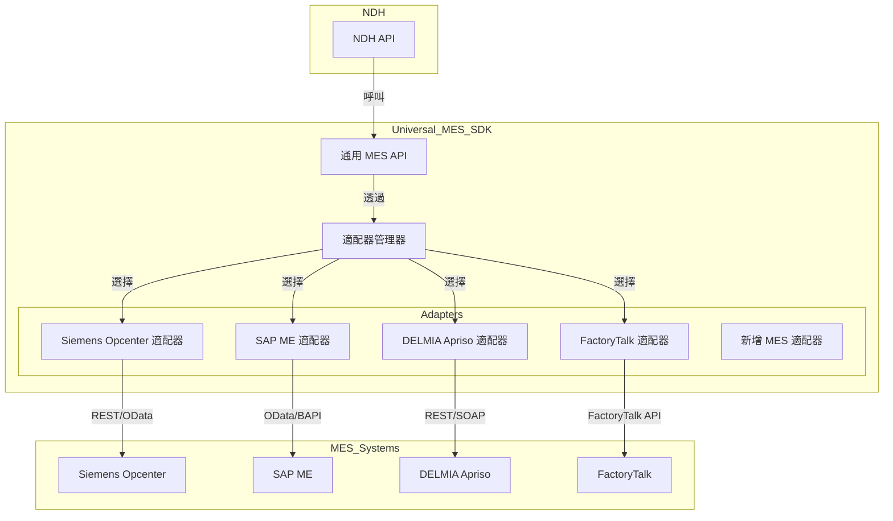

# 通用 MES SDK/API 介面架構

**作者**: Manus AI  
**日期**: 2025年10月14日  
**版本**: 1.0

---

## 1. 簡介

為了應對眾多 MES 品牌的整合挑戰,本文件設計了一個通用的 MES SDK/API 介面層,旨在標準化不同 MES 系統與 NDH 的整合,實現「一次開發,到處接入」的目標。

### 1.1 核心目標

1. **抽象化**: 提供一個統一的、與具體 MES 品牌無關的 API 介面。
2. **標準化**: 採用 ISA-95 標準作為數據模型的基礎。
3. **可擴展**: 透過「適配器模式」(Adapter Pattern) 輕鬆支援新的 MES 品牌。
4. **簡化整合**: 大大降低將新的 MES 系統接入 NDH 的開發成本和時間。

---

## 2. 系統架構

### 2.1 架構圖



### 2.2 核心組件

#### 1. 通用 MES API (Universal MES API)

- **職責**: 提供一組標準化的、與具體 MES 品牌無關的 API 介面,供 NDH 或其他應用程式呼叫。
- **技術**: 基於 RESTful 和 WebSocket 的 API 設計。

#### 2. 適配器管理器 (Adapter Manager)

- **職責**: 根據配置動態加載和管理不同的 MES 適配器。
- **技術**: 工廠模式 (Factory Pattern) 或依賴注入 (Dependency Injection)。

#### 3. MES 適配器 (MES Adapter)

- **職責**: 將通用 MES API 的呼叫轉換為特定 MES 系統的 API 呼叫,並處理數據格式的轉換。
- **技術**: 每個適配器都是一個獨立的模組,實現了統一的介面。

---


## 3. SDK API 規格與適配器模式

### 3.1 適配器介面 (Adapter Interface)

所有 MES 適配器都必須實現以下介面 (以 Python 為例):

```python
from abc import ABC, abstractmethod
from typing import List, Dict

class IMESAdapter(ABC):
    """通用 MES 適配器介面"""

    @abstractmethod
    def get_work_orders(self, plant: str, work_center: str) -> List[Dict]:
        """獲取生產工單"""
        pass

    @abstractmethod
    def get_work_order_details(self, work_order_id: str) -> Dict:
        """獲取工單詳情"""
        pass

    @abstractmethod
    def get_equipment_status(self, equipment_id: str) -> Dict:
        """獲取設備狀態"""
        pass

    @abstractmethod
    def confirm_production(self, confirmation: Dict) -> bool:
        """回傳生產確認"""
        pass

    @abstractmethod
    def subscribe_to_events(self, callback) -> None:
        """訂閱 MES 事件"""
        pass
```

### 3.2 通用 MES API

通用 MES API 將直接呼叫適配器的方法。

#### `GET /api/v1/mes/work-orders`

```python
@app.get("/api/v1/mes/work-orders")
def get_work_orders(plant: str, work_center: str):
    adapter = adapter_manager.get_adapter()
    return adapter.get_work_orders(plant, work_center)
```

#### `POST /api/v1/mes/confirmations`

```python
@app.post("/api/v1/mes/confirmations")
def confirm_production(confirmation: Dict):
    adapter = adapter_manager.get_adapter()
    success = adapter.confirm_production(confirmation)
    if success:
        return {"message": "Confirmation successful."}
    else:
        raise HTTPException(status_code=500, detail="Confirmation failed.")
```

### 3.3 適配器管理器 (Adapter Manager)

```python
class AdapterManager:
    def __init__(self, config):
        self.config = config
        self.adapters = {}
        self._load_adapters()

    def _load_adapters(self):
        # 從配置中動態加載適配器
        for adapter_config in self.config["adapters"]:
            adapter_name = adapter_config["name"]
            adapter_class = self._get_class(adapter_config["class"])
            self.adapters[adapter_name] = adapter_class(adapter_config["params"])

    def get_adapter(self, name: str = None) -> IMESAdapter:
        # 根據名稱獲取適配器,或返回預設適配器
        if name:
            return self.adapters.get(name)
        else:
            return next(iter(self.adapters.values()))

    def _get_class(self, class_name):
        # 動態導入類
        parts = class_name.split(".")
        module_name = ".".join(parts[:-1])
        class_name = parts[-1]
        module = __import__(module_name, fromlist=[class_name])
        return getattr(module, class_name)
```

### 3.4 配置文件 (config.yaml)

```yaml
mes:
  default_adapter: siemens
  adapters:
    - name: siemens
      class: adapters.siemens.SiemensOpcenterAdapter
      params:
        api_url: "https://siemens-mes.company.com/api"
        api_key: "secret_key"
    - name: sap
      class: adapters.sap.SAPMEAdapter
      params:
        odata_url: "https://sap-mes.company.com/odata"
        username: "user"
        password: "password"
```

---

