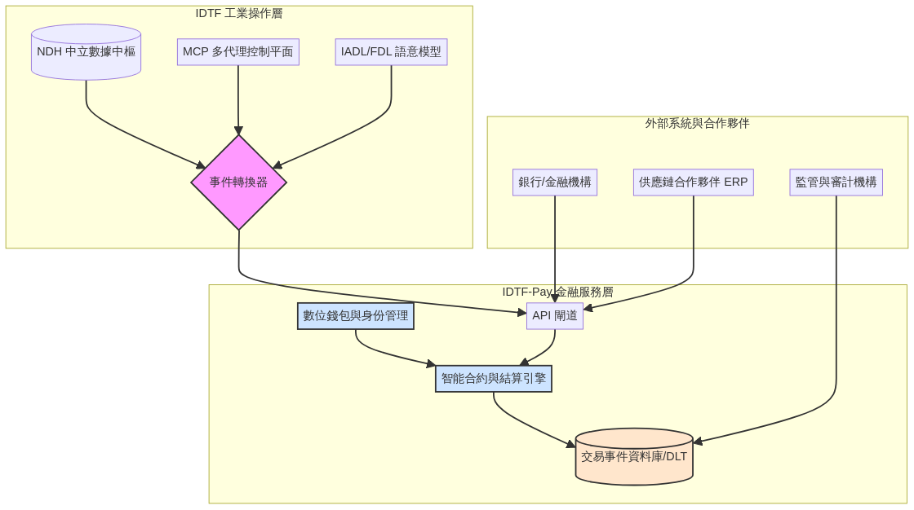
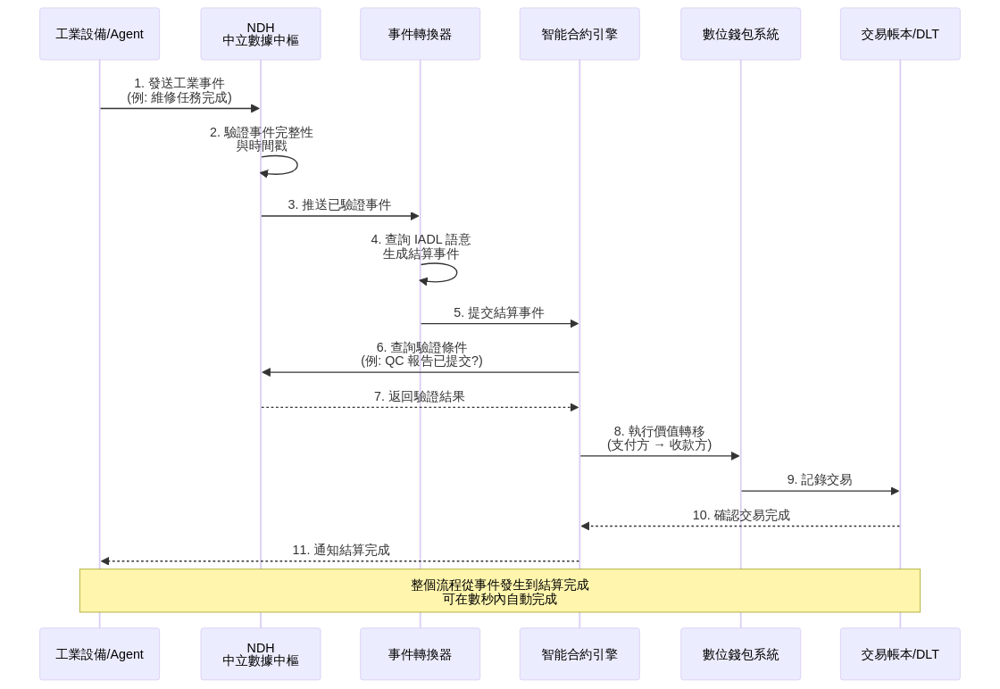

# IDTF-Pay: 工業數位孿生金融平台 架構白皮書

**版本**: 0.1  
**發布日期**: 2025年10月18日  
**作者**: Chih Cheng Lin (Michael Lin) & Manus AI  
**組織**: IDTF Consortium  
**狀態**: 草稿供審閱

---

## 執行摘要

**IDTF-Pay** 是一個從 **工業數位孿生框架 (Industrial Digital Twin Framework, IDTF)** 衍生出的創新型工業級支付與價值交換平台。在當前的工業 4.0 浪潮中，物理世界的生產活動與數位世界的金融結算之間存在著巨大的鴻溝。傳統的供應鏈金融結算可能需要數天甚至數週才能完成，這不僅影響了中小企業的現金流，也限制了工業自動化的進一步發展。

IDTF-Pay 旨在填補這一鴻溝，它利用 IDTF 的核心組件——包括 **IADL/FDL** 的語意模型、**NDH** 的事件一致性機制以及 **MCP** 的多代理控制平面——將工廠內部與供應鏈之間的「生產事件、能源使用、維修作業」等物理活動，無縫轉化為可驗證、可自動結算的數位金融交易。透過建立一個可信、高效、透明的價值交換網路，IDTF-Pay 將為製造業、供應鏈金融和能源市場帶來革命性的變革，最終實現一個自主運行的工業經濟生態系統。

本白皮書闡述了 IDTF-Pay 的技術架構、結算事件模型、應用場景以及實施路線圖，為工業界和金融界的利益相關者提供了一個清晰的願景和行動指南。

---

## 目錄

1. [簡介](#1-簡介)
2. [問題背景與市場機會](#2-問題背景與市場機會)
3. [核心概念與價值主張](#3-核心概念與價值主張)
4. [IDTF-Pay 技術架構](#4-idtf-pay-技術架構)
5. [結算事件模型](#5-結算事件模型)
6. [核心工作流程](#6-核心工作流程)
7. [應用場景與案例](#7-應用場景與案例)
8. [安全性與合規性](#8-安全性與合規性)
9. [實施路線圖](#9-實施路線圖)
10. [商業模式分析](#10-商業模式分析)
11. [結論](#11-結論)
12. [參考資料](#12-參考資料)

---

## 1. 簡介

### 1.1. IDTF-Pay 的誕生

IDTF-Pay 是從工業數位孿生框架 (IDTF) 自然演化而來的金融服務平台。IDTF 已經成功地建立了一套完整的工業資產數位化體系，包括資產定義語言 (IADL)、工廠設計語言 (FDL)、中立數據中樞 (NDH) 以及多代理控制平面 (MCP)。這些組件共同構成了一個能夠精確描述、監控和控制工業資產的數位生態系統。

然而，在實際應用中，我們發現了一個關鍵的缺失環節：**價值交換的自動化**。工廠裡的每一個生產動作、每一次能源消耗、每一次維修服務，都代表著價值的產生和轉移，但這些價值交換卻仍然依賴於傳統的、滯後的金融結算流程。IDTF-Pay 的使命就是將這些物理世界的價值創造活動，即時地轉化為數位世界的金融交易。

### 1.2. 核心理念

> **如果一個事件可以在物理世界中被可靠地測量和驗證，那麼它所代表的價值交換就應該可以被即時、自動地結算。**

這個理念的實現依賴於三個關鍵要素：

1. **語意錨定**：透過 IADL/FDL 為每個工業事件賦予明確的業務和財務含義。
2. **可信驗證**：透過 NDH 確保所有事件數據的完整性和不可篡改性。
3. **自主執行**：透過智能合約和 MCP 實現交易的自動觸發和執行。

### 1.3. 平台願景：自主工業經濟

IDTF-Pay 的長期願景是催生一個 **自主工業經濟 (Autonomous Industrial Economy)**。在這個生態系統中：

- **設備即錢包**：工廠裡的每一台機器不僅是生產工具，也是一個經濟參與者，能夠根據其工作貢獻自主賺取收入和支付費用。
- **服務即交易**：每一次維修、每一次能源輸送、每一個生產步驟，都可以被定義為一個微服務，並透過智能合約進行即時、自動的計費和結算。
- **工廠即市場**：工廠內部和工廠之間將形成一個動態的價值交換市場，資源（如能源、算力、產能）可以被更有效地調度和利用。

---

## 2. 問題背景與市場機會

### 2.1. 當前工業金融的痛點

現代工業營運高度複雜，涉及從原料採購、生產製造、能源消耗到設備維護的無數個環節。每一個環節都伴隨著價值的產生與轉移。然而，這些價值交換的結算過程卻往往是滯後、不透明且高度依賴人為介入的。

#### 主要問題包括：

**結算週期過長**：傳統的供應鏈金融支付可能需要數天甚至數週才能從支付請求到結算完成，這嚴重影響了供應鏈中中小企業的現金流[1]。根據研究，許多中小供應商因為漫長的結算週期而面臨資金壓力，甚至需要依賴高成本的短期融資。

**缺乏透明度**：傳統的發票、採購訂單和銀行轉帳流程不僅效率低下，還帶來了高昂的交易成本和潛在的錯誤風險。供應鏈中的各方往往對交易狀態缺乏即時可見性，導致爭議和延遲。

**人工作業成本高**：大量的對帳、審批和支付操作仍然依賴人工處理，不僅耗時且容易出錯。根據研究，區塊鏈智能合約可以自動化複雜的支付邏輯，顯著減少處理時間[2]。

**信任成本高**：跨組織的協作因缺乏信任和透明度而受到阻礙，特別是在涉及多方的複雜供應鏈中。

### 2.2. 新興技術帶來的機會

近年來，幾項關鍵技術的成熟為解決上述問題提供了可能：

**區塊鏈與智能合約**：區塊鏈技術提供了一個不可篡改的分散式帳本，而智能合約則能夠自動執行預定義的業務邏輯。這使得「當條件 X 滿足時，自動執行支付 Y」成為可能[2][3]。

**工業物聯網 (IIoT)**：工業設備越來越多地配備傳感器和網路連接，能夠即時產生大量的運營數據。這些數據為價值交換提供了可靠的物理基礎。

**DeFi 與微支付**：去中心化金融 (DeFi) 的發展消除了傳統支付系統的高費用和慢速度，使得 IoT 微支付成為可能[4]。這為工業場景中的高頻、小額交易提供了經濟可行性。

**數位身份**：W3C 的去中心化身份 (DID) 標準為設備和組織提供了安全、自主控制的數位身份，這是建立可信交易網路的基礎。

### 2.3. 市場規模與潛力

根據市場研究，全球供應鏈金融市場規模預計將持續增長，而工業自動化和智能製造的投資也在快速增加。IDTF-Pay 處於這兩個巨大市場的交匯點：

- **供應鏈金融市場**：預計到 2030 年將達到數兆美元的規模。
- **工業 4.0 投資**：製造業正在大規模投資於數位化轉型，其中包括對自動化支付和結算系統的需求。
- **能源交易市場**：隨著分散式能源和微電網的普及，點對點能源交易的需求正在快速增長[5]。

---

## 3. 核心概念與價值主張

### 3.1. 從工業事件到金融交易

IDTF-Pay 的核心創新在於其「事件轉換」能力。它將一個模糊的工業活動轉化為一個精確的金融交易，這個過程包含三個關鍵步驟：

#### 3.1.1. 語意錨定 (Semantic Anchoring)

透過 **IADL (工業資產定義語言)**，為每個資產和事件賦予清晰的業務和財務含義。例如，IADL 文件可以定義：

```yaml
assetType: "CNC_Milling_Machine"
financialAttributes:
  operatingCostPerHour: 50.00 # USD
  maintenanceFeePerService: 500.00 # USD
  productionValuePerUnit: 10.00 # USD
```

當這台機器完成一個單元的生產時，IDTF-Pay 就知道這個事件代表著 10 美元的價值創造。

#### 3.1.2. 可信驗證 (Trusted Verification)

透過 **NDH (中立數據中樞)**，確保所有事件數據（如傳感器讀數、生產日誌）的完整性、時間順序和不可篡改性。NDH 成為了所有交易的客觀仲裁者。它不僅記錄事件，還能夠驗證事件的真實性，例如：

- 確認生產批次確實已完成
- 驗證品質檢查報告已提交
- 確認設備運行時間與計費數據一致

#### 3.1.3. 自主執行 (Autonomous Execution)

透過 **MCP (多代理控制平面)** 和智能合約，根據預設的業務規則自動觸發和執行結算，無需人工審批。智能合約可以編碼複雜的業務邏輯，例如：

```
IF (NDH.verifyEvent('production_complete') AND NDH.verifyEvent('qc_passed'))
THEN (transfer 10000 USD from Buyer to Supplier)
```

### 3.2. 核心價值主張

IDTF-Pay 為工業界帶來了四大核心價值：

| 價值主張 | 描述 | 量化效益 |
|---|---|---|
| **極致自動化** | 將傳統數天甚至數週的結算流程縮短至秒級，從事件發生到價值轉移完全自動化。 | 降低 90% 的結算處理時間，減少 80% 的人工作業成本。 |
| **完全透明與可追溯** | 所有交易都與可驗證的物理事件綁定，並記錄在不可篡改的帳本上。 | 為審計、合規和爭議解決提供了堅實的基礎，減少 95% 的爭議處理時間。 |
| **提升供應鏈韌性** | 透過即時結算，加速供應鏈中的資金流動，顯著改善中小供應商的現金流狀況。 | 供應商的平均收款週期從 60 天縮短至 1 天，降低對短期融資的依賴。 |
| **催生新商業模式** | 實現「設備即服務 (Equipment-as-a-Service)」、「按成果付費 (Pay-per-Outcome)」等創新的商業模式。 | 製造商可以從銷售產品轉向銷售服務，創造持續的收入流。 |

### 3.3. 與傳統方案的比較

| 特性 | 傳統供應鏈金融 | IDTF-Pay |
|---|---|---|
| **結算速度** | 數天至數週 | 數秒至數分鐘 |
| **人工介入** | 高（審批、對帳） | 極低（僅異常處理） |
| **透明度** | 低（各方信息不對稱） | 高（所有參與方可見） |
| **信任基礎** | 中介機構（銀行） | 可驗證的物理事件 + 智能合約 |
| **交易成本** | 高（手續費、利息） | 低（僅網路費用） |
| **適用場景** | 大額、低頻交易 | 支援微支付和高頻交易 |

---

## 4. IDTF-Pay 技術架構

IDTF-Pay 架構深度整合於 IDTF 生態系統，並引入了專門的金融服務層。

### 4.1. 整體架構圖



如圖所示，IDTF-Pay 架構分為三個主要層次：

1. **IDTF 工業操作層**：包含 NDH、MCP 和 IADL/FDL，負責工業事件的產生、驗證和語意解釋。
2. **IDTF-Pay 金融服務層**：包含事件轉換器、智能合約引擎、數位錢包和交易帳本，負責金融交易的執行和記錄。
3. **外部生態**：包含銀行、供應鏈合作夥伴和監管機構，透過 API 閘道與 IDTF-Pay 互動。

### 4.2. 核心組件詳解

#### 4.2.1. 事件轉換器 (Event Transformer)

事件轉換器是連接工業世界和金融世界的關鍵橋樑。它的主要職責包括：

- **事件監聽**：訂閱來自 NDH 的工業事件流。
- **語意查詢**：根據事件中的資產 ID，從 IADL/FDL 資料庫中查詢相關的財務屬性和業務規則。
- **事件生成**：將工業事件轉換為標準化的「結算事件」，包含支付方、收款方、金額和結算條件。
- **規則引擎**：支援複雜的業務邏輯，例如「只有在品質檢查通過後才觸發支付」。

**技術實現**：

- 基於異步消息隊列（如 RabbitMQ 或 Kafka）實現高吞吐量的事件處理。
- 使用規則引擎（如 Drools）來管理和執行複雜的業務規則。

#### 4.2.2. 智能合約與結算引擎

智能合約引擎是 IDTF-Pay 的執行核心，負責：

- **合約部署**：允許用戶定義和部署自定義的結算邏輯。
- **條件驗證**：在執行交易前，向 NDH 查詢並驗證所有預設條件是否滿足。
- **交易執行**：一旦條件滿足，自動觸發價值轉移或記錄債權債務關係。
- **狀態管理**：追蹤每筆交易的狀態（待處理、處理中、已完成、失敗）。

**技術選項**：

- **企業級區塊鏈**：如 Hyperledger Fabric，適合需要隱私和許可控制的場景。
- **公鏈**：如 Ethereum，適合需要更高透明度和去中心化的場景。
- **混合方案**：核心交易在私有鏈上執行，定期將摘要錨定到公鏈以增強信任。

#### 4.2.3. 交易事件資料庫 (Transaction Ledger)

交易事件資料庫儲存所有金融交易的歷史記錄，它必須具備以下特性：

- **不可篡改**：一旦記錄，無法修改或刪除。
- **高可用**：支援高並發查詢和寫入。
- **可審計**：提供完整的交易歷史和審計追蹤。

**技術選項**：

- **分散式帳本技術 (DLT)**：如區塊鏈，提供最高級別的信任和透明度。
- **WORM 資料庫**：如 Amazon QLDB，提供類似區塊鏈的不可篡改性，但性能更高。

#### 4.2.4. 數位錢包與身份管理

每個參與方（組織、設備、AI Agent）都需要一個數位身份和錢包：

- **去中心化身份 (DID)**：基於 W3C DID 標準，確保身份的自主性和可驗證性。
- **HD 錢包**：支援分層確定性錢包，方便管理多個子帳戶。
- **多簽機制**：對於大額交易，支援多方簽名以增強安全性。

#### 4.2.5. API 閘道

API 閘道提供標準化的介面，供外部系統與 IDTF-Pay 互動：

- **RESTful API**：支援查詢交易狀態、發起支付請求、訂閱事件通知等操作。
- **身份驗證**：基於 OAuth 2.0 或 JWT 的安全認證機制。
- **速率限制**：防止濫用和 DDoS 攻擊。

---

## 5. 結算事件模型

「結算事件 (Settlement Event)」是 IDTF-Pay 的原子操作單元，它將工業活動的上下文與金融交易的指令封裝在一起。

### 5.1. 標準結構

結算事件採用 YAML 格式定義，以下是一個完整的範例：

```yaml
# 結算事件範例：生產里程碑支付
eventId: "evt_20251018_prod_milestone_54321"
timestamp: "2025-10-18T14:30:00Z"
eventType: "PRODUCTION_MILESTONE" # 事件類型
status: "PENDING" # 狀態: PENDING, PROCESSING, COMPLETED, FAILED

description: "完成批次 #P-54321 的生產，觸發對供應商 XYZ 的款項支付"

trigger: # 觸發此事件的工業來源
  source: "NDH"
  eventId: "ndh_evt_prod_finish_54321"
  assetId: "urn:iadl:harvatek:fab1:line3:machine5" # IADL 資產唯一標識符
  timestamp: "2025-10-18T14:25:00Z"

payers: # 支付方列表
  - partyId: "did:idtf:org:harvatek"
    walletId: "wallet_harvatek_main"
    amount: 15000.00
    currency: "USD"

payees: # 收款方列表
  - partyId: "did:idtf:org:supplier_xyz"
    walletId: "wallet_supplier_xyz_primary"
    amount: 15000.00
    currency: "USD"

settlementLogic: # 結算邏輯與條件
  type: "SMART_CONTRACT"
  contractId: "sc_milestone_payment_v1"
  conditions:
    - "NDH.verifyEvent('ndh_evt_prod_finish_54321', 'status', 'VERIFIED_BY_QC')"
    - "NDH.verifyEvent('ndh_evt_qc_report_54321', 'result', 'PASS')"

metadata: # 額外元數據
  purchaseOrder: "PO-2025-09-1001"
  relatedDocuments:
    - "hash://sha256/abc123...doc_qc_report_54321.pdf"
  notes: "第一批次生產完成，品質檢查已通過"
```

### 5.2. 關鍵欄位說明

| 欄位 | 描述 | 必填 |
|---|---|---|
| **eventId** | 唯一的事件標識符，用於追蹤和查詢。 | 是 |
| **timestamp** | 事件創建的時間戳（ISO 8601 格式）。 | 是 |
| **eventType** | 事件類型，定義了事件的業務含義。 | 是 |
| **status** | 事件的當前狀態，反映處理進度。 | 是 |
| **trigger** | 關聯的原始工業事件，確保交易的可追溯性。 | 是 |
| **payers/payees** | 定義交易的支付方和收款方，包含身份、錢包和金額。 | 是 |
| **settlementLogic** | 定義交易執行的條件和邏輯，通常指向一個智能合約。 | 是 |
| **metadata** | 其他業務相關的元數據，如採購訂單號、相關文件等。 | 否 |

### 5.3. 事件類型範例

IDTF-Pay 支援多種事件類型，以適應不同的工業場景：

| 事件類型 | 描述 | 應用場景 |
|---|---|---|
| **PRODUCTION_MILESTONE** | 生產達到特定里程碑（如完成一個批次）。 | 供應鏈金融、按產量付費。 |
| **ENERGY_CONSUMPTION** | 設備在特定時間段內的能源消耗。 | 工廠微電網能源交易、能源計費。 |
| **MAINTENANCE_SERVICE** | 完成一次預防性或響應式維護服務。 | 設備維護外包、按成果付費。 |
| **ASSET_USAGE** | 根據設備的運行時間或使用次數計費。 | 設備即服務 (EaaS)、租賃計費。 |
| **DATA_TRANSACTION** | 購買或出售來自工業設備的數據集。 | 工業數據市場、AI 訓練數據交易。 |
| **QUALITY_PENALTY** | 因品質問題觸發的罰款或賠償。 | 供應鏈品質管理、SLA 執行。 |

---

## 6. 核心工作流程

以「自動化維修服務結算」為例，展示 IDTF-Pay 的完整工作流程。

### 6.1. 工作流程圖



### 6.2. 詳細步驟說明

**步驟 1：事件發生**  
維修機器人（由 MCP 管理的 AI Agent）在完成維修任務後，向 NDH 發送一個「任務完成」事件。事件包含維修的詳細信息，如維修時間、更換的零件、維修報告等。

**步驟 2：事件驗證**  
NDH 接收到事件後，首先驗證事件的完整性和時間戳。它確保事件來自可信的來源（維修機器人的 DID），並且事件數據沒有被篡改。

**步驟 3：事件推送**  
NDH 將已驗證的事件推送給事件轉換器。

**步驟 4：語意查詢與事件生成**  
事件轉換器根據事件中的資產 ID（例如 `urn:iadl:harvatek:fab1:pump01`），從 IADL 資料庫中查詢該資產的維護合約信息。假設 IADL 定義了：

```yaml
maintenanceContract:
  serviceProvider: "did:idtf:org:maintenance_co"
  feePerService: 500.00 # USD
  paymentCondition: "TASK_COMPLETED_AND_VERIFIED"
```

事件轉換器生成一個 `MAINTENANCE_SERVICE` 類型的結算事件，指定支付方為工廠，收款方為維修公司，金額為 500 美元。

**步驟 5：提交結算事件**  
事件轉換器將結算事件提交給智能合約引擎。

**步驟 6：條件驗證**  
智能合約引擎根據 `settlementLogic` 中定義的條件，向 NDH 查詢驗證數據。例如，它可能需要確認：
- 維修任務確實已完成（檢查任務狀態）
- 品質檢查報告已提交（檢查是否存在相關的 QC 事件）

**步驟 7：返回驗證結果**  
NDH 返回驗證結果。如果所有條件都滿足，智能合約引擎進入下一步；否則，交易被標記為「待處理」，等待條件滿足。

**步驟 8：執行價值轉移**  
一旦所有條件滿足，智能合約引擎指示數位錢包系統，從工廠的錢包中將 500 美元轉移到維修公司的錢包。

**步驟 9：記錄交易**  
數位錢包系統將交易記錄到交易帳本（DLT 或 WORM 資料庫）中，確保交易的不可篡改性。

**步驟 10：確認交易完成**  
交易帳本向智能合約引擎返回確認，表示交易已成功記錄。

**步驟 11：通知結算完成**  
智能合約引擎向所有相關方（工廠、維修公司、維修機器人）發送通知，告知結算已完成。

**時間效率**：整個流程從事件發生到結算完成，可以在數秒內自動完成，相比傳統的數天甚至數週的結算週期，效率提升了數千倍。

---

## 7. 應用場景與案例

### 7.1. 場景一：自動化供應鏈金融

#### 背景

一家 LED 製造商（如宏齊科技）從多家供應商採購原材料和零件。傳統的付款流程是：供應商發貨 → 製造商收貨驗收 → 製造商開立發票 → 財務審批 → 銀行轉帳。這個過程通常需要 30-60 天。

#### IDTF-Pay 解決方案

1. **IADL 定義**：在 IADL 中定義每個採購訂單的付款條件，例如「當生產線完成使用該批次原材料的產品，並且品質檢查通過後，自動支付 X 金額給供應商 Y」。

2. **事件觸發**：當生產線完成一個產品批次時，NDH 記錄「生產完成」事件。品質檢查部門提交「QC 通過」事件。

3. **自動結算**：事件轉換器監聽到這兩個事件，生成一個 `PRODUCTION_MILESTONE` 結算事件。智能合約驗證條件後，自動從製造商錢包支付款項給供應商。

#### 效益

- **供應商**：收款週期從 60 天縮短至 1 天，大幅改善現金流。
- **製造商**：減少人工對帳和審批成本，降低供應鏈風險。
- **金融機構**：可以基於即時的交易數據提供更精準的供應鏈金融服務。

### 7.2. 場景二：設備即服務 (Equipment-as-a-Service)

#### 背景

一家工具機製造商希望從「銷售機床」轉向「銷售加工服務」。客戶不再需要購買昂貴的機床，而是根據實際使用量付費。

#### IDTF-Pay 解決方案

1. **IADL 定義**：在 IADL 中定義機床的計費模型，例如「每加工一個零件收費 5 美元」或「每運行一小時收費 50 美元」。

2. **實時監控**：機床上的傳感器將運行數據（如加工件數、運行時間）即時發送到 NDH。

3. **自動計費**：事件轉換器根據運行數據生成 `ASSET_USAGE` 結算事件。智能合約每小時或每天自動從客戶錢包中扣除相應費用，並轉入製造商錢包。

#### 效益

- **客戶**：降低初始投資，只為實際使用付費，提高資金效率。
- **製造商**：從一次性銷售轉向持續收入，提高客戶黏性。
- **維護優化**：製造商有動力確保設備高可用性，因為停機意味著收入損失。

### 7.3. 場景三：工廠微電網能源交易

#### 背景

一個工業園區內有多家工廠，部分工廠安裝了太陽能板和儲能系統。在不同時間段，各工廠的能源供需不同。傳統上，多餘的電力只能賣給電網，價格較低。

#### IDTF-Pay 解決方案

1. **FDL 定義**：在 FDL 中定義工業園區的能源網路拓撲，包括每個工廠的發電設備和用電設備。

2. **實時能源數據**：每個工廠的智能電表將發電量和用電量數據即時發送到 NDH。

3. **動態定價與交易**：MCP 中的能源交易 Agent 根據供需情況動態調整電價。當工廠 A 有多餘電力時，Agent 自動尋找需要電力的工廠 B，並透過 IDTF-Pay 執行點對點的能源交易。

4. **自動結算**：事件轉換器生成 `ENERGY_CONSUMPTION` 結算事件，智能合約自動從工廠 B 的錢包支付電費給工廠 A。

#### 效益

- **能源效率**：園區內的能源利用率提高，減少對外部電網的依賴。
- **成本節約**：工廠可以以更低的價格購買園區內的電力。
- **環境效益**：促進可再生能源的使用和分享。

### 7.4. 場景四：基於成果的維護合約

#### 背景

一家半導體廠房將設備維護外包給專業維護公司。傳統的維護合約按工時和備件計費，但這種模式無法激勵維護公司提高設備可用性。

#### IDTF-Pay 解決方案

1. **IADL 定義**：在 IADL 中定義維護合約為「基於設備正常運行時間 (Uptime) 計費」，例如「設備每正常運行 1 小時，支付 10 美元給維護公司」。

2. **實時監控**：設備的運行狀態（運行/停機/故障）即時發送到 NDH。

3. **動態計費**：事件轉換器根據設備的累計運行時間生成 `MAINTENANCE_SERVICE` 結算事件。智能合約每天或每週自動結算。

4. **激勵機制**：如果設備發生故障，運行時間停止累計，維護公司的收入也相應減少。這激勵維護公司主動進行預防性維護，提高設備可用性。

#### 效益

- **廠房**：設備可用性提高，生產效率提升。
- **維護公司**：收入與服務品質直接掛鉤，優質服務獲得更高回報。
- **風險共擔**：雙方共同承擔設備可用性的風險，建立更緊密的合作關係。

---

## 8. 安全性與合規性

### 8.1. 身份管理與訪問控制

**去中心化身份 (DID)**：IDTF-Pay 採用 W3C 的去中心化身份標準，為每個參與方（人、組織、設備、AI Agent）提供一個安全、自主控制的數位身份。DID 的優勢包括：

- **自主性**：用戶完全控制自己的身份，無需依賴中心化的身份提供商。
- **可驗證性**：任何人都可以驗證 DID 的真實性，無需信任第三方。
- **隱私保護**：用戶可以選擇性地披露身份信息，保護隱私。

**基於角色的訪問控制 (RBAC)**：IDTF-Pay 實施嚴格的權限控制，確保只有授權的用戶才能執行特定操作：

- **事件創建**：只有經過認證的設備和 Agent 才能向 NDH 發送事件。
- **交易審批**：對於大額交易，可以要求多方簽名（Multi-Sig）才能執行。
- **數據訪問**：不同的參與方只能訪問與其相關的交易數據。

### 8.2. 交易安全

**數位簽名**：所有交易都使用標準的公鑰基礎設施 (PKI) 進行數位簽名，確保：

- **完整性**：交易數據在傳輸過程中未被篡改。
- **不可否認性**：交易發起方無法否認其發起的交易。

**加密通信**：所有網路通信都使用 TLS/SSL 加密，防止中間人攻擊和數據竊聽。

**智能合約審計**：所有部署到生產環境的智能合約都必須經過嚴格的安全審計，以防止常見的漏洞（如重入攻擊、整數溢出等）。

### 8.3. 數據隱私

**零知識證明 (ZKP)**：在某些場景下，參與方可能不希望公開敏感的商業數據（如生產配方、成本結構）。IDTF-Pay 可以利用零知識證明技術，在不洩露原始數據的情況下，驗證交易的有效性。

例如，供應商可以證明「我已經交付了 X 數量的合格產品」，而無需公開產品的具體規格或成本。

**數據最小化**：IDTF-Pay 遵循「數據最小化」原則，只收集和存儲完成交易所必需的數據，減少隱私風險。

### 8.4. 合規與審計

**不可篡改的審計追蹤**：所有交易記錄都存儲在不可篡改的帳本上（DLT 或 WORM 資料庫），為監管機構和審計人員提供了前所未有的透明度和可追溯性。

**監管報告**：IDTF-Pay 可以自動生成符合各種監管要求的報告（如反洗錢 AML、了解你的客戶 KYC），大幅降低合規成本。

**智能合約合規性**：智能合約可以編碼監管規則，確保所有交易都自動符合法律要求。例如，可以設定「單筆交易金額超過 X 時，必須進行額外的身份驗證」。

---

## 9. 實施路線圖

### 9.1. v0.1 (當前階段) - 概念驗證

**目標**：建立核心平台，驗證技術可行性。

**功能**：
- 實現基於 NDH 事件的「生產里程碑」結算功能。
- 開發事件轉換器和基礎的智能合約引擎。
- 建立簡單的數位錢包系統（支援內部代幣）。
- 專注於單一工廠內的價值交換驗證。

**里程碑**：
- 完成核心組件的開發和集成。
- 在測試環境中成功執行 100 筆自動化交易。
- 發布技術白皮書和 API 文檔。

### 9.2. v0.2 - 擴展事件類型

**目標**：支援更多類型的工業事件和結算場景。

**功能**：
- 增加「能源消耗」和「資產使用」的計費與結算模型。
- 開發更複雜的智能合約模板（如基於時間的分期付款）。
- 引入基本的監控和告警功能。

**里程碑**：
- 支援至少 5 種不同的事件類型。
- 在實際工廠環境中進行小規模試點。

### 9.3. v0.3 - 跨組織交易

**目標**：實現跨公司的自動化支付和供應鏈金融。

**功能**：
- 引入對供應鏈合作夥伴的支援，實現跨組織的身份驗證和交易。
- 開發供應鏈金融產品（如發票融資、動態貼現）。
- 增強 API 閘道，支援第三方系統集成。

**里程碑**：
- 至少 3 家供應鏈合作夥伴加入平台。
- 完成首筆跨組織的自動化支付。

### 9.4. v0.5 - 金融機構整合

**目標**：與銀行和支付網關對接，實現法幣的自動出入金。

**功能**：
- 整合銀行 API，支援法幣（如美元、人民幣）的自動轉帳。
- 開發穩定幣支援，降低加密貨幣的波動性風險。
- 引入合規模組，支援 AML/KYC 流程。

**里程碑**：
- 與至少 1 家銀行建立合作關係。
- 支援法幣和穩定幣的混合支付。

### 9.5. v1.0 - 自主經濟生態

**目標**：建立一個開放的工業金融平台，支援第三方開發者和創新應用。

**功能**：
- 發布標準化的 Agent SDK，允許開發者創建自定義的 AI Agent 和業務邏輯。
- 建立智能合約市場，用戶可以購買和部署預製的合約模板。
- 引入治理機制，讓社群參與平台的決策和發展。

**里程碑**：
- 至少 10 個第三方應用在平台上運行。
- 平台處理的交易量達到每天 10,000 筆。
- 建立 IDTF-Pay 開發者社群。

---

## 10. 商業模式分析

### 10.1. 收入來源

IDTF-Pay 的商業模式基於多元化的收入來源：

| 收入來源 | 描述 | 定價模式 |
|---|---|---|
| **交易手續費** | 對每筆結算交易收取小額手續費（如 0.1% - 0.5%）。 | 按交易金額的百分比收費。 |
| **訂閱服務** | 為企業用戶提供高級功能（如高級分析、定制合約）的訂閱服務。 | 月費或年費，分為基礎版、專業版、企業版。 |
| **智能合約市場** | 開發者可以在平台上銷售自己開發的智能合約模板，平台抽取佣金。 | 每筆銷售抽取 10% - 20% 的佣金。 |
| **數據服務** | 將匿名化的交易數據和工業數據提供給研究機構或金融機構，用於市場分析和風險評估。 | 按數據集或 API 調用次數收費。 |
| **諮詢與實施服務** | 為大型企業提供 IDTF-Pay 的定制化實施和諮詢服務。 | 按項目收費。 |

### 10.2. 成本結構

主要成本包括：

- **技術開發**：平台開發、維護和升級的人力成本。
- **基礎設施**：雲端運算、儲存和網路費用（特別是區塊鏈節點的運行成本）。
- **合規與法律**：確保平台符合各地監管要求的法律和合規成本。
- **市場推廣**：吸引用戶和合作夥伴的營銷費用。

### 10.3. 市場定位

IDTF-Pay 定位於以下市場細分：

- **製造業**：特別是高價值、複雜供應鏈的行業（如半導體、航空航天、汽車）。
- **供應鏈金融**：為金融機構提供基於即時數據的供應鏈金融產品。
- **能源市場**：支援分散式能源和微電網的點對點交易。
- **工業 SaaS**：為工業軟體和服務提供商提供嵌入式支付解決方案。

### 10.4. 競爭優勢

- **深度整合**：與 IDTF 生態系統的深度整合，提供了其他支付平台無法比擬的工業數據可信度。
- **開放標準**：基於開放標準（如 IADL、W3C DID），避免供應商鎖定。
- **自動化程度高**：從事件發生到結算完成的全自動化流程，大幅降低成本。
- **靈活性**：支援多種結算場景和商業模式，適應不同行業的需求。

---

## 11. 結論

IDTF-Pay 不僅僅是一個支付工具，它是一個 **工業價值網路的作業系統**。透過將工業世界的物理真實性與金融世界的結算確定性相結合，IDTF-Pay 為解決製造業長期存在的效率、信任和流動性問題提供了一條清晰的路徑。

從自動化的供應鏈金融到自主運行的工廠，從設備即服務到工廠微電網能源交易，IDTF-Pay 將是推動下一代工業革命的關鍵基礎設施。它不僅能夠顯著降低交易成本、提高結算效率，更重要的是，它將催生全新的商業模式和經濟形態，讓工業世界真正進入「自主經濟」時代。

我們相信，隨著 IDTF-Pay 的逐步實施和生態系統的不斷壯大，它將成為工業 4.0 時代不可或缺的基礎設施，為全球製造業的數位化轉型提供強大的金融支撐。

---

## 12. 參考資料

[1] Taulia. (2025). *Solving same-day payments for supply chain finance*. [Online]. Available: https://taulia.com/resources/blog/solving-same-day-payments-for-supply-chain-finance/

[2] Forbes. (2025). *Big Business Is Betting Big On Blockchain-Based Payments*. [Online]. Available: https://www.forbes.com/sites/douglaslaney/2025/09/27/big-business-is-betting-big-on-blockchain-based-payments/

[3] ScienceDirect. (2021). *Construction payment automation using blockchain-enabled smart contracts and robotic reality capture technologies*. [Online]. Available: https://www.sciencedirect.com/science/article/abs/pii/S0926580521003770

[4] TokenMinds. (2024). *Scale Your IoT Business with DeFi Micropayments*. [Online]. Available: https://tokenminds.co/blog/blockchain-development/scale-iot-business-with-defi-micropayments

[5] IEEE Blockchain. *Smart Contracts and Energy: How Blockchain Smart Contracts Can Improve the Energy Sector*. [Online]. Available: https://blockchain.ieee.org/topics/smart-contracts-and-energy-how-blockchain-smart-contracts-can-improve-the-energy-sector

[6] Investopedia. *Supply Chain Finance: What It Is, How It Works, Example*. [Online]. Available: https://www.investopedia.com/terms/s/supply-chain-finance.asp

[7] Mastercard. *How IoT will Shape the Future of Payments*. [Online]. Available: https://www.mastercard.com/news/media/wddjfrhn/how-iot-will-shape-the-future-of-payments.pdf

[8] ConsenSys. *Blockchain in Energy and Sustainability*. [Online]. Available: https://consensys.io/blockchain-use-cases/energy-and-sustainability

---

**附錄 A：術語表**

- **IDTF**: Industrial Digital Twin Framework，工業數位孿生框架
- **IADL**: Industrial Asset Definition Language，工業資產定義語言
- **FDL**: Factory Design Language，工廠設計語言
- **NDH**: Neutral Data Hub，中立數據中樞
- **MCP**: Multi-Agent Control Plane，多代理控制平面
- **DID**: Decentralized Identifier，去中心化身份
- **DLT**: Distributed Ledger Technology，分散式帳本技術
- **ZKP**: Zero-Knowledge Proof，零知識證明
- **EaaS**: Equipment-as-a-Service，設備即服務

---

**© 2025 IDTF Consortium. 本文件為草稿供審閱，未經授權不得分發。**

