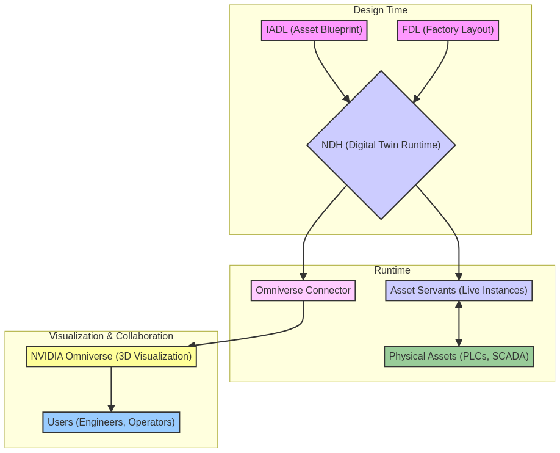

# IDTF V3.5 技術文件總覽

**版本**: 1.0
**日期**: 2025年10月14日

## 1. 簡介

歡迎來到 **IDTF (Industrial Digital Twin Framework) V3.5** 的技術文件中心。本文件旨在作為一個中心入口，引導開發者、架構師和技術決策者快速找到所需的技術規格、白皮書、設計文檔和部署指南。

IDTF V3.5 是一個開放、中立、可擴展的工業數位分身框架，其核心目標是打通 OT 與 IT 的數據壁壘，實現從物理世界到虛擬世界的高保真、即時、雙向同步。

## 2. 整體架構

IDTF V3.5 的架構圍繞四大核心組件構建，形成一個完整的從設計、部署到運維的閉環生態系統。

*

### 核心組件

| 組件 | 全名 | 核心職責 |
|---|---|---|
| **IADL** | Industrial Asset Description Language | **資產建模**: 定義資產的數據模型、3D 幾何與行為邏輯 (資產的「藍圖」)。 |
| **FDL** | Factory Design Language | **工廠設計**: 以聲明式語言描述工廠中資產的佈局、數量、位置和關係 (工廠的「佈局圖」)。 |
| **NDH** | Neutral Data Hub | **數據中樞**: 負責即時數據採集、處理、存儲，並管理 Asset Servants 的生命週期 (數位分身的「執行時」)。 |
| **Omniverse Connector** | - | **可視化與協同**: 將 NDH 中的數位分身狀態即時同步到 NVIDIA Omniverse，實現高保真渲染和多用戶協同。 |

## 3. 核心規格與白皮書

### 3.1 綜合技術白皮書

這些文件提供了對 IDTF V3.5 架構的全面性、高層次的概述。

- **[NDH、Omniverse 與數位分身整合架構白皮書](./08_White_Papers/technical/NDH_Omniverse_Digital_Twins_Architecture_Whitepaper.md)**
  - **摘要**: 深入探討 NDH、Asset Servants、Omniverse 和 Digital Twins 四大核心組件的整合機制，是理解 IDTF 執行時架構的**必讀文件**。
  - **包含內容**: 分散式部署、故障轉移、API 規範、即時同步機制。

- **[IDTF V3.5 綜合技術論文](./08_White_Papers/research/idtf_comprehensive_technical_paper.md)**
  - **摘要**: 從研究角度全面闡述 IDTF V3.5 的設計理念、技術創新和相較於行業內其他方案的優勢。

### 3.2 IADL (資產定義語言)

- **[IADL 規格書](./02_IADL_Spec/docs/02_IADL_Specification.md)**
  - **摘要**: IADL 的官方語法規範，詳細定義了數據標籤、幾何模型、行為腳本等核心元素。

### 3.3 FDL (工廠設計語言)

- **[FDL 規格設計白皮書](./04_FDL_Spec/docs/11_FDL_Specification_Whitepaper.md)**
  - **摘要**: FDL 的官方語法規範與設計指南，包含多種廠房的設計模式和最佳實踐。
  - **包含內容**: 分散式部署的 Worker 分配提示 (`worker_assignment hints`)。

### 3.4 NDH (中立數據中樞)

- **[NDH 架構文檔](./06_NDH_Spec/docs/06_NDH_Architecture.md)**
  - **摘要**: 描述 NDH 的內部微服務架構、數據流和核心組件。

- **[NDH 可插拔時序數據庫架構](./06_NDH_Spec/docs/NDH_Pluggable_TSDB_Architecture.md)**
  - **摘要**: 闡述 NDH 如何支援多種時序數據庫 (InfluxDB, TDengine 等) 的可插拔設計。

## 4. 部署與整合

### 4.1 部署指南

- **[NDH 叢集部署指南](./06_NDH_Spec/docs/NDH_Cluster_Deployment_Guide.md)**
  - **摘要**: 在 Kubernetes 環境中部署高可用、可擴展的 NDH 叢集的詳細步驟和配置建議。

### 4.2 整合指南

- **[IADL、FDL 與 NDH 互動指南](./08_White_Papers/technical/IADL_FDL_NDH_Interaction_Guide.md)**
  - **摘要**: 說明三大核心組件如何協同工作，從資產定義、工廠佈局到最終執行時實例化的完整流程。

## 5. 專案與源代碼

- **[IDTF V3.5 專案根目錄](./)**
  - 包含所有規格、文檔、白皮書和源代碼。

---

## 最新更新 (2025年10月14日)

### NDH 高可用性與災難復原機制

為確保 NDH 在生產環境中的穩定性和可靠性，我們新增了完整的高可用性與災難復原機制文件：

- **[NDH 高可用性與災難復原詳細文件](./06_NDH_Spec/docs/NDH_High_Availability_and_Disaster_Recovery.md)**
  - 鏡像備援機制（Master/Worker 節點、數據庫層）
  - 系統快照與復原機制（一致性快照、增量復原）
  - 停電保護機制（UPS 整合、優雅關機、快速啟動）
  - 故障檢測與自動恢復（秒級檢測、分鐘級恢復）
  - 災難復原計畫（RTO < 15分鐘、RPO < 5分鐘）
  - 監控與告警（Prometheus、Grafana、多通道告警）

**核心特性**：
- ✅ **99.9%+ 系統可用性**：年度停機時間 < 8.76 小時
- ✅ **無單點故障**：所有關鍵組件均採用冗餘部署
- ✅ **自動故障轉移**：Master 節點 < 10秒、Worker 節點 < 60秒
- ✅ **一致性快照**：不停機建立系統狀態快照（暫停寫入 < 5秒）
- ✅ **快速復原**：從停電到系統完全可用 < 5分鐘
- ✅ **數據零丟失**：透過 WAL 重放和增量復原機制

這些機制使 NDH 成為一個**安全、穩健、可靠**的工業級數位分身平台。

### NDH 系統更新機制

為確保 NDH 能夠安全、可靠地進行系統升級而不影響生產環境，我們新增了完整的系統更新機制文件：

- **[NDH 系統更新機制詳細文件](./06_NDH_Spec/docs/NDH_System_Update_Mechanism.md)**
  - 版本管理策略（語義化版本控制、相容性矩陣）
  - 滾動更新機制（分批次更新、Asset Servant 遷移）
  - 藍綠部署（完整環境切換、快速回滾）
  - 金絲雀部署（漸進式部署、自動化驗證）
  - 自動化更新流程（CI/CD 整合、更新腳本）
  - 回滾機制（快速回滾、自動回滾觸發）
  - 數據庫遷移（向後相容策略、Flyway/Liquibase）
  - 更新驗證測試（煙霧測試、負載測試、整合測試）

**核心特性**：
- ✅ **零停機更新**：更新過程中系統持續提供服務
- ✅ **快速回滾**：任何問題都可在 5 分鐘內回滾
- ✅ **漸進式部署**：分階段部署（5% → 25% → 50% → 100%）
- ✅ **自動化驗證**：更新後自動執行健康檢查和測試
- ✅ **版本相容性**：新舊版本可共存，確保平滑過渡
- ✅ **自動回滾**：錯誤率 > 5% 時自動觸發回滾

**更新策略**：
- **滾動更新**：適用於補丁和次版本更新（零停機）
- **藍綠部署**：適用於主版本更新（快速切換）
- **金絲雀部署**：漸進式部署策略（風險最小化）

這些機制使 NDH 的系統更新過程**安全、可靠、可控**，滿足工業級應用的嚴格要求。

---

## 最新更新：NDH MCP Server 整合

**更新日期**: 2025年10月14日

為了使 NDH 能夠與 AI 助理（如 Claude、ChatGPT、Manus 等）進行深度整合，我們設計了完整的 MCP (Model Context Protocol) Server 架構：

### NDH MCP Server 整合設計

- **[NDH MCP Server 整合詳細文件](./06_NDH_Spec/docs/NDH_MCP_Server_Integration.md)**
  - MCP 協議簡介與核心概念
  - NDH 作為 MCP Server 的架構設計
  - MCP 功能映射（Resources、Tools、Prompts）
  - 實作細節（Python/TypeScript SDK）
  - 安全性與授權機制
  - 部署架構（獨立/嵌入式/Kubernetes）
  - 實際使用場景
  - 實作路線圖（6 個階段）

### 核心價值

**對使用者**：
- ✅ 使用自然語言與數位分身系統互動
- ✅ 快速獲取工廠洞察和分析
- ✅ 降低系統使用門檻

**對開發者**：
- ✅ 標準化的 AI 整合介面
- ✅ 無需為每個 AI 平台單獨開發整合
- ✅ 自動生成工具描述和文檔

**對系統**：
- ✅ 擴展 NDH 的應用場景
- ✅ 提升系統的智能化水平
- ✅ 增強生態系統的開放性

### MCP 功能映射

#### Resources（資源）
- 工廠資產列表：`ndh://factory/{factory_id}/assets`
- 資產即時狀態：`ndh://factory/{factory_id}/asset/{asset_id}/status`
- 資產歷史數據：`ndh://factory/{factory_id}/asset/{asset_id}/history`
- 工廠佈局：`ndh://factory/{factory_id}/layout`
- 資產定義：`ndh://factory/{factory_id}/asset/{asset_id}/definition`

#### Tools（工具）
- `query_asset_status`：查詢資產狀態
- `set_asset_parameter`：設置資產參數
- `query_historical_data`：查詢歷史數據
- `execute_asset_command`：執行資產命令
- `analyze_data_trend`：分析數據趨勢
- `generate_report`：生成報告
- `search_assets`：搜尋資產

#### Prompts（提示模板）
- `factory_inspection`：工廠巡檢
- `anomaly_analysis`：異常分析
- `performance_optimization`：效能優化
- `predictive_maintenance`：預測性維護

### 使用場景範例

1. **智能工廠巡檢**：AI 助理自動檢查所有關鍵設備狀態並生成報告
2. **異常分析與診斷**：AI 助理分析設備異常並提供根本原因分析
3. **效能優化建議**：AI 助理識別瓶頸並提供具體的優化建議
4. **預測性維護**：AI 助理預測設備故障並生成維護計畫
5. **自然語言查詢**：使用者用自然語言查詢工廠資訊

### 實作路線圖

- **階段 1**：基礎架構（1-2 個月）
- **階段 2**：Resources 實作（1 個月）
- **階段 3**：Tools 實作（2 個月）
- **階段 4**：Prompts 實作（1 個月）
- **階段 5**：測試與優化（1 個月）
- **階段 6**：部署與發布（1 個月）

**總計**：7-8 個月完整實作

這個整合將使 IDTF V3.5 成為業界首個支援 MCP 的工業數位分身平台，大幅提升系統的智能化水平和使用者體驗。

---

## 最新更新：NDH MCP Server 整合

**更新日期**: 2025年10月14日

為了使 NDH 能夠與 AI 助理（如 Claude、ChatGPT、Manus 等）進行深度整合，我們設計了完整的 MCP (Model Context Protocol) Server 架構。

### FDL 與工廠設計軟體整合

**文件**: [FDL_Integration_with_Plant_Design_Software.md](04_FDL_Spec/docs/FDL_Integration_with_Plant_Design_Software.md)

**內容**:
- 主流工廠設計軟體分析（Autodesk Plant 3D、AVEVA E3D、Intergraph Smart 3D）
- FDL 與工廠設計軟體的整合架構
- 雙向整合策略（設計軟體 ↔ FDL）
- FDL Editor 增強設計
- 實作細節與程式碼範例
- 使用場景與實作路線圖

**核心價值**:
- 降低 IDTF 採用門檻，設計師可繼續使用熟悉的工具
- 自動生成 FDL，節省 80% 的時間
- 支援雙向同步，保持設計與執行的一致性
- 擴展 IDTF 的應用範圍到現有專案

